# AWS Services — Learning Guide

A structured, course-like walkthrough of the core AWS services you need to know as a backend/cloud engineer. Each section is self-contained — study in order or jump to what you need. Examples are tied to the FX Quote Service project where possible.

---

## Table of Contents

1. [Course Overview](#1-course-overview)
2. [AWS Fundamentals — Accounts, Regions, IAM](#2-aws-fundamentals--accounts-regions-iam)
3. [IAM — Identity & Access Management](#3-iam--identity--access-management)
4. [AWS Lambda — Serverless Compute](#4-aws-lambda--serverless-compute)
5. [API Gateway — HTTP to Lambda](#5-api-gateway--http-to-lambda)
6. [DynamoDB — NoSQL Database](#6-dynamodb--nosql-database)
7. [RDS — Relational Database Service](#7-rds--relational-database-service)
8. [EC2 — Virtual Servers](#8-ec2--virtual-servers)
9. [S3 — Object Storage](#9-s3--object-storage)
10. [Cognito — Authentication & User Pools](#10-cognito--authentication--user-pools)
11. [VPC — Networking Fundamentals](#11-vpc--networking-fundamentals)
12. [CloudWatch — Logging & Monitoring](#12-cloudwatch--logging--monitoring)
13. [SNS & SQS — Messaging & Queues](#13-sns--sqs--messaging--queues)
14. [CloudFront — CDN & Edge Delivery](#14-cloudfront--cdn--edge-delivery)
15. [Route 53 — DNS Management](#15-route-53--dns-management)
16. [ECS & Fargate — Containers](#16-ecs--fargate--containers)
17. [Secrets Manager & Parameter Store](#17-secrets-manager--parameter-store)
18. [CloudFormation vs Terraform](#18-cloudformation-vs-terraform)
19. [Cost Management & Free Tier](#19-cost-management--free-tier)
20. [Putting It Together — FX Service on AWS](#20-putting-it-together--fx-service-on-aws)

---

## 1. Course Overview

### Why AWS?

AWS (Amazon Web Services) is the largest cloud platform, holding ~31% of the global cloud market. Most backend jobs require some AWS knowledge.

### What You'll Learn

| Service         | What It Does                            | FX Project Mapping                     |
| --------------- | --------------------------------------- | -------------------------------------- |
| IAM             | Controls who can access what            | API keys, Lambda execution roles       |
| Lambda          | Runs code without managing servers      | Our handlers (auth, quotes, transfers) |
| API Gateway     | Routes HTTP requests to Lambda          | Replaces our local Express server      |
| DynamoDB        | NoSQL key-value/document database       | Replaces our in-memory Map stores      |
| RDS             | Managed SQL databases (Postgres, MySQL) | Alternative to DynamoDB                |
| EC2             | Virtual machines in the cloud           | Traditional server hosting             |
| S3              | File/object storage                     | Static assets, exports, backups        |
| Cognito         | User authentication & JWT tokens        | What our auth system mimics            |
| VPC             | Private cloud networking                | Isolating databases from the internet  |
| CloudWatch      | Logs, metrics, alarms                   | Monitoring Lambda errors & latency     |
| SNS/SQS         | Pub/sub messaging & job queues          | Transfer processing pipeline           |
| CloudFront      | CDN for fast global delivery            | Serving the mobile API globally        |
| Route 53        | DNS — human-readable domain names       | api.yourservice.com                    |
| ECS/Fargate     | Container orchestration                 | Alternative to Lambda for long tasks   |
| Secrets Manager | Secure config & API keys                | Storing JWT secrets, DB passwords      |

### How AWS Is Organized

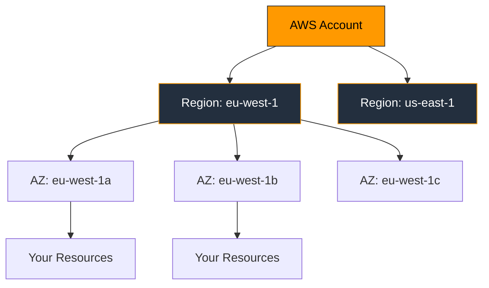

**Region** = Physical location (e.g., `eu-west-1` = Ireland)
**Availability Zone (AZ)** = Isolated data center within a region
**Resource** = Any AWS thing you create (Lambda, database, server)

---

## 2. AWS Fundamentals — Accounts, Regions, IAM

### The AWS Shared Responsibility Model

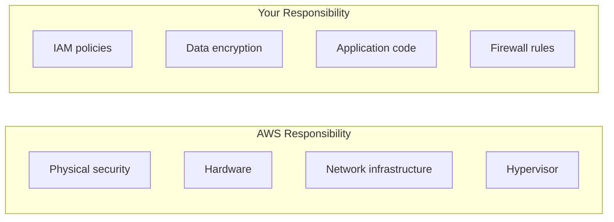

**AWS secures the cloud.** You secure what you put **in** the cloud.

### Key Concepts

| Concept      | Meaning                                                              |
| ------------ | -------------------------------------------------------------------- |
| Root Account | The email you sign up with — has full power, never use it day-to-day |
| IAM User     | A named identity with specific permissions                           |
| Region       | Geographic area — always choose the one closest to your users        |
| ARN          | Amazon Resource Name — unique ID for every resource                  |
| Tag          | Key/value label on resources (e.g., `project: fx-quote-service`)     |

### ARN Format

```
arn:aws:service:region:account-id:resource-type/resource-id
arn:aws:lambda:eu-west-1:123456789:function:fx-quote-handler
```

Every resource in AWS has an ARN. You'll use them in IAM policies and Terraform configs.

---

## 3. IAM — Identity & Access Management

### What Is IAM?

IAM controls **who** (identity) can do **what** (action) on **which** resources. It's the foundation of AWS security.

### Core Concepts

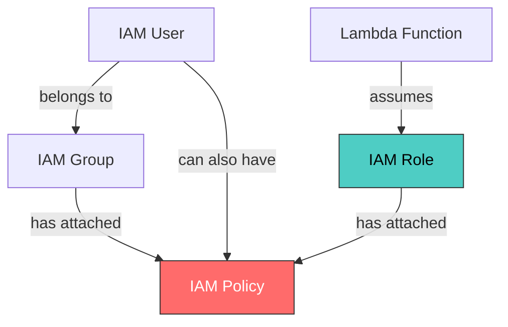

| Concept | What It Is                                                      |
| ------- | --------------------------------------------------------------- |
| User    | A person or application with long-term credentials              |
| Group   | Collection of users who share the same permissions              |
| Role    | Temporary identity that AWS services (Lambda, EC2) can "assume" |
| Policy  | JSON document listing allowed/denied actions                    |

### Policy Example — Lambda Can Read DynamoDB

```json
{
  "Version": "2012-10-17",
  "Statement": [
    {
      "Effect": "Allow",
      "Action": ["dynamodb:GetItem", "dynamodb:PutItem", "dynamodb:Query"],
      "Resource": "arn:aws:dynamodb:eu-west-1:*:table/fx-quotes"
    }
  ]
}
```

### Principle of Least Privilege

> Give only the permissions needed — nothing more.

Bad: `"Action": "*", "Resource": "*"` (full admin)
Good: `"Action": "dynamodb:GetItem", "Resource": "arn:...table/fx-quotes"`

### FX Project Mapping

Our backend runs locally now, but on AWS:

- Lambda functions would have an **execution role**
- That role would allow `dynamodb:*` on our tables and `logs:*` for CloudWatch
- API Gateway would have permission to invoke Lambda

---

## 4. AWS Lambda — Serverless Compute

### What Is Lambda?

Lambda runs your code **without a server**. You upload a function, AWS runs it when triggered, and you pay only for execution time.

### How Lambda Works

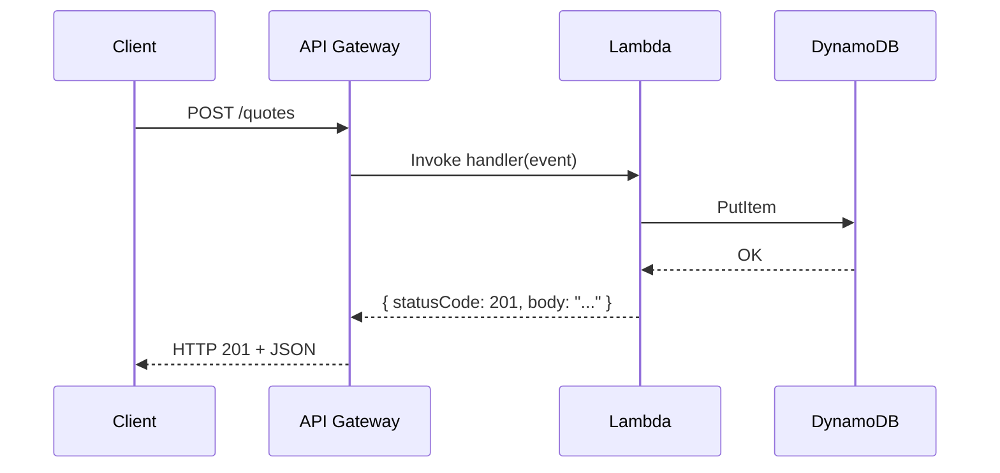

### Lambda Handler — Our Code Already Follows This Pattern

```javascript
// This is exactly what our quoteHandler.js does
async function handler(event) {
  const body = JSON.parse(event.body);
  const quote = calculateQuote(body.amount, body.currency);

  return {
    statusCode: 200,
    headers: { "Content-Type": "application/json" },
    body: JSON.stringify(quote),
  };
}
```

The `event` object comes from API Gateway and contains:

- `event.body` — request body (string)
- `event.headers` — HTTP headers
- `event.pathParameters` — URL params like `{ id: "abc-123" }`
- `event.queryStringParameters` — query string `?key=value`

### Key Configuration

| Setting     | What It Controls                               | Typical Value          |
| ----------- | ---------------------------------------------- | ---------------------- |
| Memory      | RAM allocated (also scales CPU proportionally) | 128–512 MB             |
| Timeout     | Max execution time                             | 3–30 seconds           |
| Runtime     | Language version                               | nodejs20.x             |
| Handler     | Entry point                                    | handlers/quote.handler |
| Environment | Env variables (DB URLs, secrets)               | KEY=value              |

### Cold Starts

When Lambda hasn't been called recently, AWS must:

1. Find a server → 2. Download your code → 3. Start the runtime → 4. Run your function

This is a **cold start** (~200–500ms for Node.js). Subsequent calls are **warm** (<10ms).

### Pricing

- **Free tier**: 1M requests + 400,000 GB-seconds/month
- After: $0.20 per 1M requests + $0.0000166667 per GB-second
- For our FX service: essentially free at low traffic

---

## 5. API Gateway — HTTP to Lambda

### What Is API Gateway?

API Gateway is the "front door" for your API. It receives HTTP requests and routes them to Lambda functions — replacing our local Express server.

### How It Maps to Our Express Routes

| Express (local)                       | API Gateway + Lambda (AWS)         |
| ------------------------------------- | ---------------------------------- |
| `app.post("/auth/register", handler)` | POST /auth/register → authHandler  |
| `app.get("/quotes/:id", handler)`     | GET /quotes/{id} → quoteHandler    |
| `app.use(cors())`                     | CORS configured in API Gateway     |
| `express.json()` middleware           | Automatic — body arrives as string |

### API Gateway Types

| Type     | Best For                        | Pricing              |
| -------- | ------------------------------- | -------------------- |
| HTTP API | Simple REST APIs (recommended)  | ~$1/million requests |
| REST API | Complex features (caching, WAF) | ~$3.50/million       |

### Stage Variables & Deployment

```
https://abc123.execute-api.eu-west-1.amazonaws.com/prod/quotes
          │                    │                    │      │
    API ID              Region               Stage   Path
```

- **Stage** = deployment environment (dev, staging, prod)
- Each stage can have different Lambda versions

### Authorizers — Protecting Routes on AWS

On AWS, instead of our `authMiddleware.js`, API Gateway uses **Cognito Authorizers** or **Lambda Authorizers**:

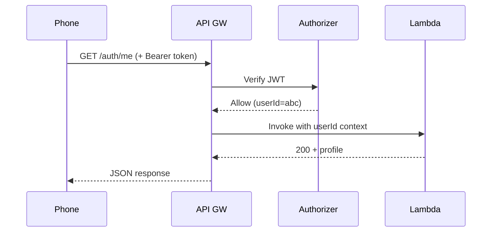

---

## 6. DynamoDB — NoSQL Database

### What Is DynamoDB?

A fully managed NoSQL database — no servers, no patching, scales automatically. Stores data as JSON-like items in tables.

### DynamoDB vs Our In-Memory Maps

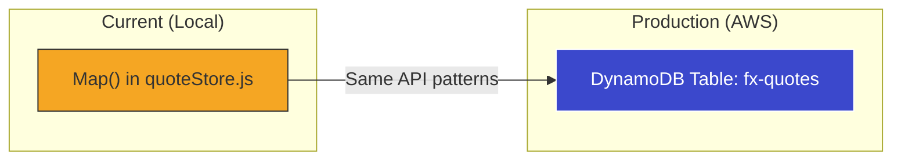

### Core Concepts

| Concept       | Meaning                                              | Our Equivalent           |
| ------------- | ---------------------------------------------------- | ------------------------ |
| Table         | Collection of items                                  | `quoteStore` Map         |
| Item          | A single record (JSON object)                        | One quote object         |
| Partition Key | Primary key for lookups — must be unique             | `id` (UUID)              |
| Sort Key      | Optional second key for ordering                     | `createdAt`              |
| GSI           | Global Secondary Index — query by non-key attributes | Query quotes by `userId` |

### Table Design for FX Quotes

```
Table: fx-quotes
┌─────────────────┬───────────────────┬────────┬─────────┬────────┐
│ id (PK)         │ userId (GSI-PK)   │ amount │ status  │ createdAt │
├─────────────────┼───────────────────┼────────┼─────────┼────────┤
│ q-abc-123       │ u-def-456         │ 100    │ open    │ 2026-... │
│ q-ghi-789       │ u-def-456         │ 250    │ confirmed│ 2026-.. │
└─────────────────┴───────────────────┴────────┴─────────┴────────┘
```

### CRUD Operations

```javascript
// PutItem — save a quote (like quoteStore.save())
await dynamodb
  .put({
    TableName: "fx-quotes",
    Item: {
      id: "q-abc-123",
      userId: "u-def-456",
      sourceAmount: 100,
      sourceCurrency: "EUR",
      status: "open",
      createdAt: new Date().toISOString(),
    },
  })
  .promise();

// GetItem — fetch by primary key (like quoteStore.findById())
const result = await dynamodb
  .get({
    TableName: "fx-quotes",
    Key: { id: "q-abc-123" },
  })
  .promise();

// Query — find by GSI (like quoteStore.findByUserId())
const result = await dynamodb
  .query({
    TableName: "fx-quotes",
    IndexName: "userId-index",
    KeyConditionExpression: "userId = :uid",
    ExpressionAttributeValues: { ":uid": "u-def-456" },
  })
  .promise();
```

### Key Pricing

- **On-Demand**: $1.25 per million writes, $0.25 per million reads
- **Provisioned**: you set capacity, cheaper if predictable
- **Free tier**: 25 GB storage, 25 WCU, 25 RCU (enough for development)

### When to Use DynamoDB

✅ Key-value lookups, high throughput, variable schema
❌ Complex joins, aggregations, ad-hoc queries → Use RDS instead

---

## 7. RDS — Relational Database Service

### What Is RDS?

Managed SQL databases. AWS handles backups, patching, and replication — you write SQL.

### Supported Engines

| Engine     | Notes                                              |
| ---------- | -------------------------------------------------- |
| PostgreSQL | Most popular for new projects, rich feature set    |
| MySQL      | Widely used, good for simple CRUD apps             |
| Aurora     | AWS-custom, PostgreSQL/MySQL compatible, 5x faster |
| SQL Server | For Microsoft/.NET shops                           |
| MariaDB    | MySQL fork, community-driven                       |

### RDS vs DynamoDB

| Feature    | RDS (SQL)                        | DynamoDB (NoSQL)                  |
| ---------- | -------------------------------- | --------------------------------- |
| Data model | Tables with fixed schema         | Flexible JSON documents           |
| Queries    | SQL joins, aggregations          | Key-value lookups, simple queries |
| Scaling    | Vertical (bigger instance)       | Horizontal (automatic)            |
| Pricing    | Per hour (even when idle)        | Per request (pay-per-use)         |
| Best for   | Complex relationships, reporting | High-speed lookups, events        |

### For Our FX Service

DynamoDB is the better fit because:

- Simple key-value access patterns (get quote by ID, list by user)
- No complex joins needed
- Pay-per-request matches low/variable traffic
- Scales without configuration

But if we needed reports like "total transfers by currency this month," RDS (PostgreSQL) would be better.

### RDS Architecture

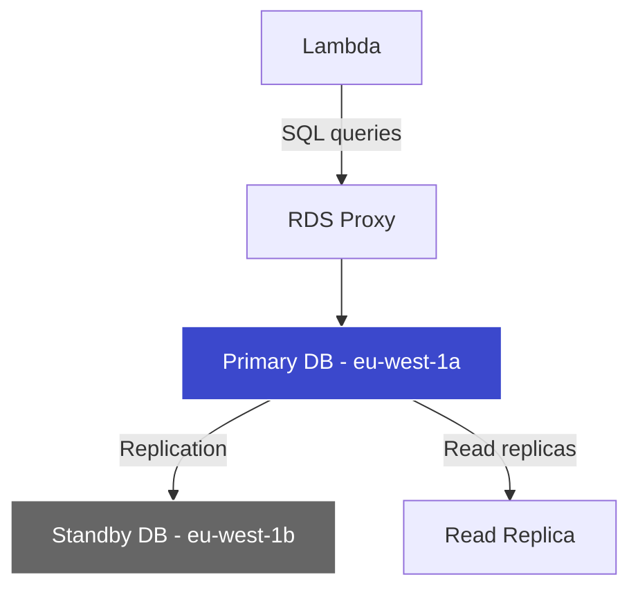

- **RDS Proxy**: Connection pooling (Lambda opens many connections)
- **Multi-AZ**: Automatic failover to standby
- **Read Replicas**: Offload read-heavy queries

### Connection from Lambda

Lambda creates new connections on every cold start. Use **RDS Proxy** to pool connections:

```javascript
const { Client } = require("pg");
const client = new Client({
  host: process.env.DB_HOST, // RDS Proxy endpoint
  database: "fx_quotes",
  user: process.env.DB_USER,
  password: process.env.DB_PASS,
  ssl: { rejectUnauthorized: false },
});
```

---

## 8. EC2 — Virtual Servers

### What Is EC2?

Elastic Compute Cloud — virtual machines (instances) that you fully control. Choose the OS, install anything, run any software.

### When to Use EC2 vs Lambda

| Factor         | Lambda                    | EC2                             |
| -------------- | ------------------------- | ------------------------------- |
| Execution time | Max 15 minutes            | Unlimited                       |
| Startup        | Cold starts (~300ms)      | Always running                  |
| Control        | Just your function code   | Full OS access                  |
| Pricing        | Per millisecond of use    | Per hour (even when idle)       |
| Scaling        | Automatic (1000 parallel) | Manual or Auto Scaling Groups   |
| Best for       | API handlers, events      | Databases, long-running workers |

### Instance Types

```
t3.micro  →  2 vCPU,  1 GB RAM   ~$0.01/hr   (free tier eligible)
t3.medium →  2 vCPU,  4 GB RAM   ~$0.04/hr
m5.large  →  2 vCPU,  8 GB RAM   ~$0.10/hr   (general purpose)
c5.xlarge →  4 vCPU,  8 GB RAM   ~$0.17/hr   (compute optimized)
r5.large  →  2 vCPU, 16 GB RAM   ~$0.13/hr   (memory optimized)
```

**Naming**: `[family][generation].[size]`

- `t` = burstable, `m` = general, `c` = compute, `r` = memory
- `3/5` = generation number
- `micro/small/medium/large/xlarge` = size

### Key Pairs & Security Groups

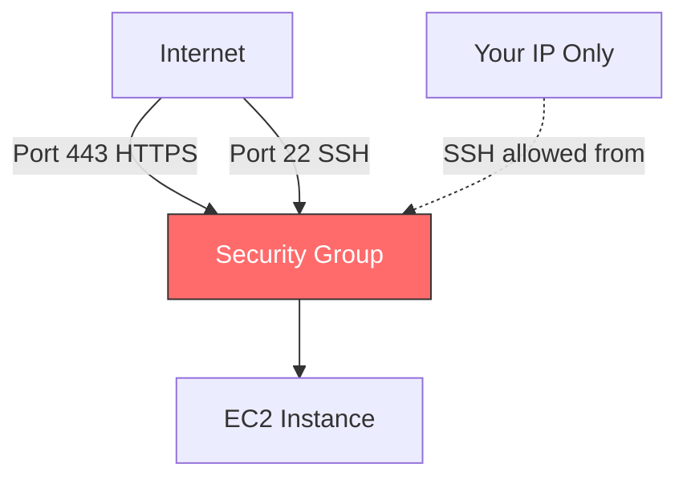

- **Key Pair**: SSH keys to connect to your instance
- **Security Group**: Firewall rules (inbound/outbound)
- **Always restrict SSH** to your IP, never open to 0.0.0.0/0

### For Our FX Service

We don't need EC2 — Lambda handles our API. But you'd use EC2 if you needed:

- A background worker processing transfers continuously
- A self-managed database
- Software that can't run in Lambda (e.g., Redis, Kafka)

---

## 9. S3 — Object Storage

### What Is S3?

Simple Storage Service — stores files (objects) in buckets. Unlimited storage, 99.999999999% durability (11 nines).

### Core Concepts

| Concept | Meaning                                                    |
| ------- | ---------------------------------------------------------- |
| Bucket  | Container for objects (globally unique name)               |
| Object  | A file + metadata (max 5 TB)                               |
| Key     | The "path" to the object: `exports/quotes-2026-03.csv`     |
| Prefix  | Simulated folder: `exports/` (S3 is flat, no real folders) |

### Storage Classes

| Class            | Use Case                      | Cost (per GB/month) |
| ---------------- | ----------------------------- | ------------------- |
| Standard         | Frequently accessed           | $0.023              |
| Intelligent-Tier | Unknown access patterns       | $0.023 + monitoring |
| Standard-IA      | Infrequent access             | $0.0125             |
| Glacier          | Archive (minutes to retrieve) | $0.004              |
| Glacier Deep     | Long-term archive             | $0.00099            |

### S3 for Our FX Service

```javascript
// Export daily transfer report to S3
const AWS = require("aws-sdk");
const s3 = new AWS.S3();

await s3
  .putObject({
    Bucket: "fx-quote-service-exports",
    Key: `reports/${new Date().toISOString().slice(0, 10)}.json`,
    Body: JSON.stringify(transfers),
    ContentType: "application/json",
  })
  .promise();
```

Use cases in our project:

- Store OpenAPI spec for public access
- Export transfer reports/CSVs
- Host the React Native web build (static site hosting)

### Pre-Signed URLs

Give temporary upload/download access without exposing credentials:

```javascript
const url = s3.getSignedUrl("getObject", {
  Bucket: "fx-quote-service-exports",
  Key: "reports/2026-03-08.json",
  Expires: 300, // 5 minutes
});
// Returns: https://bucket.s3.amazonaws.com/...?X-Amz-Signature=...
```

---

## 10. Cognito — Authentication & User Pools

### What Is Cognito?

Managed authentication service. Handles sign-up, sign-in, password reset, MFA — so you don't build it yourself.

### What Our Code Mimics

| Our Local Code            | Real AWS Cognito Equivalent              |
| ------------------------- | ---------------------------------------- |
| `authService.register()`  | `SignUp` + `AdminConfirmSignUp`          |
| `authService.login()`     | `InitiateAuth` (USER_PASSWORD_AUTH flow) |
| `tokenUtils.signToken()`  | Cognito issues JWT automatically         |
| `authMiddleware.verify()` | API Gateway Cognito Authorizer           |
| `userStore` (Map)         | Cognito User Pool (managed by AWS)       |

### Cognito Architecture

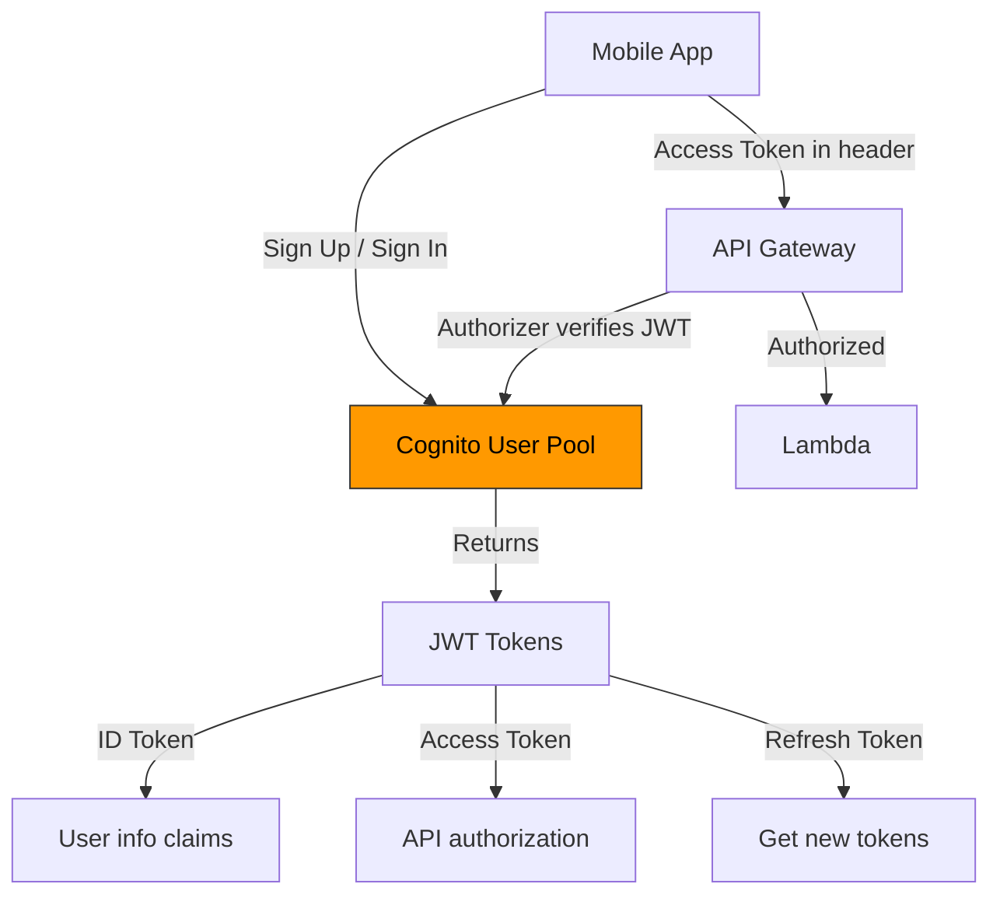

### JWT Tokens from Cognito

Cognito issues **three** tokens:

| Token         | Purpose                                | Lifetime |
| ------------- | -------------------------------------- | -------- |
| ID Token      | Contains user attributes (email, name) | 1 hour   |
| Access Token  | Authorizes API calls                   | 1 hour   |
| Refresh Token | Exchange for new ID/Access tokens      | 30 days  |

Our simplified version issues only an access token — real Cognito gives all three.

### User Pool Settings

```
User Pool: fx-quote-users
├── Required attributes: email
├── Password policy: min 8 chars, number, uppercase
├── MFA: Optional (SMS or TOTP app)
├── Email verification: Required
└── App client: fx-mobile-app (no client secret)
```

### Why We Mock It Locally

- No AWS account needed for development
- Faster iteration (no network calls to Cognito)
- Same JWT patterns — code migrates easily to real Cognito
- Tests run offline

---

## 11. VPC — Networking Fundamentals

### What Is a VPC?

Virtual Private Cloud — your own isolated network within AWS. Think of it as a private LAN in the cloud.

### VPC Architecture

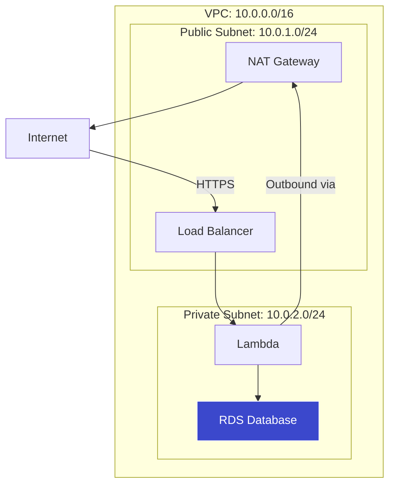

### Key Components

| Component        | Purpose                                                     |
| ---------------- | ----------------------------------------------------------- |
| VPC              | The overall network (e.g., 10.0.0.0/16 = 65,536 IPs)        |
| Subnet           | Subdivision of VPC in one AZ                                |
| Public Subnet    | Has route to Internet Gateway (for public-facing resources) |
| Private Subnet   | No direct internet access (for databases, Lambda)           |
| Internet Gateway | Connects VPC to the internet                                |
| NAT Gateway      | Lets private resources make outbound internet calls         |
| Route Table      | Rules for where network traffic goes                        |
| Security Group   | Stateful firewall on individual resources                   |
| NACL             | Stateless firewall on subnets                               |

### For Our FX Service

```
VPC: fx-service-vpc
├── Public Subnet (API Gateway, NAT Gateway)
├── Private Subnet AZ-a (Lambda, RDS primary)
└── Private Subnet AZ-b (RDS standby)
```

Lambda in a private subnet can reach DynamoDB via a **VPC Endpoint** (no internet needed).

---

## 12. CloudWatch — Logging & Monitoring

### What Is CloudWatch?

Centralized logging, metrics, and alerting for all AWS services. Every Lambda invocation automatically sends logs here.

### Log Structure

```
Log Group:  /aws/lambda/fx-quoteHandler
└── Log Stream: 2026/03/08/[$LATEST]abc123
    ├── START RequestId: abc-123
    ├── [INFO] Quote created: { id: "q-789", amount: 100 }
    ├── END RequestId: abc-123
    └── REPORT RequestId: abc-123 Duration: 45ms Memory: 128MB
```

### Key Metrics for Lambda

| Metric         | What It Tells You                      | Alert Threshold         |
| -------------- | -------------------------------------- | ----------------------- |
| Invocations    | How many times the function was called | Spike = possible attack |
| Duration       | Execution time                         | > 5s = problem          |
| Errors         | Uncaught exceptions                    | > 0 = investigate       |
| Throttles      | Rejected because of concurrency limits | > 0 = scale up          |
| ConcurrentExec | How many running simultaneously        | Near limit = danger     |

### CloudWatch Alarm Example

```
Alarm: fx-quote-errors
  Metric: AWS/Lambda Errors for fx-quoteHandler
  Condition: >= 5 errors in 5 minutes
  Action: Send SNS notification to ops-team@company.com
```

### Structured Logging (Best Practice)

```javascript
// Instead of console.log("Quote created")
console.log(
  JSON.stringify({
    level: "INFO",
    message: "Quote created",
    quoteId: quote.id,
    userId: user.userId,
    amount: quote.sourceAmount,
    currency: quote.sourceCurrency,
    timestamp: new Date().toISOString(),
  }),
);
```

Structured logs are searchable with **CloudWatch Insights**:

```sql
fields @timestamp, quoteId, amount
| filter level = "ERROR"
| sort @timestamp desc
| limit 20
```

---

## 13. SNS & SQS — Messaging & Queues

### Why Messaging?

Instead of doing everything in one Lambda call, you can **decouple** work into separate steps:

```mermaid
graph LR
    A[POST /transfers] -->|1. Create transfer| B[Transfer Lambda]
    B -->|2. Send message| C[SQS Queue]
    C -->|3. Process async| D[Processing Lambda]
    D -->|4. Update status| E[DynamoDB]
    D -->|5. Notify user| F[SNS Topic]
    F -->|Email| G[user@example.com]
    F -->|SMS| H[+216 XX XXX XXX]

    style C fill:#ff6b6b,stroke:#333,color:#fff
    style F fill:#4ecdc4,stroke:#333,color:#000
```

### SNS vs SQS

| Feature  | SNS (Simple Notification)        | SQS (Simple Queue)                   |
| -------- | -------------------------------- | ------------------------------------ |
| Pattern  | Pub/Sub — fan out to many        | Queue — one consumer processes each  |
| Delivery | Push to subscribers immediately  | Pull — consumer polls for messages   |
| Use case | Notifications, alerts, fan-out   | Job processing, decoupling           |
| Analogy  | Radio broadcast (many listeners) | Ticket queue (one person per ticket) |

### FX Service Use Case

When a transfer is confirmed:

1. **SQS**: Queue for processing (simulate bank transfer, delay, retry on failure)
2. **SNS**: Notify user via email/SMS that transfer is complete

### SQS Dead Letter Queue

If a message fails processing 3 times, move it to a **Dead Letter Queue** for investigation:

```
Main Queue (fx-transfer-processing)
  ↓ fails 3 times
Dead Letter Queue (fx-transfer-dlq)
  ↓ alarm triggers
CloudWatch Alert → Ops team investigates
```

---

## 14. CloudFront — CDN & Edge Delivery

### What Is CloudFront?

Content Delivery Network — caches your content at 400+ edge locations worldwide for fast delivery.

### Use Cases for Our Service

| Use Case                   | Without CloudFront | With CloudFront     |
| -------------------------- | ------------------ | ------------------- |
| API calls from Tunisia     | 150ms → eu-west-1  | 30ms → edge cache   |
| Same quote requested twice | Lambda runs again  | Served from cache   |
| Static web build           | S3 direct (slow)   | CDN-cached globally |

### CloudFront + API Gateway

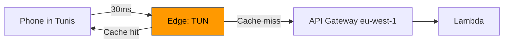

---

## 15. Route 53 — DNS Management

### What Is Route 53?

AWS's DNS service — translates human-readable domain names to IP addresses.

```
api.fxquote.com  →  d1234.cloudfront.net  →  actual IP
```

### Record Types

| Type  | Purpose                               | Example                              |
| ----- | ------------------------------------- | ------------------------------------ |
| A     | Domain → IPv4 address                 | fxquote.com → 1.2.3.4                |
| AAAA  | Domain → IPv6 address                 | fxquote.com → 2001:db8::1            |
| CNAME | Domain → another domain               | api.fxquote.com → abc.cloudfront.net |
| ALIAS | AWS-specific, points to AWS resources | fxquote.com → CloudFront dist        |

### Routing Policies

- **Simple**: One destination
- **Weighted**: Split traffic (90% v1, 10% v2 — canary deploys)
- **Latency**: Route to nearest region
- **Failover**: Primary → secondary if health check fails

---

## 16. ECS & Fargate — Containers

### When Lambda Isn't Enough

Lambda has limits: 15-min timeout, 10 GB memory, stateless. For long-running or stateful workloads, use **containers**.

### ECS vs EKS

| Service | What It Is                        | Complexity | Best For                     |
| ------- | --------------------------------- | ---------- | ---------------------------- |
| ECS     | AWS-native container orchestrator | Medium     | Most projects                |
| Fargate | Serverless containers (no EC2)    | Low        | Don't want to manage servers |
| EKS     | Managed Kubernetes                | High       | Already using Kubernetes     |

### Fargate for Our Service

If we needed a long-running transfer processor:

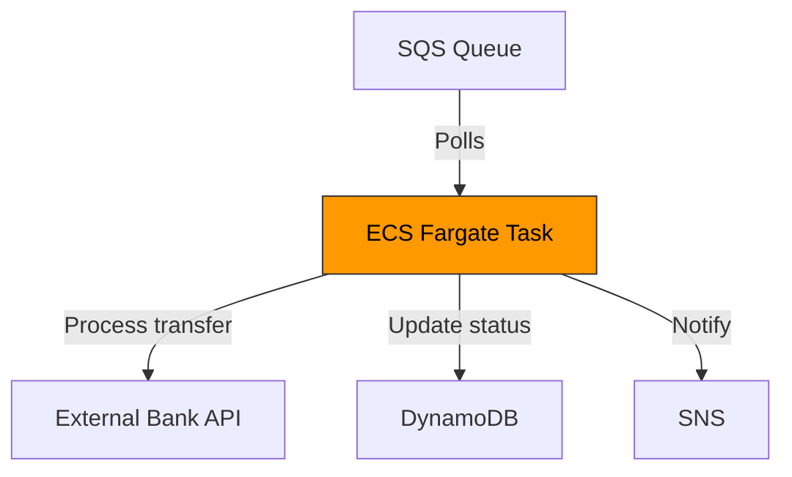

---

## 17. Secrets Manager & Parameter Store

### The Problem

Never hardcode secrets:

```javascript
// ❌ BAD — secret in code
const JWT_SECRET = "fx-quote-local-dev-secret";

// ✅ GOOD — secret from environment
const JWT_SECRET = process.env.JWT_SECRET;
```

### Secrets Manager vs Parameter Store

| Feature       | Secrets Manager                              | Parameter Store (SSM)        |
| ------------- | -------------------------------------------- | ---------------------------- |
| Auto-rotation | Yes (e.g., rotate DB password every 30 days) | No                           |
| Encryption    | Always encrypted                             | Optional (SecureString)      |
| Pricing       | $0.40/secret/month                           | Free (standard tier)         |
| Best for      | DB passwords, API keys                       | Config values, feature flags |

### FX Service Secrets

| Secret                   | Store In        | Current (Local)            |
| ------------------------ | --------------- | -------------------------- |
| JWT signing secret       | Secrets Manager | Hardcoded in tokenUtils.js |
| Database password        | Secrets Manager | N/A (in-memory store)      |
| API rate limit config    | Parameter Store | N/A                        |
| FX rate provider API key | Secrets Manager | Static rates in fxRates.js |

### Accessing Secrets in Lambda

```javascript
const { SecretsManager } = require("aws-sdk");
const client = new SecretsManager();

// Cache the secret outside the handler (reused across warm invocations)
let cachedSecret;

async function getJwtSecret() {
  if (cachedSecret) return cachedSecret;
  const result = await client
    .getSecretValue({
      SecretId: "fx-quote/jwt-secret",
    })
    .promise();
  cachedSecret = result.SecretString;
  return cachedSecret;
}
```

---

## 18. CloudFormation vs Terraform

### Infrastructure as Code (IaC)

Both let you define AWS resources in code instead of clicking through the console.

| Feature         | CloudFormation | Terraform                    |
| --------------- | -------------- | ---------------------------- |
| Provider        | AWS only       | AWS, Azure, GCP, and 1000+   |
| Language        | JSON / YAML    | HCL (HashiCorp Language)     |
| State           | Managed by AWS | You manage (S3 + DynamoDB)   |
| Drift detection | Built-in       | `terraform plan` shows drift |
| Learning curve  | Medium         | Medium                       |
| Community       | AWS-focused    | Massive, multi-cloud         |

> We cover Terraform in detail in the [Terraform Guide](TERRAFORM_GUIDE.md).

---

## 19. Cost Management & Free Tier

### Free Tier Essentials

| Service     | Free Tier (12 months)                             |
| ----------- | ------------------------------------------------- |
| Lambda      | 1M requests + 400K GB-sec/month (always free)     |
| DynamoDB    | 25 GB + 25 read/write capacity (always free)      |
| API Gateway | 1M HTTP API calls/month (12 months)               |
| S3          | 5 GB storage (12 months)                          |
| EC2         | 750 hrs t2.micro/month (12 months)                |
| RDS         | 750 hrs db.t2.micro + 20 GB (12 months)           |
| CloudWatch  | 10 metrics, 10 alarms, 1M API calls (always free) |
| Cognito     | 50,000 MAUs (always free)                         |

### Cost Estimation for FX Service

At 10,000 API calls/month:

```
Lambda:       10K invocations @ 256MB, 200ms avg    = $0.00  (free tier)
API Gateway:  10K HTTP API calls                     = $0.00  (free tier)
DynamoDB:     10K writes + 30K reads                 = $0.00  (free tier)
Cognito:      100 users                              = $0.00  (free tier)
CloudWatch:   Logs + 5 metrics                       = $0.00  (free tier)
─────────────────────────────────────────────────────────
Total:                                                 $0.00/month
```

### Budget Alerts

Always set a billing alarm:

1. Go to **AWS Budgets**
2. Create a **Cost Budget**: $5/month
3. Alert at 80% ($4) and 100% ($5)

---

## 20. Putting It Together — FX Service on AWS

### Production Architecture

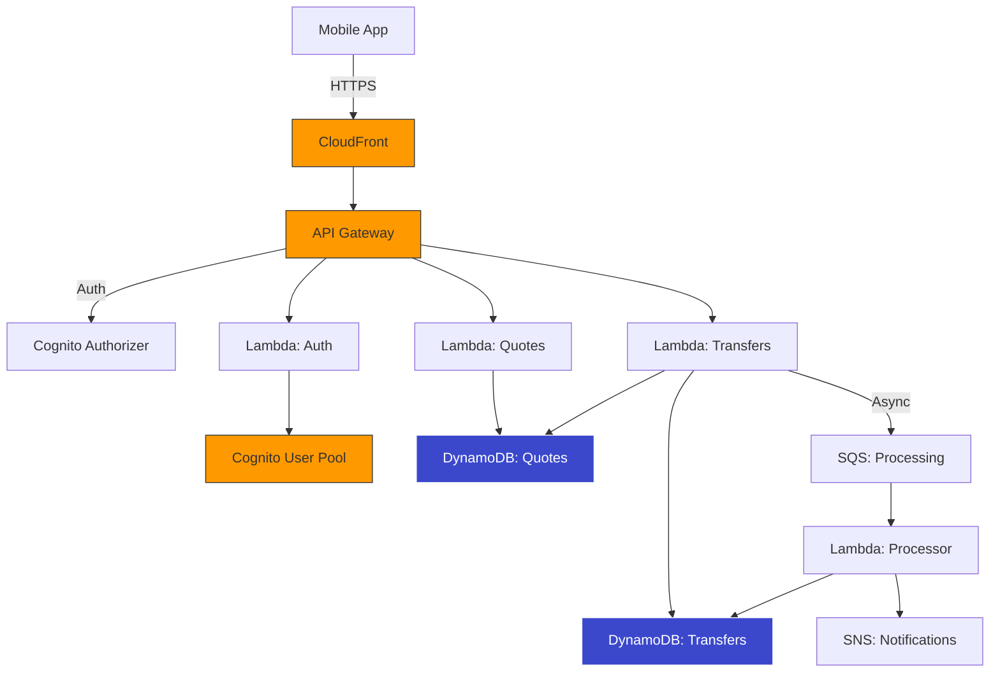

### Local → AWS Migration Path

| Local Component      | AWS Replacement       | Effort |
| -------------------- | --------------------- | ------ |
| Express server.js    | API Gateway           | Low    |
| In-memory Maps       | DynamoDB tables       | Medium |
| bcrypt + JWT auth    | Cognito User Pool     | Medium |
| authMiddleware.js    | Cognito Authorizer    | Low    |
| console.log          | CloudWatch Logs       | None   |
| hardcoded JWT secret | Secrets Manager       | Low    |
| localhost:3000       | CloudFront + Route 53 | Low    |

### Next Steps

1. ✅ You are here — running locally
2. 📖 Learn Terraform → See [TERRAFORM_GUIDE.md](TERRAFORM_GUIDE.md)
3. 🚀 Deploy to AWS with Terraform
4. 🔒 Replace mock auth with real Cognito
5. 💾 Replace Maps with DynamoDB
6. 📊 Add CloudWatch dashboards
