# FX Quote Service — Learning Guide

A structured, course-like walkthrough of every concept used in this project. Each topic is self-contained so you can study them in order or jump to what you need.

---

## Table of Contents

1. [Course Overview](#1-course-overview)
2. [Node.js Fundamentals for Backend](#2-nodejs-fundamentals-for-backend)
3. [AWS Lambda — Concepts & Local Simulation](#3-aws-lambda--concepts--local-simulation)
4. [Clean Architecture — Layered Backend Design](#4-clean-architecture--layered-backend-design)
5. [REST API Design & HTTP Status Codes](#5-rest-api-design--http-status-codes)
6. [Input Validation & Error Handling](#6-input-validation--error-handling)
7. [OpenAPI 3.0 — Designing an API Contract](#7-openapi-30--designing-an-api-contract)
8. [Unit Testing with Jest](#8-unit-testing-with-jest)
9. [React Native & Expo — Mobile Fundamentals](#9-react-native--expo--mobile-fundamentals)
10. [State Management Without Redux](#10-state-management-without-redux)
11. [Connecting Frontend to Backend — HTTP Clients](#11-connecting-frontend-to-backend--http-clients)
12. [FX Domain Knowledge — Rates, Fees, Quotes](#12-fx-domain-knowledge--rates-fees-quotes)
13. [Authentication — JWT & Mocked AWS Cognito](#13-authentication--jwt--mocked-aws-cognito)
14. [Middleware — Protecting Routes](#14-middleware--protecting-routes)
15. [Transfers — State Machines & Entity Relationships](#15-transfers--state-machines--entity-relationships)
16. [React Navigation — Multi-Screen Apps](#16-react-navigation--multi-screen-apps)
17. [Project Workflow — Putting It All Together](#17-project-workflow--putting-it-all-together)

---

## 1. Course Overview

### What You'll Build

A money transfer quote system with three layers:

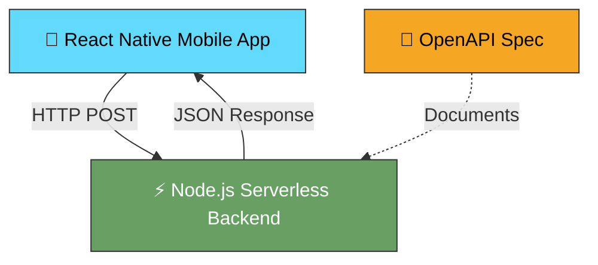

### What You'll Learn

| Topic               | Why It Matters                                                      |
| ------------------- | ------------------------------------------------------------------- |
| AWS Lambda pattern  | How serverless functions work — without needing an AWS account      |
| Clean architecture  | Separating handlers, services, and data layers                      |
| REST API design     | Proper HTTP methods, status codes, request/response contracts       |
| OpenAPI specs       | Documenting APIs so any team can consume them                       |
| Jest testing        | Writing reliable, automated tests for business logic                |
| Auth & JWT          | User registration, login, and token-based authentication            |
| Cognito mock        | Simulating AWS Cognito locally without an AWS account               |
| Middleware          | Protecting routes with token verification (Lambda Authorizer style) |
| React Native + Expo | Building cross-platform mobile UIs                                  |
| React Navigation    | Multi-screen navigation with auth-gated flows                       |
| State management    | Managing loading, error, and success states without heavy libraries |

### Prerequisites

- Basic JavaScript knowledge (functions, objects, async/await)
- Node.js and npm installed
- A code editor (VS Code recommended)
- Expo Go app on your phone (optional, for mobile testing)

---

## 2. Node.js Fundamentals for Backend

### What Is Node.js?

Node.js lets you run JavaScript outside the browser — on a server, in a script, or as a serverless function. It uses an **event-driven, non-blocking I/O** model, which makes it efficient for network applications.

### Modules — How Code Is Organized

Node.js uses **CommonJS modules** (the `require` / `module.exports` pattern):

```js
// greet.js — exporting a function
function greet(name) {
  return `Hello, ${name}!`;
}

module.exports = { greet };
```

```js
// app.js — importing and using it
const { greet } = require("./greet");

console.log(greet("World")); // "Hello, World!"
```

**Key rule:** Each file is a module. You explicitly choose what to expose via `module.exports`.

### In This Project

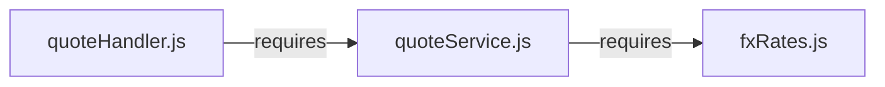

- `fxRates.js` exports rate data
- `quoteService.js` imports rates and exports business logic
- `quoteHandler.js` imports the service and exports the Lambda handler

### npm & package.json

`package.json` is the manifest for a Node.js project. It declares:

```json
{
  "name": "fx-quote-backend",
  "scripts": {
    "test": "jest --verbose"
  },
  "devDependencies": {
    "jest": "^29.7.0"
  }
}
```

| Field             | Purpose                                                     |
| ----------------- | ----------------------------------------------------------- |
| `name`            | Project identifier                                          |
| `scripts`         | Shortcuts — `npm test` runs `jest --verbose`                |
| `devDependencies` | Packages needed only during development (not in production) |

Run `npm install` to download dependencies into `node_modules/`.

---

## 3. AWS Lambda — Concepts & Local Simulation

### What Is AWS Lambda?

AWS Lambda is a **serverless compute service**. You upload a function, and AWS runs it in response to events (HTTP requests, queue messages, timers, etc.). You don't manage servers.

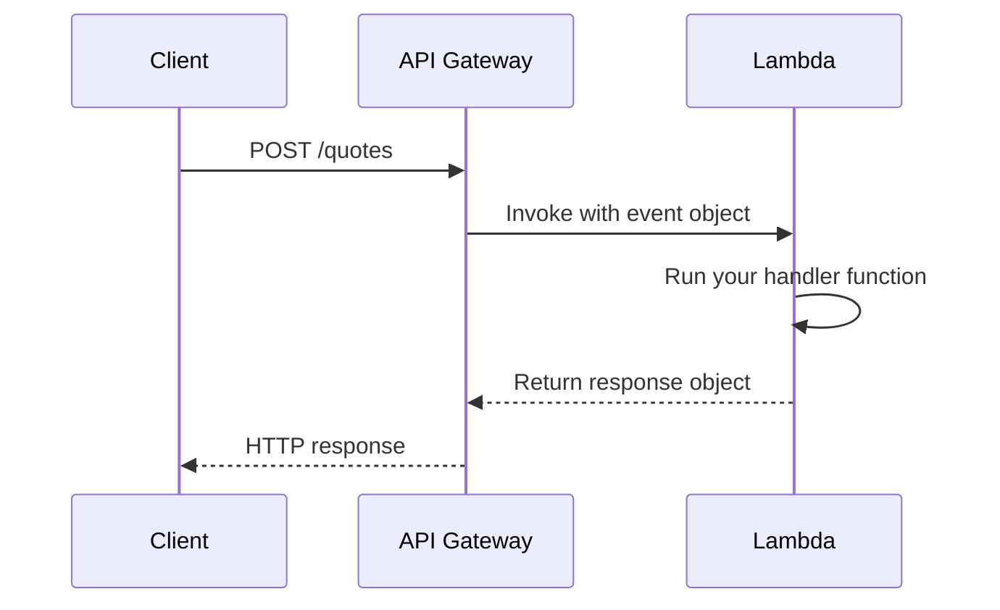

### The Lambda Handler Pattern

Every Lambda function has a **handler** — a function with a specific signature:

```js
exports.handler = async (event) => {
  // event contains the request data
  // You must return a response object
  return {
    statusCode: 200,
    headers: { "Content-Type": "application/json" },
    body: JSON.stringify({ message: "Hello" }),
  };
};
```

#### The `event` Object

When triggered by API Gateway, `event` contains:

| Property                      | What It Holds                           |
| ----------------------------- | --------------------------------------- |
| `event.body`                  | The raw JSON string of the request body |
| `event.httpMethod`            | `"GET"`, `"POST"`, etc.                 |
| `event.headers`               | HTTP headers as key-value pairs         |
| `event.pathParameters`        | URL path parameters                     |
| `event.queryStringParameters` | URL query string parameters             |

#### The Response Object

Lambda must return an object with this shape:

```js
{
  statusCode: 200,               // HTTP status code (number)
  headers: { ... },              // Response headers (object)
  body: JSON.stringify({ ... })  // Response body (must be a string)
}
```

> **Important:** `body` must be a **string**, not an object. Always `JSON.stringify()` it.

### Why We Mock It Locally

Real Lambda requires:

- An AWS account
- IAM roles and permissions
- API Gateway configuration
- Deployment tooling (SAM, Serverless Framework, etc.)

**Our approach:** We write the handler with the exact same signature. We test it by passing a fake `event` object. The code is **deploy-ready** for real Lambda when you're ready.

### How to Invoke Locally

```js
const { handler } = require("./handlers/quoteHandler");

// Simulate an API Gateway event
const mockEvent = {
  body: JSON.stringify({ amount: 100, currency: "EUR" }),
};

handler(mockEvent).then((response) => {
  console.log(response.statusCode); // 200
  console.log(JSON.parse(response.body)); // Quote object
});
```

This is exactly what AWS would do — but on your machine.

---

## 4. Clean Architecture — Layered Backend Design

### The Problem With Putting Everything in One File

```js
// ❌ Bad: all logic in the handler
exports.handler = async (event) => {
  const { amount, currency } = JSON.parse(event.body);
  // validation here...
  // rate lookup here...
  // fee calculation here...
  // response formatting here...
  return { statusCode: 200, body: JSON.stringify(result) };
};
```

This is hard to test, hard to read, and hard to change.

### The Solution: Separation of Concerns

Split code into layers, each with a **single responsibility**:

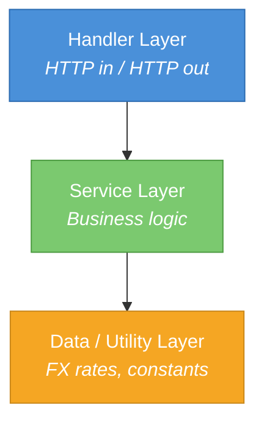

| Layer       | File              | Responsibility                                    | Knows About HTTP? |
| ----------- | ----------------- | ------------------------------------------------- | ----------------- |
| **Handler** | `quoteHandler.js` | Parse request, call service, format HTTP response | ✅ Yes            |
| **Service** | `quoteService.js` | Calculate quote (pure business logic)             | ❌ No             |
| **Utility** | `fxRates.js`      | Provide raw data (rates, fees)                    | ❌ No             |

### Why This Matters

- **Testability:** You can test `quoteService.js` without simulating HTTP events.
- **Reusability:** The service can be called from a CLI tool, a different handler, or a scheduled job.
- **Readability:** Each file is small and focused.
- **Changeability:** Want to fetch rates from an API instead of a static table? Only `fxRates.js` changes.

### The Pattern in Practice

```js
// Handler — thin, only deals with HTTP
exports.handler = async (event) => {
  const body = JSON.parse(event.body);
  const quote = calculateQuote(body.amount, body.currency);
  return { statusCode: 200, body: JSON.stringify(quote) };
};

// Service — pure logic, no HTTP awareness
function calculateQuote(amount, currency) {
  const { rate, fee } = getRate(currency, "TND");
  return {
    sourceAmount: amount,
    convertedAmount: (amount - fee) * rate,
    // ...
  };
}

// Utility — raw data
function getRate(from, to) {
  return rates[`${from}_${to}`]; // { rate: 3.35, fee: 2.5 }
}
```

---

## 5. REST API Design & HTTP Status Codes

### What Is REST?

REST (Representational State Transfer) is an architectural style for APIs. Core ideas:

| Principle        | Meaning                                                     |
| ---------------- | ----------------------------------------------------------- |
| **Resources**    | Everything is a "resource" identified by a URL (`/quotes`)  |
| **HTTP Methods** | Use verbs to express intent (`GET` = read, `POST` = create) |
| **Stateless**    | Each request contains all the information the server needs  |
| **JSON**         | Standard data format for request/response bodies            |

### Our Endpoint

```
POST /quotes
```

- **POST** because we're _creating_ a new quote (not reading an existing one).
- **`/quotes`** is the resource (a collection of quotes).

### HTTP Status Codes You Must Know

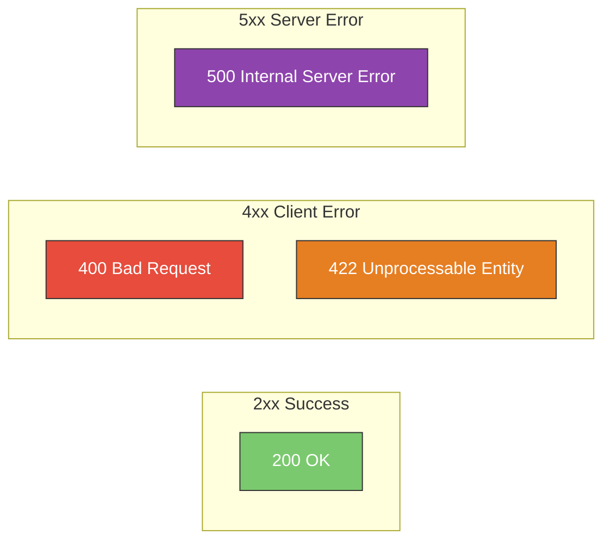

| Code    | Name                  | When to Use                                                                             |
| ------- | --------------------- | --------------------------------------------------------------------------------------- |
| **200** | OK                    | Request succeeded, here's the result                                                    |
| **400** | Bad Request           | Request is malformed (missing fields, bad JSON syntax)                                  |
| **422** | Unprocessable Entity  | Request is well-formed but fails business rules (negative amount, unsupported currency) |
| **500** | Internal Server Error | Something unexpected broke on the server side                                           |

### 400 vs 422 — The Distinction

This is a common source of confusion:

- **400:** "I can't even parse what you sent me."
  - Missing `Content-Type` header
  - Invalid JSON: `{ amount: }` (syntax error)
  - Missing required fields

- **422:** "I understood your request, but it doesn't make business sense."
  - `amount: -50` (negative)
  - `currency: "XYZ"` (unsupported)
  - `amount: 0` (zero transfer)

### Response Shape Consistency

Always return the same JSON shape for errors:

```json
{
  "error": "Amount must be a positive number"
}
```

This lets the mobile app handle all errors the same way:

```js
if (response.error) {
  showError(response.error);
}
```

---

## 6. Input Validation & Error Handling

### Why Validate?

The backend is a **trust boundary**. Never assume the client sends correct data. Even your own mobile app might have bugs.

### Validation Strategy

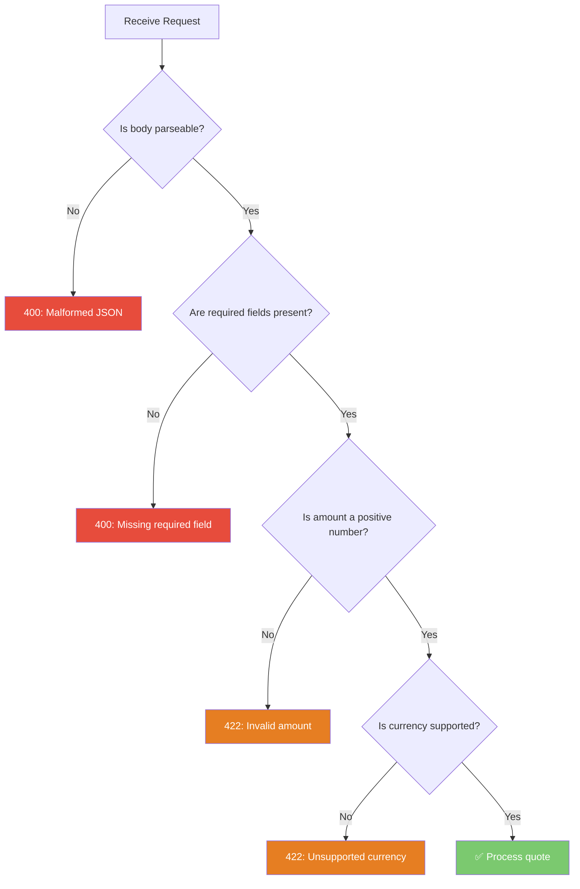

### Two Levels of Validation

**1. Structural validation (→ 400)** — Is the data shape correct?

```js
function parseRequestBody(rawBody) {
  if (!rawBody) throw { status: 400, message: "Request body is required" };

  let body;
  try {
    body = JSON.parse(rawBody);
  } catch {
    throw { status: 400, message: "Invalid JSON" };
  }

  if (body.amount === undefined) {
    throw { status: 400, message: "Missing required field: amount" };
  }
  if (body.currency === undefined) {
    throw { status: 400, message: "Missing required field: currency" };
  }

  return body;
}
```

**2. Business validation (→ 422)** — Does the data make domain sense?

```js
function validateQuoteRequest(amount, currency) {
  if (typeof amount !== "number" || amount <= 0) {
    throw { status: 422, message: "Amount must be a positive number" };
  }
  if (!supportedCurrencies.includes(currency)) {
    throw { status: 422, message: `Unsupported currency: ${currency}` };
  }
}
```

### Centralized Error Handling in the Handler

```js
exports.handler = async (event) => {
  try {
    // ... parse, validate, compute
    return { statusCode: 200, body: JSON.stringify(quote) };
  } catch (err) {
    const status = err.status || 500;
    const message = err.message || "Internal server error";
    return { statusCode: status, body: JSON.stringify({ error: message }) };
  }
};
```

The `try/catch` at the handler level catches all thrown errors and maps them to proper HTTP responses. The service layer just **throws** — it doesn't know about HTTP.

---

## 7. OpenAPI 3.0 — Designing an API Contract

### What Is OpenAPI?

OpenAPI (formerly Swagger) is a **standard format** for describing REST APIs. It's a YAML or JSON file that defines:

- Endpoints (paths and HTTP methods)
- Request and response schemas
- Error codes
- Data types and validation rules

### Why Write a Spec?

| Benefit             | Explanation                                        |
| ------------------- | -------------------------------------------------- |
| **Documentation**   | Auto-generate beautiful API docs                   |
| **Contract-first**  | Frontend and backend agree on shape before coding  |
| **Code generation** | Generate client SDKs, server stubs, mock servers   |
| **Validation**      | Tools can verify requests/responses match the spec |

### Anatomy of an OpenAPI Spec

```yaml
openapi: 3.0.3 # Spec version
info:
  title: FX Quote API # API name
  version: 1.0.0 # Your API version

paths: # All endpoints
  /quotes: # One endpoint
    post: # HTTP method
      summary: Create a quote
      requestBody: # What the client sends
        required: true
        content:
          application/json:
            schema:
              $ref: "#/components/schemas/QuoteRequest"
      responses: # What the server returns
        "200":
          description: Quote created
          content:
            application/json:
              schema:
                $ref: "#/components/schemas/QuoteResponse"

components: # Reusable definitions
  schemas:
    QuoteRequest:
      type: object
      required: [amount, currency]
      properties:
        amount:
          type: number
          minimum: 0.01
        currency:
          type: string
          enum: [EUR, USD, GBP]
```

### Key Concepts

| Concept              | Purpose                                          |
| -------------------- | ------------------------------------------------ |
| `paths`              | Define your endpoints and methods                |
| `requestBody`        | Describe what the client sends                   |
| `responses`          | Describe every possible response (200, 400, 422) |
| `components/schemas` | Reusable data type definitions (DRY)             |
| `$ref`               | Reference a schema defined elsewhere             |
| `enum`               | Restrict a field to specific allowed values      |
| `required`           | List which fields must be present                |

### How to Use It

1. **Read it** — Open in [Swagger Editor](https://editor.swagger.io/) for a visual view
2. **Share it** — Give to frontend devs so they know the exact contract
3. **Validate against it** — Use tools to verify your implementation matches

---

## 8. Unit Testing with Jest

### What Is Jest?

Jest is a JavaScript testing framework. It provides:

- A test runner (finds and executes test files)
- Assertions (`expect(...).toBe(...)`)
- Mocking utilities
- Code coverage reports

### The Basics

```js
// A simple test
test("adds 1 + 2 to equal 3", () => {
  expect(1 + 2).toBe(3);
});
```

### Structure of a Test File

```js
const { calculateQuote } = require("../services/quoteService");

describe("calculateQuote", () => {
  test("returns correct quote for EUR", () => {
    const quote = calculateQuote(100, "EUR");

    expect(quote.sourceAmount).toBe(100);
    expect(quote.fxRate).toBe(3.35);
    expect(quote.fee).toBe(2.5);
    expect(quote.convertedAmount).toBe(326.625);
  });

  test("throws for unsupported currency", () => {
    expect(() => calculateQuote(100, "XYZ")).toThrow();
  });
});
```

### Key Concepts

| Concept          | Syntax                     | Purpose                            |
| ---------------- | -------------------------- | ---------------------------------- |
| `describe`       | `describe('name', fn)`     | Groups related tests               |
| `test` / `it`    | `test('name', fn)`         | Defines a single test case         |
| `expect`         | `expect(value)`            | Creates an assertion               |
| `.toBe()`        | `expect(a).toBe(b)`        | Strict equality (`===`)            |
| `.toEqual()`     | `expect(a).toEqual(b)`     | Deep equality (for objects/arrays) |
| `.toThrow()`     | `expect(fn).toThrow()`     | Asserts a function throws an error |
| `.toBeCloseTo()` | `expect(a).toBeCloseTo(b)` | Floating-point comparison          |

### Arrange-Act-Assert (AAA) Pattern

Every good test follows three steps:

```js
test("calculates converted amount correctly", () => {
  // Arrange — set up inputs
  const amount = 100;
  const currency = "EUR";

  // Act — call the function
  const quote = calculateQuote(amount, currency);

  // Assert — check the result
  expect(quote.convertedAmount).toBe(326.625);
});
```

### What to Test in This Project

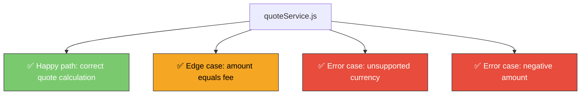

### Running Tests

```bash
cd backend
npm test
```

Jest auto-discovers files matching `*.test.js` or inside `__tests__/` folders.

---

## 9. React Native & Expo — Mobile Fundamentals

### What Is React Native?

React Native lets you build **native mobile apps** using JavaScript and React. The UI renders to real native components (not a webview).

### What Is Expo?

Expo is a **toolchain** built around React Native that simplifies development:

| Feature          | Without Expo            | With Expo             |
| ---------------- | ----------------------- | --------------------- |
| Project setup    | Complex native config   | `npx create-expo-app` |
| Running on phone | Build & install APK/IPA | Scan QR with Expo Go  |
| Native modules   | Manual linking          | Pre-configured        |
| Hot reload       | Manual setup            | Built-in              |

### Core React Native Concepts

#### Components

Everything is a **component** — a function that returns UI:

```jsx
import { Text, View } from "react-native";

function QuoteResult({ quote }) {
  return (
    <View>
      <Text>You receive: {quote.convertedAmount} TND</Text>
    </View>
  );
}
```

#### Core UI Components

| Component             | Purpose              | HTML Equivalent |
| --------------------- | -------------------- | --------------- |
| `<View>`              | Container / layout   | `<div>`         |
| `<Text>`              | Display text         | `<p>`, `<span>` |
| `<TextInput>`         | User input field     | `<input>`       |
| `<TouchableOpacity>`  | Tappable button      | `<button>`      |
| `<ActivityIndicator>` | Loading spinner      | —               |
| `<ScrollView>`        | Scrollable container | —               |

#### Styling

React Native uses **JavaScript objects** for styles (not CSS):

```js
import { StyleSheet } from "react-native";

const styles = StyleSheet.create({
  container: {
    flex: 1,
    padding: 20,
    backgroundColor: "#fff",
  },
  title: {
    fontSize: 24,
    fontWeight: "bold",
    marginBottom: 16,
  },
});
```

Key differences from CSS:

- `camelCase` property names (`backgroundColor`, not `background-color`)
- No units — numbers are density-independent pixels
- Flexbox is the default layout model (`flexDirection: 'column'` by default)

### In This Project

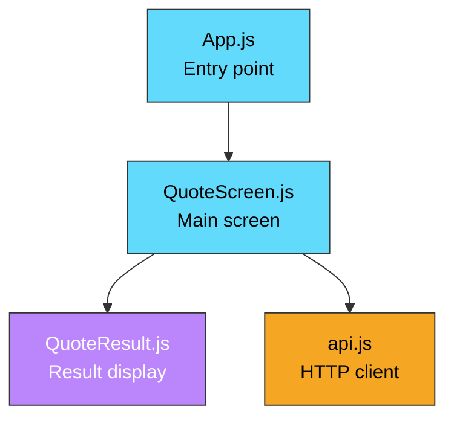

---

## 10. State Management Without Redux

### The `useState` Hook

React's built-in `useState` is all we need for this app:

```js
const [amount, setAmount] = useState("");
const [quote, setQuote] = useState(null);
const [loading, setLoading] = useState(false);
const [error, setError] = useState(null);
```

Each call creates a piece of state and a function to update it.

### Managing UI States

Our screen has four possible states:

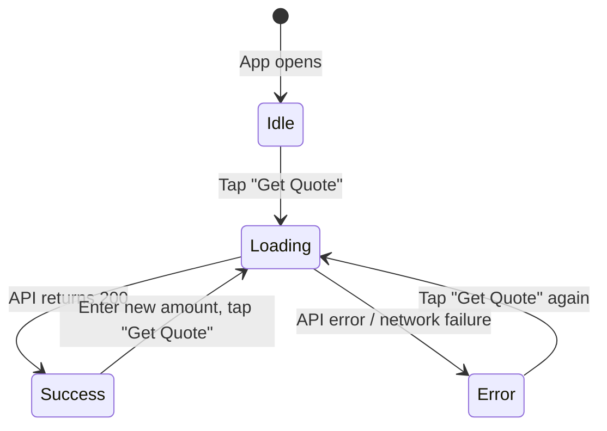

In code:

```jsx
function QuoteScreen() {
  const [amount, setAmount] = useState("");
  const [quote, setQuote] = useState(null); // null = idle
  const [loading, setLoading] = useState(false); // true = loading
  const [error, setError] = useState(null); // string = error

  const handleGetQuote = async () => {
    setLoading(true);
    setError(null);

    try {
      const result = await fetchQuote(amount);
      setQuote(result);
    } catch (err) {
      setError(err.message);
    } finally {
      setLoading(false);
    }
  };

  return (
    <View>
      {loading && <ActivityIndicator />}
      {error && <Text style={styles.error}>{error}</Text>}
      {quote && <QuoteResult quote={quote} />}
    </View>
  );
}
```

### Why Not Redux?

| Factor            | Our App              | When You'd Need Redux             |
| ----------------- | -------------------- | --------------------------------- |
| Number of screens | 1                    | 10+ with shared state             |
| State complexity  | 4 simple values      | Deeply nested, relational data    |
| Data sharing      | None (single screen) | Many components need same data    |
| Async flows       | One API call         | Complex sagas, optimistic updates |

**Rule of thumb:** Start with `useState`. Add complexity only when you feel pain.

---

## 11. Connecting Frontend to Backend — HTTP Clients

### The `fetch` API

React Native includes the `fetch` API (same as browsers):

```js
const response = await fetch("https://api.example.com/quotes", {
  method: "POST",
  headers: { "Content-Type": "application/json" },
  body: JSON.stringify({ amount: 100, currency: "EUR" }),
});

const data = await response.json();
```

### Structuring the API Layer

Keep HTTP calls in a dedicated file (`services/api.js`), not in your components:

```js
// services/api.js
const API_BASE_URL = "http://localhost:3000";

async function fetchQuote(amount, currency = "EUR") {
  const response = await fetch(`${API_BASE_URL}/quotes`, {
    method: "POST",
    headers: { "Content-Type": "application/json" },
    body: JSON.stringify({ amount: Number(amount), currency }),
  });

  const data = await response.json();

  if (!response.ok) {
    throw new Error(data.error || "Something went wrong");
  }

  return data;
}
```

### Why Separate the API Layer?

| Benefit                    | Explanation                                             |
| -------------------------- | ------------------------------------------------------- |
| **Single source of truth** | Base URL configured in one place                        |
| **Reusability**            | Any screen can call `fetchQuote()`                      |
| **Testability**            | Mock the API module in tests                            |
| **Swappability**           | Switch from `fetch` to `axios` without touching screens |

### Error Handling Flow

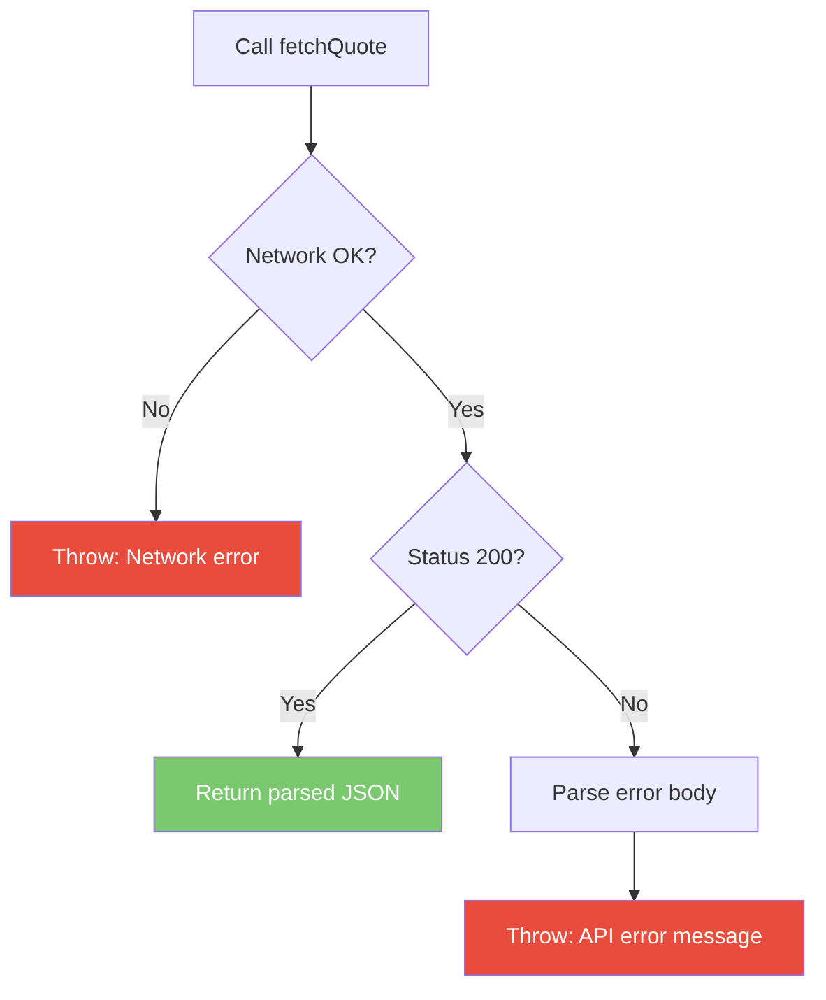

> **Important:** `fetch` does **not** throw on 4xx/5xx status codes. You must check `response.ok` yourself.

---

## 12. FX Domain Knowledge — Rates, Fees, Quotes

### What Is an FX Quote?

An FX (foreign exchange) quote tells the user: _"If you send X in currency A, the recipient gets Y in currency B."_

### The Components


### The Formula

$$\text{convertedAmount} = (\text{sourceAmount} - \text{fee}) \times \text{fxRate}$$

### Glossary

| Term                   | Definition                                                                |
| ---------------------- | ------------------------------------------------------------------------- |
| **Source currency**    | The currency the sender pays in (EUR)                                     |
| **Target currency**    | The currency the recipient receives (TND)                                 |
| **FX rate**            | The exchange rate between source and target (3.35 means 1 EUR = 3.35 TND) |
| **Fee**                | A flat charge deducted from the source amount before conversion           |
| **Converted amount**   | The final amount the recipient receives                                   |
| **Estimated delivery** | How long the transfer takes                                               |

### Example Walkthrough

| Step                      | Calculation  | Result                     |
| ------------------------- | ------------ | -------------------------- |
| **1.** User enters amount | —            | 100 EUR                    |
| **2.** Deduct fee         | 100 − 2.50   | 97.50 EUR                  |
| **3.** Apply FX rate      | 97.50 × 3.35 | 326.625 TND                |
| **4.** Return quote       | —            | Recipient gets 326.625 TND |

### Real-World Considerations (Not In Our Demo)

In production, FX systems also handle:

- **Rate expiry** — Quotes are valid for a limited time (e.g. 30 seconds)
- **Tiered fees** — Fee varies by amount, currency corridor, or customer tier
- **Spread** — The markup built into the displayed rate vs. the interbank rate
- **Compliance** — KYC/AML checks before allowing a transfer
- **Idempotency** — Preventing duplicate quote creation

---

## 13. Authentication — JWT & Mocked AWS Cognito

### What Is AWS Cognito?

AWS Cognito is a managed **user directory and authentication service**. It handles:

- User registration (sign-up)
- User login (authentication)
- Token issuance (JWT access/ID tokens)
- Password hashing and storage
- Token refresh and expiry

### How Cognito Works (Simplified)

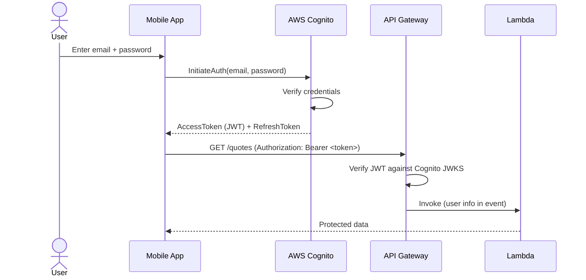

### How We Mock It Locally

We replicate the same flow without AWS:

| Real Cognito             | Our Mock                    | File                           |
| ------------------------ | --------------------------- | ------------------------------ |
| User Pool (stores users) | In-memory Map               | `store/userStore.js`           |
| SignUp API               | `register()` with bcrypt    | `services/authService.js`      |
| InitiateAuth API         | `login()` returns JWT       | `services/authService.js`      |
| JWT signed with RSA      | JWT signed with HMAC secret | `utils/tokenUtils.js`          |
| API Gateway Authorizer   | `authenticate()` middleware | `middleware/authMiddleware.js` |

### JWT (JSON Web Token)

A JWT is a digitally signed JSON payload. It has three parts:

```
header.payload.signature
```

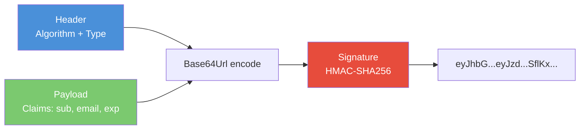

#### Key Claims (Payload Fields)

| Claim       | Meaning                            | Example              |
| ----------- | ---------------------------------- | -------------------- |
| `sub`       | Subject — unique user ID           | `"a1b2c3-d4e5"`      |
| `email`     | User's email                       | `"user@example.com"` |
| `token_use` | Token purpose (Cognito convention) | `"access"`           |
| `iat`       | Issued at (Unix timestamp)         | `1709856000`         |
| `exp`       | Expiry (Unix timestamp)            | `1709859600`         |

### Password Hashing with bcrypt

Never store plain-text passwords. bcrypt:

1. Generates a random **salt**
2. Hashes the password + salt through multiple rounds
3. Produces a fixed-length hash that includes the salt

```js
const bcrypt = require("bcryptjs");

// Registration — hash the password
const hashed = await bcrypt.hash("mypassword", 10); // 10 salt rounds

// Login — compare plain text to stored hash
const isValid = await bcrypt.compare("mypassword", hashed); // true
```

The `10` is the **cost factor** — higher = slower = more secure against brute force.

### Token Flow in Our Project

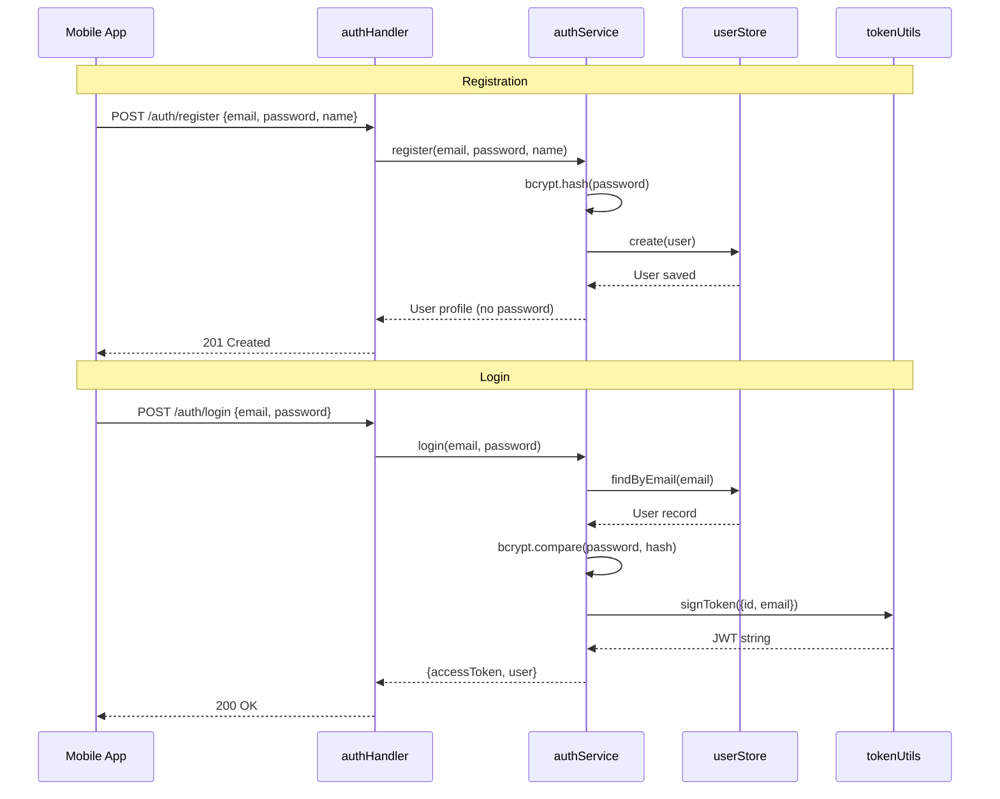

---

## 14. Middleware — Protecting Routes

### What Is Middleware?

Middleware is code that runs **between** receiving a request and executing the main handler logic. In our case, it verifies the JWT before allowing access to protected endpoints.

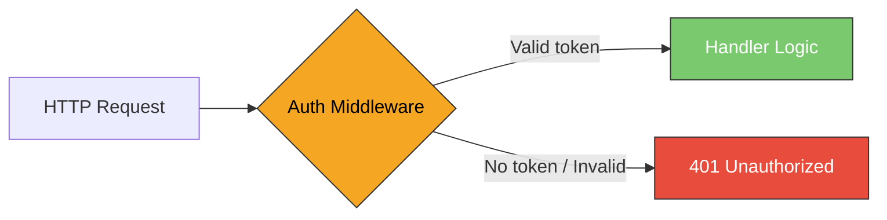

### Lambda Authorizer (What Cognito Uses)

In real AWS, API Gateway has a **Lambda Authorizer** that:

1. Intercepts the request before it reaches your handler
2. Extracts the `Authorization: Bearer <token>` header
3. Verifies the JWT against Cognito's public keys (JWKS)
4. Injects the decoded user info into the Lambda event
5. Returns `Allow` or `Deny`

### Our Local Implementation

We do the same thing as a function:

```js
const { verifyToken } = require("../utils/tokenUtils");

function authenticate(event) {
  // 1. Extract the Authorization header
  const authHeader = event.headers?.Authorization;

  // 2. Validate format: "Bearer <token>"
  const parts = authHeader.split(" ");
  if (parts.length !== 2 || parts[0] !== "Bearer") {
    throw { status: 401, message: "Invalid format" };
  }

  // 3. Verify the JWT signature and expiry
  const decoded = verifyToken(parts[1]);

  // 4. Return user info (like Cognito would inject)
  return { userId: decoded.sub, email: decoded.email };
}
```

### Public vs Protected Endpoints

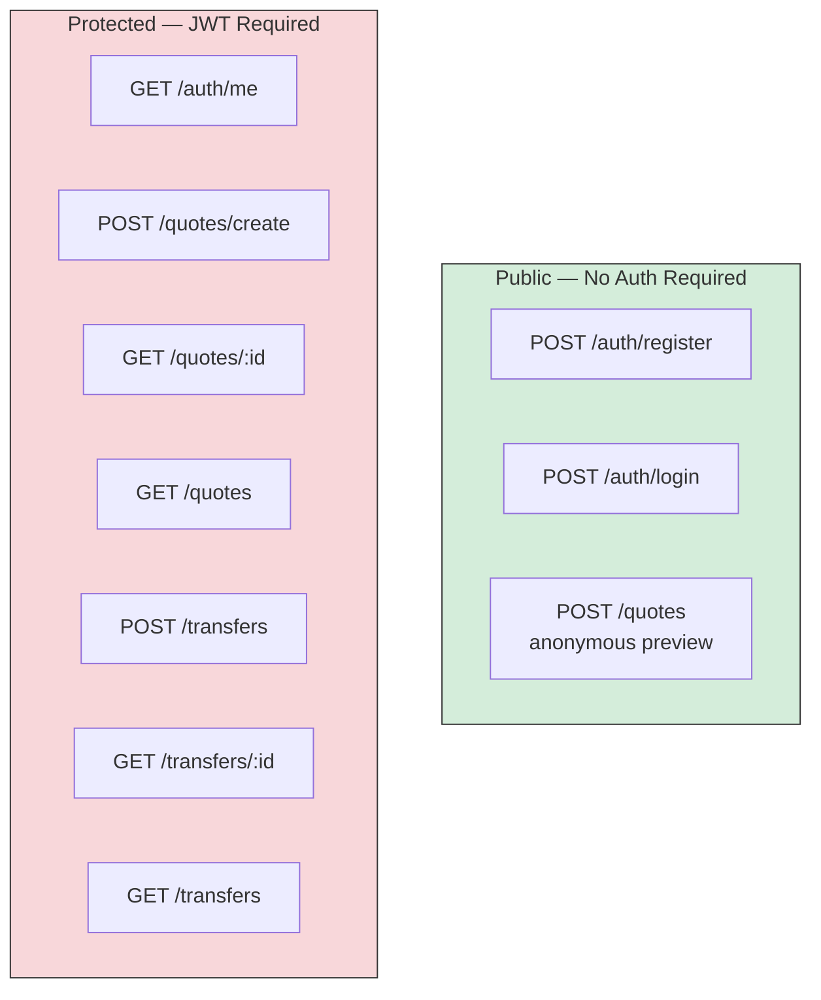

Protected handlers start with:

```js
async function createQuoteHandler(event) {
  const user = authenticate(event); // Throws 401 if invalid
  // ... rest of handler uses user.userId
}
```

### HTTP 401 vs 403

| Code                 | Meaning                                     | When                                  |
| -------------------- | ------------------------------------------- | ------------------------------------- |
| **401** Unauthorized | "I don't know who you are"                  | Missing or invalid token              |
| **403** Forbidden    | "I know who you are, but you can't do this" | Valid token, insufficient permissions |

We use 401 for all auth failures since we don't have role-based permissions.

---

## 15. Transfers — State Machines & Entity Relationships

### The Quote → Transfer Flow

A quote is a **preview**. A transfer is a **commitment**. The user flow:

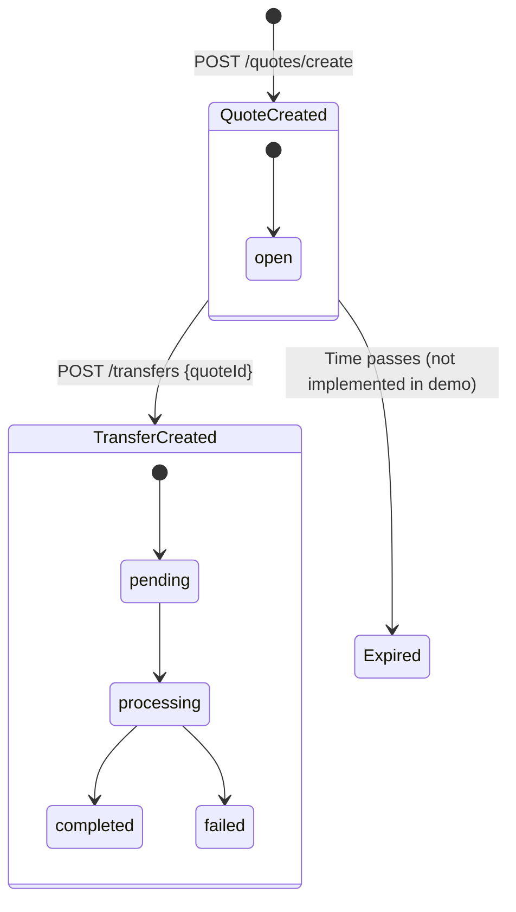

### Entity Relationships

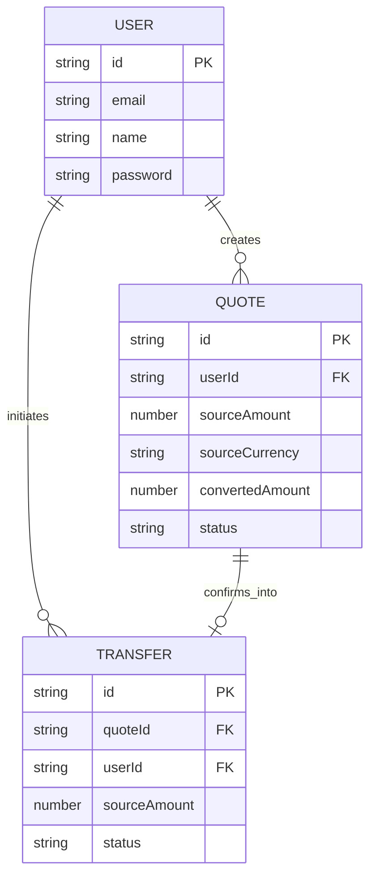

### Preventing Duplicate Transfers (Idempotency)

Once a quote is used, we mark it as `"confirmed"` and reject further attempts:

```js
if (quote.status === "confirmed") {
  throw { status: 409, message: "Quote already used" };
}

quote.status = "confirmed"; // Mark as used
```

**409 Conflict** is the right status code — the request conflicts with the current state of the resource.

### Ownership Checks

Every query includes a user ID check so users can only see their own data:

```js
function getTransfer(transferId, userId) {
  const transfer = transferStore.findById(transferId);

  // Returns 404 (not 403) to avoid leaking existence of other users' data
  if (!transfer || transfer.userId !== userId) {
    throw { status: 404, message: "Transfer not found" };
  }

  return transfer;
}
```

> **Security pattern:** Return 404 instead of 403 for resources owned by other users. This prevents an attacker from discovering valid IDs.

---

## 16. React Navigation — Multi-Screen Apps

### Why Navigation?

Our app now has multiple screens: Login, Register, and the Quote screen. React Navigation handles:

- Stack-based screen transitions
- Conditional rendering based on auth state
- Header management
- Deep linking (optional)

### Installation

```bash
npx expo install @react-navigation/native @react-navigation/native-stack \
  react-native-screens react-native-safe-area-context \
  @react-native-async-storage/async-storage
```

### Auth-Gated Navigation

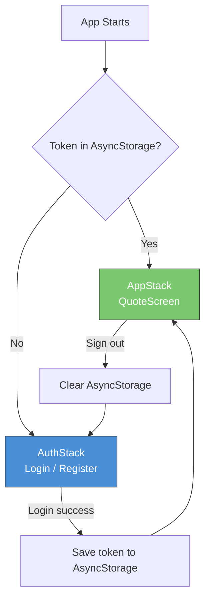

### The Navigation Structure

```jsx
// Two separate stacks based on auth state
function AuthStack() {
  return (
    <Stack.Navigator>
      <Stack.Screen name="Login" component={LoginScreen} />
      <Stack.Screen name="Register" component={RegisterScreen} />
    </Stack.Navigator>
  );
}

function AppStack() {
  return (
    <Stack.Navigator>
      <Stack.Screen name="Quote" component={QuoteScreen} />
    </Stack.Navigator>
  );
}

// Root switches between them
function RootNavigator() {
  const { token, loading } = useAuth();
  if (loading) return <Spinner />;
  return token ? <AppStack /> : <AuthStack />;
}
```

### React Context for Auth State

We use React's built-in Context API to share auth state across all screens:

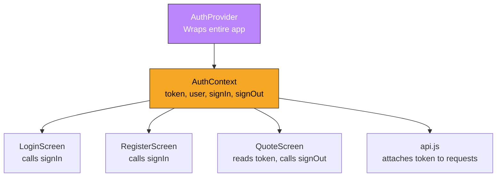

### AsyncStorage — Persisting the Session

AsyncStorage is React Native's equivalent of `localStorage`. We use it so the user stays logged in across app restarts:

```js
import AsyncStorage from "@react-native-async-storage/async-storage";

// Save on login
await AsyncStorage.setItem("token", accessToken);

// Restore on app start
const token = await AsyncStorage.getItem("token");

// Clear on logout
await AsyncStorage.removeItem("token");
```

---

## 17. Project Workflow — Putting It All Together

### Development Order

Build the project in this sequence:

```mermaid
graph TD
    A[1. Define API Contract<br/>openapi/quotes-api.yaml] --> B[2. Build Data Layer<br/>stores + fxRates.js]
    B --> C[3. Build Auth System<br/>authService + tokenUtils]
    C --> D[4. Build Quote Service<br/>quoteService.js]
    D --> E[5. Build Transfer Service<br/>transferService.js]
    E --> F[6. Build Middleware<br/>authMiddleware.js]
    F --> G[7. Build Handlers<br/>auth / quote / transfer]
    G --> H[8. Write Tests<br/>all service tests]
    H --> I[9. Build Mobile Auth<br/>context + login + register]
    I --> J[10. Build Mobile Quote + Transfer<br/>screens + api.js]

    style A fill:#f5a623,stroke:#333,color:#000
    style B fill:#f5a623,stroke:#333,color:#000
    style C fill:#e74c3c,stroke:#333,color:#fff
    style D fill:#7bc96f,stroke:#333,color:#fff
    style E fill:#7bc96f,stroke:#333,color:#fff
    style F fill:#e74c3c,stroke:#333,color:#fff
    style G fill:#4a90d9,stroke:#333,color:#fff
    style H fill:#8e44ad,stroke:#333,color:#fff
    style I fill:#61dafb,stroke:#333,color:#000
    style J fill:#61dafb,stroke:#333,color:#000
```

### Full API Surface

| Endpoint         | Method | Auth | Purpose                     |
| ---------------- | ------ | ---- | --------------------------- |
| `/auth/register` | POST   | No   | Create user account         |
| `/auth/login`    | POST   | No   | Authenticate → get JWT      |
| `/auth/me`       | GET    | Yes  | Get current user profile    |
| `/quotes`        | POST   | No   | Anonymous quote preview     |
| `/quotes/create` | POST   | Yes  | Create & persist a quote    |
| `/quotes/:id`    | GET    | Yes  | Retrieve a saved quote      |
| `/quotes`        | GET    | Yes  | List user's quote history   |
| `/transfers`     | POST   | Yes  | Confirm quote into transfer |
| `/transfers/:id` | GET    | Yes  | Get transfer status         |
| `/transfers`     | GET    | Yes  | List user's transfers       |

### Summary Cheat Sheet

| Concept              | Tool / Pattern                         | File(s)                                                   |
| -------------------- | -------------------------------------- | --------------------------------------------------------- |
| Serverless function  | AWS Lambda handler pattern             | `quoteHandler.js`, `authHandler.js`, `transferHandler.js` |
| Business logic layer | Pure functions, no HTTP coupling       | `quoteService.js`, `authService.js`, `transferService.js` |
| Data layer           | In-memory stores (mock DynamoDB)       | `userStore.js`, `quoteStore.js`, `transferStore.js`       |
| FX rates             | Static lookup (mock provider)          | `fxRates.js`                                              |
| Authentication       | JWT + bcrypt (mock Cognito)            | `authService.js`, `tokenUtils.js`                         |
| Middleware           | Token verification (Lambda Authorizer) | `authMiddleware.js`                                       |
| API documentation    | OpenAPI 3.0 YAML                       | `quotes-api.yaml`                                         |
| Unit testing         | Jest, AAA pattern                      | `*.test.js` (32 tests)                                    |
| Mobile UI            | React Native + Expo                    | `QuoteScreen.js`, `LoginScreen.js`, `RegisterScreen.js`   |
| Navigation           | React Navigation (native stack)        | `App.js`                                                  |
| Auth state           | React Context + AsyncStorage           | `AuthContext.js`                                          |
| HTTP client          | `fetch` API, separated service         | `api.js`                                                  |
| Input validation     | Structural (400) + Business (422)      | All handlers                                              |
| Idempotency          | Quote status check (409 Conflict)      | `transferService.js`                                      |

---

> **Next:** Start building! Follow the order in [Section 17](#17-project-workflow--putting-it-all-together) and refer back to each topic section as you work through each layer.
