# React Native & Expo — Learning Guide

A structured, course-like walkthrough of React Native and Expo from zero to building the FX Quote Service mobile app. Each section is self-contained — study in order or jump to what you need. All examples are tied to the actual project code.

---

## Table of Contents

1. [Course Overview](#1-course-overview)
2. [React Fundamentals — Components, JSX, Props](#2-react-fundamentals--components-jsx-props)
3. [Core Components — View, Text, ScrollView](#3-core-components--view-text-scrollview)
4. [Expo — Setup & Toolchain](#4-expo--setup--toolchain)
5. [Styling — Flexbox, Inline Styles, No CSS](#5-styling--flexbox-inline-styles-no-css)
6. [React Native Paper — Material Design Components](#6-react-native-paper--material-design-components)
7. [State & Hooks — useState, useEffect, useCallback](#7-state--hooks--usestate-useeffect-usecallback)
8. [Context API — Sharing State Across Screens](#8-context-api--sharing-state-across-screens)
9. [AsyncStorage — Persisting Data Locally](#9-asyncstorage--persisting-data-locally)
10. [Networking — fetch, API Clients, Error Handling](#10-networking--fetch-api-clients-error-handling)
11. [React Navigation — Stacks & Tabs](#11-react-navigation--stacks--tabs)
12. [Auth Flow — Login, Register, Token Gating](#12-auth-flow--login-register-token-gating)
13. [Forms — TextInput, Validation, Keyboard Handling](#13-forms--textinput-validation-keyboard-handling)
14. [Lists — ScrollView, RefreshControl, Expandable Cards](#14-lists--scrollview-refreshcontrol-expandable-cards)
15. [Screen Lifecycle — useFocusEffect & Cleanup](#15-screen-lifecycle--usefocuseffect--cleanup)
16. [Platform Differences — iOS, Android, Web](#16-platform-differences--ios-android-web)
17. [Debugging & Common Errors](#17-debugging--common-errors)
18. [Project Architecture — File Structure & Patterns](#18-project-architecture--file-structure--patterns)
19. [Building & Exporting](#19-building--exporting)
20. [Putting It Together — Full FX App Walkthrough](#20-putting-it-together--full-fx-app-walkthrough)

---

## 1. Course Overview

### What Is React Native?

React Native lets you build **native mobile apps** using JavaScript and React. Unlike web-based frameworks (Cordova, Ionic), React Native renders to real native UI components — not a WebView.

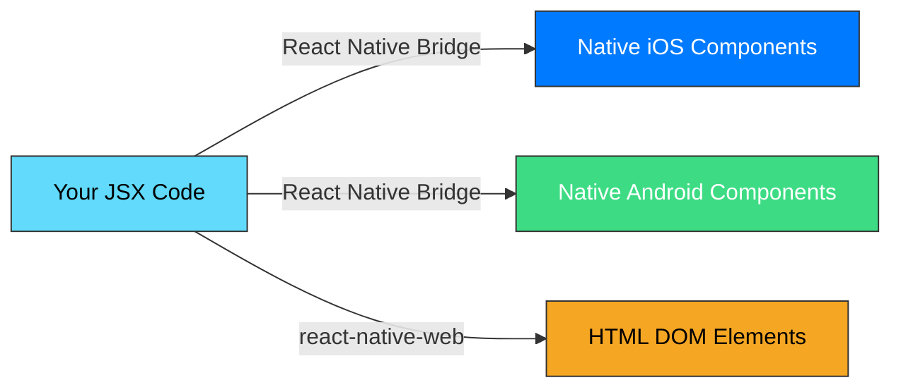

### What You'll Build

The FX Quote Service mobile app — a multi-screen app with:

| Screen              | Purpose                                      | API Endpoints Used                         |
| ------------------- | -------------------------------------------- | ------------------------------------------ |
| LoginScreen         | Email/password authentication                | `POST /auth/login`                         |
| RegisterScreen      | New user sign-up (then auto-login)           | `POST /auth/register` + `POST /auth/login` |
| QuoteScreen         | Enter amount, select currency, get FX quote  | `POST /quotes/create` + `POST /transfers`  |
| QuotesListScreen    | View all saved quotes, tap to expand details | `GET /quotes/list`                         |
| TransfersListScreen | View all transfers with status tracking      | `GET /transfers/list`                      |
| ProfileScreen       | View profile info, sign out                  | `GET /auth/me`                             |

### Architecture Overview

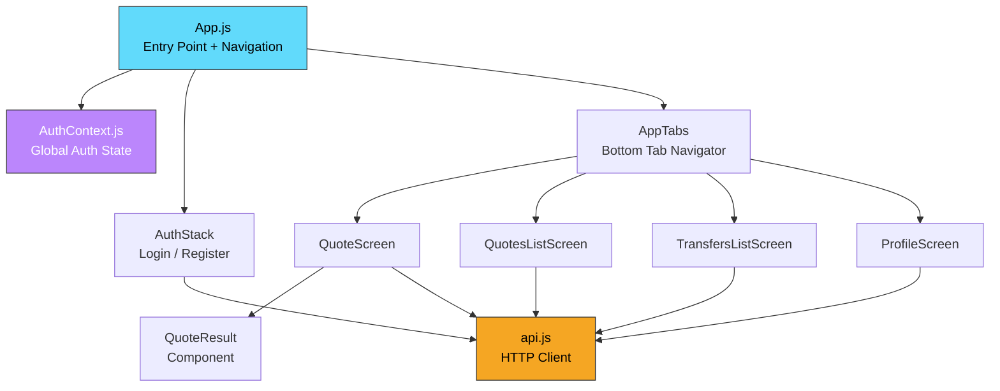

### Prerequisites

- Basic JavaScript (functions, objects, async/await, destructuring)
- Basic React concepts (components, props, state) — or willingness to learn here
- Node.js and npm installed
- Expo Go app on your phone (optional, for testing on a real device)

---

## 2. React Fundamentals — Components, JSX, Props

### What Is a Component?

A component is a **function that returns UI**. It's the building block of every React Native app:

```jsx
function Greeting() {
  return <Text>Hello, World!</Text>;
}
```

### JSX — HTML-Like Syntax in JavaScript

JSX lets you write UI structures that look like HTML but are actually JavaScript:

```jsx
// JSX (what you write)
const element = <Text style={{ color: "blue" }}>Hello</Text>;

// What React sees (compiled)
const element = React.createElement(
  Text,
  { style: { color: "blue" } },
  "Hello",
);
```

Key JSX rules:

| Rule                       | Example                                            |
| -------------------------- | -------------------------------------------------- |
| Must have one root element | Wrap siblings in `<View>` or `<>...</>` (Fragment) |
| JavaScript goes in `{}`    | `<Text>{user.name}</Text>`                         |
| Self-closing tags need `/` | `<TextInput />`                                    |
| `className` → `style`      | `style={{ color: "red" }}`                         |

### Props — Passing Data to Components

Props are how parent components pass data down to children:

```jsx
// Parent passes data via attributes
<QuoteResult quote={result} />;

// Child receives them as a single object
function QuoteResult({ quote }) {
  return (
    <Card>
      <Text>Rate: {quote.fxRate}</Text>
      <Text>You receive: {quote.convertedAmount} TND</Text>
    </Card>
  );
}
```

### In This Project — QuoteResult Component

Our `QuoteResult.js` receives a `quote` prop and renders it using Paper components:

```jsx
// components/QuoteResult.js
import { Card, Text, Divider } from "react-native-paper";

export default function QuoteResult({ quote }) {
  return (
    <Card style={{ marginTop: 20 }} mode="outlined">
      <Card.Content>
        <Text
          variant="titleMedium"
          style={{ fontWeight: "700", marginBottom: 8 }}
        >
          Quote Result
        </Text>
        <Divider style={{ marginBottom: 12 }} />
        {/* Row components displaying quote data */}
      </Card.Content>
    </Card>
  );
}
```

**Key concept:** Components are **reusable**. `QuoteResult` doesn't know where the quote data came from — it just renders whatever it receives.

---

## 3. Core Components — View, Text, ScrollView

### The Big Three

React Native provides primitive components that map to native platform views:

| Component      | Purpose               | HTML Equivalent       | Used In          |
| -------------- | --------------------- | --------------------- | ---------------- |
| `<View>`       | Container, layout box | `<div>`               | Every screen     |
| `<Text>`       | Display text          | `<p>`, `<span>`       | Every screen     |
| `<ScrollView>` | Scrollable container  | `<div>` with overflow | All list screens |

### View — The Universal Container

`<View>` is a non-scrolling container. Use it for layout grouping:

```jsx
<View style={{ flexDirection: "row", justifyContent: "space-between" }}>
  <Text>Amount</Text>
  <Text>100 EUR</Text>
</View>
```

### Text — All Text Must Be in `<Text>`

Unlike HTML, you **cannot** put raw text inside a `<View>`. This will crash:

```jsx
// ❌ WRONG — crashes on native
<View>Hello</View>

// ✅ CORRECT
<View><Text>Hello</Text></View>
```

### ScrollView — When Content Overflows

`<ScrollView>` wraps content that might exceed the screen height:

```jsx
<ScrollView
  contentContainerStyle={{ padding: 24, paddingTop: 60 }}
  keyboardShouldPersistTaps="handled"
>
  {/* Screen content here */}
</ScrollView>
```

> **`keyboardShouldPersistTaps="handled"`** prevents the keyboard from dismissing when tapping buttons — essential for forms.

### TouchableOpacity — Tappable Elements

For making things tappable (beyond Paper's `Button`):

```jsx
import { TouchableOpacity } from "react-native";

<TouchableOpacity
  activeOpacity={0.7}
  onPress={() => setExpandedId(expanded ? null : item.id)}
>
  <Card>{/* Card content */}</Card>
</TouchableOpacity>;
```

### In This Project

- **QuotesListScreen** and **TransfersListScreen** wrap each list card in `<TouchableOpacity>` to make the entire card tappable for expanding details
- Every screen uses `<ScrollView>` as the root scrollable container
- `<View>` is used extensively for row layouts (flexDirection: "row")

---

## 4. Expo — Setup & Toolchain

### What Is Expo?

Expo is a framework and toolchain built around React Native. It handles the hard parts — native builds, development servers, OTA updates — so you can focus on JavaScript.

### Expo vs Bare React Native

| Feature        | Expo (our choice)  | Bare React Native          |
| -------------- | ------------------ | -------------------------- |
| Setup time     | 2 minutes          | 30+ minutes                |
| Run on phone   | Scan QR code       | Build APK/IPA first        |
| Native modules | Pre-bundled        | Manual linking             |
| Build service  | EAS (cloud builds) | Local Xcode/Android Studio |
| Ejecting       | Possible anytime   | Already bare               |

### Creating a Project

```bash
npx create-expo-app my-app
cd my-app
npx expo start
```

### The Expo Development Server

When you run `npx expo start`, Expo starts a development server with:

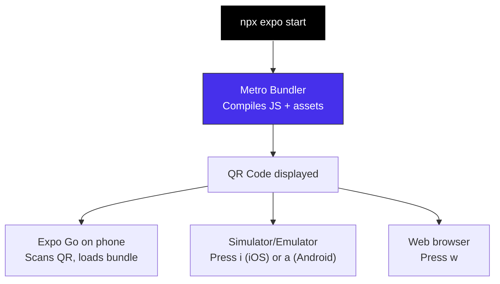

### Project Structure (Our App)

```
mobile/
├── App.js              ← Entry point, navigation setup
├── app.json            ← Expo configuration
├── package.json        ← Dependencies
├── index.js            ← Registers the root component
├── context/
│   └── AuthContext.js   ← Global auth state (token, user)
├── services/
│   └── api.js           ← HTTP client (all 10 API functions)
├── screens/
│   ├── LoginScreen.js
│   ├── RegisterScreen.js
│   ├── QuoteScreen.js
│   ├── QuotesListScreen.js
│   ├── TransfersListScreen.js
│   └── ProfileScreen.js
├── components/
│   └── QuoteResult.js   ← Reusable quote display card
└── assets/              ← Images, fonts, icons
```

### Key Files

| File       | Purpose                                                     |
| ---------- | ----------------------------------------------------------- |
| `app.json` | Expo config: app name, SDK version, splash screen, icons    |
| `App.js`   | Root component — sets up providers, navigation, auth gating |
| `index.js` | Entry point — registers `App` as the root component         |

### Running on Your Phone

1. Install **Expo Go** from App Store / Google Play
2. Run `npx expo start` in the `mobile/` directory
3. Scan the QR code with your phone
4. The app loads over your local network

> **Important:** Your phone and computer must be on the same Wi-Fi network. Our API URL uses the LAN IP (`192.168.1.15:3000`) for this reason.

---

## 5. Styling — Flexbox, Inline Styles, No CSS

### No CSS Files

React Native doesn't use CSS files, CSS classes, or CSS selectors. All styles are JavaScript objects:

```jsx
// Inline style object
<View style={{ flex: 1, padding: 24, backgroundColor: "#fff" }}>
```

### Property Name Differences

| CSS                | React Native                                 |
| ------------------ | -------------------------------------------- |
| `background-color` | `backgroundColor`                            |
| `font-size`        | `fontSize`                                   |
| `border-radius`    | `borderRadius`                               |
| `margin-top`       | `marginTop`                                  |
| `20px`             | `20` (no units — density-independent pixels) |

### Flexbox — The Default Layout

React Native uses Flexbox for all layout, with one key difference from CSS: **`flexDirection` defaults to `"column"`** (not "row").

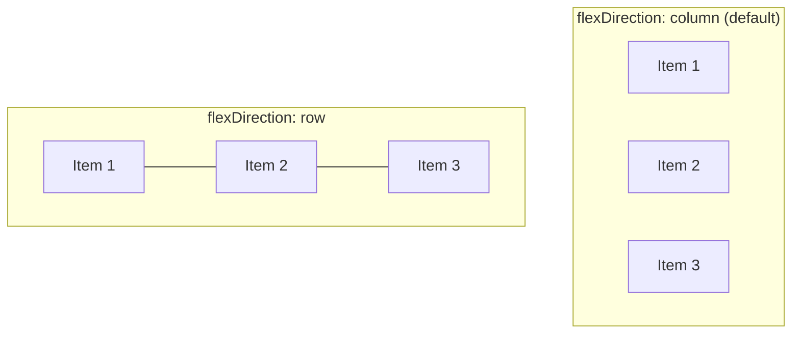

Common layout patterns used in our app:

```jsx
// Full-screen container
style={{ flex: 1, backgroundColor: "#fff" }}

// Centering content (loading spinners)
style={{ flex: 1, justifyContent: "center", alignItems: "center" }}

// Side-by-side row (amount + currency, label + value)
style={{ flexDirection: "row", justifyContent: "space-between", alignItems: "center" }}

// Horizontal gap between chips
style={{ flexDirection: "row", gap: 8, marginBottom: 20 }}
```

### Our Approach — Inline Styles with Paper

We use **React Native Paper** instead of `StyleSheet.create`. Paper components come pre-styled, so we only add minor tweaks inline:

```jsx
// Paper's TextInput — already styled, just add margin
<TextInput
  label="Email"
  mode="outlined"
  style={{ marginBottom: 16 }}
/>

// Paper's Button — already styled, just tweak border radius
<Button
  mode="contained"
  style={{ borderRadius: 8, paddingVertical: 4 }}
>
  Sign In
</Button>
```

### Why Not StyleSheet.create?

`StyleSheet.create` is the traditional approach:

```jsx
// Traditional approach (we DON'T use this)
const styles = StyleSheet.create({
  container: { flex: 1, padding: 20 },
  title: { fontSize: 24, fontWeight: "bold" },
});

<View style={styles.container}>
  <Text style={styles.title}>Hello</Text>
</View>;
```

We chose inline styles + Paper because:

- Paper components handle most styling automatically
- Inline styles are simpler for component-scoped tweaks
- No need to scroll between JSX and a separate styles block
- The app is small enough that performance difference is negligible

---

## 6. React Native Paper — Material Design Components

### What Is React Native Paper?

React Native Paper is a **component library** that implements Google's Material Design for React Native. It provides pre-built, styled components — buttons, text inputs, cards, chips — so you don't write UI from scratch.

### Installation

```bash
npx expo install react-native-paper
```

### Components We Use

| Component             | Purpose                           | Used In                          |
| --------------------- | --------------------------------- | -------------------------------- |
| `<Text>`              | Typography with variants          | Every screen                     |
| `<TextInput>`         | Material text fields              | Login, Register, Quote           |
| `<Button>`            | Contained, outlined, text buttons | Every screen                     |
| `<Card>`              | Elevated/outlined containers      | QuoteResult, Lists, Profile      |
| `<Chip>`              | Compact labeled elements          | Currency selector, Status badges |
| `<Banner>`            | Full-width message bar            | Error messages                   |
| `<ActivityIndicator>` | Loading spinner                   | List screens                     |
| `<Divider>`           | Horizontal separator line         | Expanded details                 |
| `<PaperProvider>`     | Theme provider (wraps app)        | App.js root                      |

### Text Variants

Paper's `<Text>` component supports typography variants:

```jsx
<Text variant="headlineMedium">Big Title</Text>     // ~28px, bold
<Text variant="titleMedium">Section Title</Text>     // ~16px, medium
<Text variant="bodyMedium">Normal text</Text>        // ~14px, regular
<Text variant="bodySmall">Small caption</Text>       // ~12px, lighter
```

### TextInput — Outlined & Filled Modes

```jsx
// Outlined mode (used in all our forms)
<TextInput
  label="Email"
  mode="outlined"
  keyboardType="email-address"
  autoCapitalize="none"
  value={email}
  onChangeText={setEmail}
/>

// Filled mode (alternative style)
<TextInput label="Amount" mode="flat" />
```

### Button Modes

```jsx
// Primary action (solid background)
<Button mode="contained" onPress={handleSubmit}>Submit</Button>

// Secondary action (outline only)
<Button mode="outlined" onPress={handleCancel}>Cancel</Button>

// Tertiary action (text only, like links)
<Button mode="text" onPress={() => navigation.navigate("Register")}>
  Don't have an account? Sign Up
</Button>
```

Button loading state — shows a spinner and disables the button:

```jsx
<Button
  mode="contained"
  onPress={handleLogin}
  loading={loading} // Shows spinner when true
  disabled={loading} // Prevents double-tap
>
  Sign In
</Button>
```

### Card — Container for Grouped Content

```jsx
<Card mode="outlined" style={{ marginBottom: 12 }}>
  <Card.Content>
    <Text variant="titleMedium">100 EUR → 330.50 TND</Text>
    <Text variant="bodySmall">Rate: 3.305 — Fee: 2.50 EUR</Text>
  </Card.Content>
</Card>
```

### Chip — Compact Labels

We use Chips for two things:

**1. Currency selector** (QuoteScreen):

```jsx
{
  ["EUR", "USD", "GBP"].map((c) => (
    <Chip
      key={c}
      selected={currency === c}
      onPress={() => setCurrency(c)}
      mode="outlined"
    >
      {c}
    </Chip>
  ));
}
```

**2. Status badges** (Lists):

```jsx
<Chip
  compact
  mode="outlined"
  textStyle={{ fontSize: 11 }}
  style={{ backgroundColor: q.status === "open" ? "#d1e7dd" : "#e2e3e5" }}
>
  {q.status?.toUpperCase()}
</Chip>
```

### Banner — Error Messages

```jsx
{
  error && (
    <Banner
      visible
      icon="alert-circle"
      style={{ marginTop: 16, backgroundColor: "#f8d7da" }}
    >
      {error}
    </Banner>
  );
}
```

The `icon` prop accepts [MaterialCommunityIcons](https://materialdesignicons.com/) names — Paper includes them by default.

### PaperProvider — Wrapping Your App

Paper requires a `<PaperProvider>` at the root of your app:

```jsx
// App.js
import { PaperProvider } from "react-native-paper";

export default function App() {
  return (
    <PaperProvider>
      <AuthProvider>
        <NavigationContainer>{/* screens */}</NavigationContainer>
      </AuthProvider>
    </PaperProvider>
  );
}
```

---

## 7. State & Hooks — useState, useEffect, useCallback

### useState — Reactive Variables

`useState` creates a variable that triggers a re-render when updated:

```jsx
const [amount, setAmount] = useState(""); // string, starts empty
const [quote, setQuote] = useState(null); // object or null
const [loading, setLoading] = useState(false); // boolean
const [error, setError] = useState(null); // string or null
```

**Rules:**

- Always call hooks at the top level of your component (not inside if/loops)
- The setter function (`setAmount`) replaces the value entirely
- React re-renders the component whenever state changes

### useEffect — Side Effects on Mount

`useEffect` runs code after the component renders. Common uses: fetching data, setting up subscriptions, restoring saved state.

```jsx
// Runs once when component mounts (empty dependency array)
useEffect(() => {
  (async () => {
    const savedToken = await AsyncStorage.getItem("fx_quote_token");
    if (savedToken) setToken(savedToken);
  })();
}, []); // ← empty array = run once
```

The dependency array controls when the effect re-runs:

| Dependency Array | When It Runs                        |
| ---------------- | ----------------------------------- |
| `[]`             | Once, on mount                      |
| `[token]`        | On mount + whenever `token` changes |
| _(omitted)_      | After every render (rarely wanted)  |

### useCallback — Stable Function References

`useCallback` memorizes a function so it doesn't get recreated on every render:

```jsx
const load = useCallback(async () => {
  const data = await listQuotes(token);
  setQuotes(data.quotes || []);
}, [token]); // Only recreated when token changes
```

**Why we need it:** React Navigation's `useFocusEffect` requires a stable callback to avoid infinite re-render loops.

### State Patterns in Our App

Every screen follows this pattern:

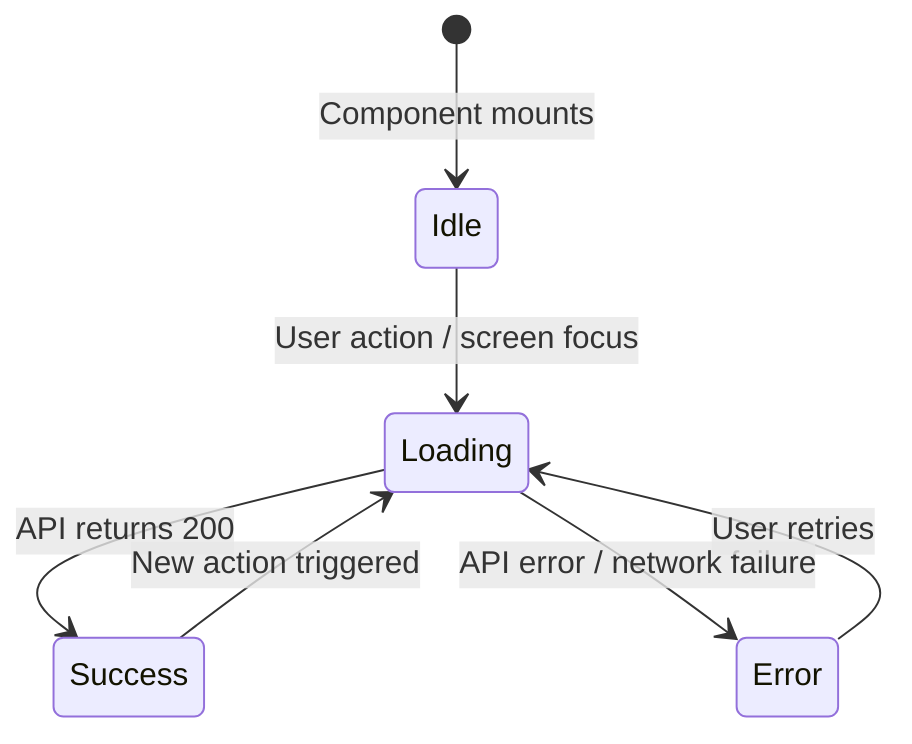

In code:

```jsx
const [data, setData] = useState(null);
const [loading, setLoading] = useState(false);
const [error, setError] = useState(null);

const handleAction = async () => {
  setLoading(true);
  setError(null);
  try {
    const result = await apiCall();
    setData(result);
  } catch (err) {
    setError(err.message);
  } finally {
    setLoading(false); // Always runs, even on error
  }
};
```

---

## 8. Context API — Sharing State Across Screens

### The Problem

Multiple screens need access to the same data — the logged-in user and their JWT token:

- **LoginScreen** sets the token after login
- **QuoteScreen** reads the token to make authenticated API calls
- **ProfileScreen** reads user data and provides sign-out
- **App.js** checks if a token exists to show auth or main screens

### The Solution — React Context

Context provides a way to pass data through the component tree without manually passing props through every level.

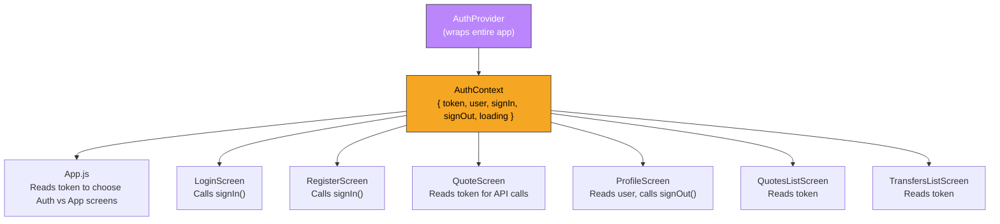

### Building AuthContext — Step by Step

**Step 1: Create the context**

```jsx
import { createContext, useContext } from "react";

const AuthContext = createContext(null);
```

**Step 2: Build the provider component**

```jsx
export function AuthProvider({ children }) {
  const [token, setToken] = useState(null);
  const [user, setUser] = useState(null);
  const [loading, setLoading] = useState(true);

  // Restore session on app start
  useEffect(() => {
    (async () => {
      try {
        const savedToken = await AsyncStorage.getItem(TOKEN_KEY);
        const savedUser = await AsyncStorage.getItem(USER_KEY);
        if (savedToken && savedUser) {
          setToken(savedToken);
          setUser(JSON.parse(savedUser));
        }
      } finally {
        setLoading(false);
      }
    })();
  }, []);

  const signIn = async (accessToken, userData) => {
    await AsyncStorage.setItem(TOKEN_KEY, accessToken);
    await AsyncStorage.setItem(USER_KEY, JSON.stringify(userData));
    setToken(accessToken);
    setUser(userData);
  };

  const signOut = async () => {
    await AsyncStorage.removeItem(TOKEN_KEY);
    await AsyncStorage.removeItem(USER_KEY);
    setToken(null);
    setUser(null);
  };

  return (
    <AuthContext.Provider value={{ token, user, loading, signIn, signOut }}>
      {children}
    </AuthContext.Provider>
  );
}
```

**Step 3: Create a convenience hook**

```jsx
export function useAuth() {
  const ctx = useContext(AuthContext);
  if (!ctx) throw new Error("useAuth must be used within AuthProvider");
  return ctx;
}
```

**Step 4: Wrap the app**

```jsx
// App.js
export default function App() {
  return (
    <PaperProvider>
      <AuthProvider>
        <NavigationContainer>
          <RootNavigator />
        </NavigationContainer>
      </AuthProvider>
    </PaperProvider>
  );
}
```

**Step 5: Use in any screen**

```jsx
// Any screen can now access auth state
const { token, user, signOut } = useAuth();
```

### Why Context Instead of Redux?

| Factor           | Our App            | When Redux Helps                    |
| ---------------- | ------------------ | ----------------------------------- |
| Shared state     | Just token + user  | Complex relational data             |
| Update frequency | Login/logout only  | High-frequency updates              |
| Boilerplate      | ~50 lines total    | Actions, reducers, store, selectors |
| Learning curve   | Already know React | Additional concepts to learn        |

**Rule of thumb:** Start with Context. Reach for Redux/Zustand only when Context becomes painful (many consumers updating frequently).

---

## 9. AsyncStorage — Persisting Data Locally

### What Is AsyncStorage?

AsyncStorage is React Native's equivalent of `localStorage` in web browsers. It stores key-value pairs that persist across app restarts.

### Installation

```bash
npx expo install @react-native-async-storage/async-storage
```

### API — Simple Key-Value Operations

```jsx
import AsyncStorage from "@react-native-async-storage/async-storage";

// Store a string
await AsyncStorage.setItem("fx_quote_token", "eyJhbGci...");

// Store an object (must stringify)
await AsyncStorage.setItem(
  "fx_quote_user",
  JSON.stringify({ id: "1", name: "John" }),
);

// Retrieve a string (returns null if not found)
const token = await AsyncStorage.getItem("fx_quote_token");

// Retrieve an object (must parse)
const user = JSON.parse(await AsyncStorage.getItem("fx_quote_user"));

// Delete a key
await AsyncStorage.removeItem("fx_quote_token");
```

### In Our App — Session Persistence

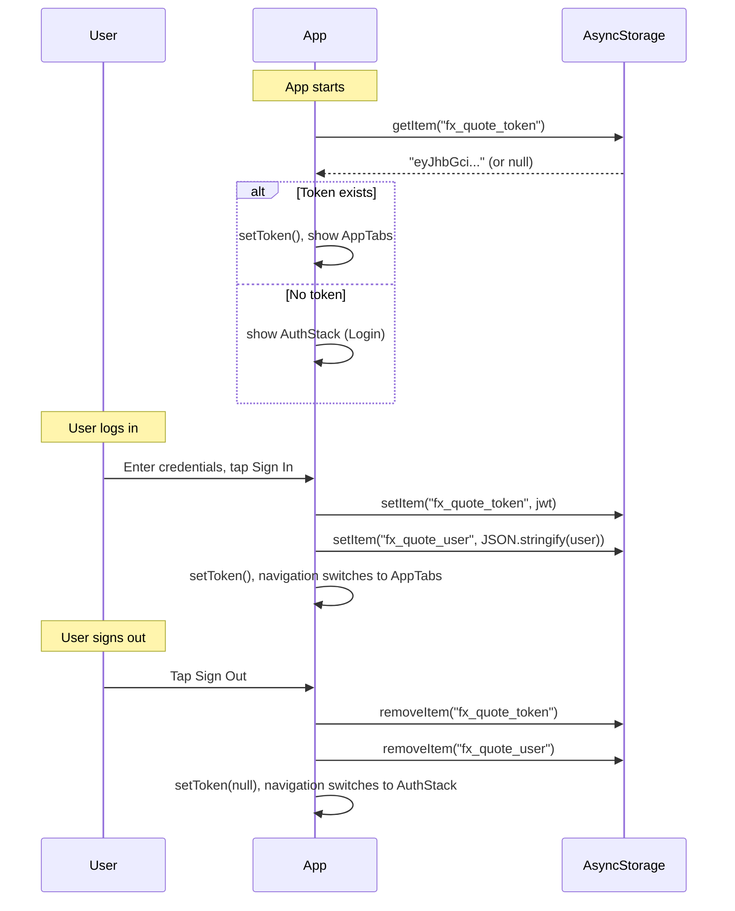

### Important Notes

- **All operations are async** — always use `await` or `.then()`
- **Values must be strings** — use `JSON.stringify` / `JSON.parse` for objects
- Data persists across app restarts but is wiped when the app is uninstalled
- Not suitable for sensitive data in production (use `expo-secure-store` for tokens in real apps)

---

## 10. Networking — fetch, API Clients, Error Handling

### The Built-in fetch API

React Native includes the `fetch` API (same as web browsers):

```jsx
const response = await fetch("http://192.168.1.15:3000/auth/login", {
  method: "POST",
  headers: { "Content-Type": "application/json" },
  body: JSON.stringify({ email: "john@example.com", password: "secret123" }),
});

const data = await response.json();
```

### Building a Reusable API Client

Instead of repeating fetch calls in every screen, we centralize them in `services/api.js`:

```jsx
const API_BASE_URL = "http://192.168.1.15:3000";

async function request(path, { method = "GET", body, token } = {}) {
  const headers = { "Content-Type": "application/json" };
  if (token) {
    headers["Authorization"] = `Bearer ${token}`;
  }

  const options = { method, headers };
  if (body) {
    options.body = JSON.stringify(body);
  }

  const response = await fetch(`${API_BASE_URL}${path}`, options);
  const data = await response.json();

  if (!response.ok) {
    throw new Error(data.error || "Something went wrong");
  }

  return data;
}
```

Then each API call is a one-liner:

```jsx
// Auth
export const registerUser = (email, password, name) =>
  request("/auth/register", {
    method: "POST",
    body: { email, password, name },
  });

export const loginUser = (email, password) =>
  request("/auth/login", { method: "POST", body: { email, password } });

export const getProfile = (token) => request("/auth/me", { token });

// Quotes
export const createQuote = (amount, currency, token) =>
  request("/quotes/create", {
    method: "POST",
    body: { amount: Number(amount), currency },
    token,
  });

export const listQuotes = (token) => request("/quotes/list", { token });

// Transfers
export const createTransfer = (quoteId, token) =>
  request("/transfers", { method: "POST", body: { quoteId }, token });

export const listTransfers = (token) => request("/transfers/list", { token });
```

### Error Handling Pattern

Every screen uses the same try/catch pattern:

```jsx
try {
  const result = await createQuote(amount, currency, token);
  setQuote(result); // Success → update state
} catch (err) {
  setError(err.message); // Error → show message
} finally {
  setLoading(false); // Always → stop spinner
}
```

The `request` helper throws on non-2xx responses, so the catch block handles both network errors and API errors uniformly.

### Network Configuration for Expo

On a physical device, `localhost` refers to the phone itself — not your computer. Use your computer's LAN IP:

```
✅ http://192.168.1.15:3000   (LAN IP — works from phone)
❌ http://localhost:3000        (refers to the phone itself)
```

Find your IP:

- **Windows:** `ipconfig` → IPv4 Address
- **Mac:** `ifconfig en0` → inet

---

## 11. React Navigation — Stacks & Tabs

### What Is React Navigation?

React Navigation is the standard navigation library for React Native. It handles screen transitions, tab bars, and nested navigators.

### Installation

```bash
npx expo install @react-navigation/native @react-navigation/native-stack \
  @react-navigation/bottom-tabs react-native-screens react-native-safe-area-context
```

### Navigation Types

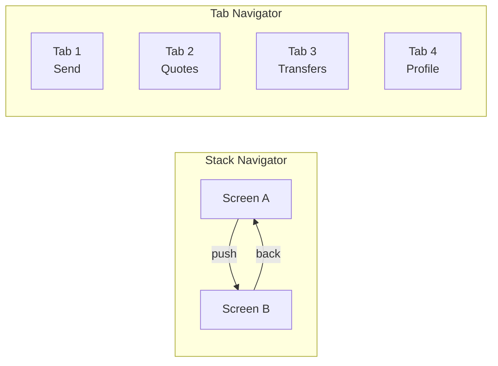

| Type        | Use Case                              | Our Usage                        |
| ----------- | ------------------------------------- | -------------------------------- |
| Stack       | Linear flow (Login → Register → back) | Auth screens                     |
| Bottom Tabs | Main app sections                     | Send, Quotes, Transfers, Profile |

### Stack Navigator — Auth Flow

```jsx
import { createNativeStackNavigator } from "@react-navigation/native-stack";

const Stack = createNativeStackNavigator();

function AuthStack() {
  return (
    <Stack.Navigator screenOptions={{ headerShown: false }}>
      <Stack.Screen name="Login" component={LoginScreen} />
      <Stack.Screen name="Register" component={RegisterScreen} />
    </Stack.Navigator>
  );
}
```

Navigating between stack screens:

```jsx
// In LoginScreen — navigate to Register
navigation.navigate("Register");

// In RegisterScreen — go back to Login
navigation.navigate("Login");
// or
navigation.goBack();
```

### Bottom Tab Navigator — Main App

```jsx
import { createBottomTabNavigator } from "@react-navigation/bottom-tabs";

const Tab = createBottomTabNavigator();

function AppTabs() {
  return (
    <Tab.Navigator
      screenOptions={{
        headerShown: false,
        tabBarShowLabel: false,
        tabBarStyle: {
          height: 64,
          backgroundColor: "#fff",
          borderTopWidth: 1,
          borderTopColor: "#e9ecef",
          elevation: 0,
          shadowOpacity: 0,
        },
      }}
    >
      <Tab.Screen
        name="Send"
        component={QuoteScreen}
        options={{
          tabBarIcon: ({ focused }) => (
            <TabLabel label="Send" focused={focused} />
          ),
        }}
      />
      <Tab.Screen name="Quotes" component={QuotesListScreen} /* ... */ />
      <Tab.Screen name="Transfers" component={TransfersListScreen} /* ... */ />
      <Tab.Screen name="Profile" component={ProfileScreen} /* ... */ />
    </Tab.Navigator>
  );
}
```

### Custom Tab Bar Labels

We built a custom tab label component instead of using icons:

```jsx
function TabLabel({ label, focused }) {
  return (
    <View style={{ alignItems: "center", paddingTop: 8 }}>
      <View
        style={{
          width: 24,
          height: 3,
          borderRadius: 2,
          backgroundColor: focused ? "#4a90d9" : "transparent", // Active indicator
          marginBottom: 6,
        }}
      />
      <Text
        style={{
          fontSize: 13,
          fontWeight: focused ? "700" : "500",
          color: focused ? "#4a90d9" : "#6c757d",
        }}
      >
        {label}
      </Text>
    </View>
  );
}
```

### Nesting Navigators — Auth Gate

The root navigator conditionally renders either the auth stack or the main tabs:

```jsx
function RootNavigator() {
  const { token, loading } = useAuth();

  if (loading) {
    return (
      <View style={{ flex: 1, justifyContent: "center", alignItems: "center" }}>
        <ActivityIndicator size="large" />
      </View>
    );
  }

  return token ? <AppTabs /> : <AuthStack />;
}
```

```mermaid
flowchart TD
    A[App Starts] --> B{Loading?}
    B -->|Yes| C[Show Spinner]
    B -->|No| D{Token exists?}
    D -->|Yes| E["AppTabs<br/>(Send / Quotes / Transfers / Profile)"]
    D -->|No| F["AuthStack<br/>(Login / Register)"]

    F -->|Login success| G[signIn() saves token]
    G --> E
    E -->|Sign out| H[signOut() clears token]
    H --> F

    style E fill:#7bc96f,stroke:#333,color:#fff
    style F fill:#4a90d9,stroke:#333,color:#fff
```

---

## 12. Auth Flow — Login, Register, Token Gating

### The Full Auth Lifecycle

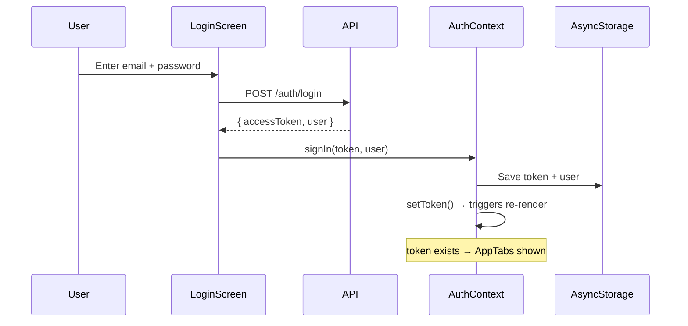

### LoginScreen — Step by Step

```jsx
const handleLogin = async () => {
  // 1. Validate input
  if (!email.trim() || !password) {
    setError("Please enter email and password");
    return;
  }

  // 2. Start loading, clear old errors
  setLoading(true);
  setError(null);

  try {
    // 3. Call the API
    const result = await loginUser(email.trim(), password);

    // 4. Store token + user globally
    await signIn(result.accessToken, result.user);
    // Navigation switches automatically (token now exists)
  } catch (err) {
    // 5. Show error to user
    setError(err.message);
  } finally {
    // 6. Stop loading spinner
    setLoading(false);
  }
};
```

### RegisterScreen — Register Then Auto-Login

```jsx
const handleRegister = async () => {
  // Register the user
  await registerUser(email.trim(), password, name.trim());

  // Immediately log them in (so they don't have to enter credentials again)
  const result = await loginUser(email.trim(), password);
  await signIn(result.accessToken, result.user);
};
```

### Token-Based API Calls

Once logged in, every authenticated API call includes the token:

```jsx
const { token } = useAuth();

// Token is passed to all API functions
const quotes = await listQuotes(token);
const profile = await getProfile(token);
```

The `request` helper attaches it as a Bearer token:

```jsx
if (token) {
  headers["Authorization"] = `Bearer ${token}`;
}
```

### Sign Out

```jsx
// ProfileScreen
const { signOut } = useAuth();

<Button mode="contained" buttonColor="#dc3545" onPress={signOut}>
  Sign Out
</Button>;
```

When `signOut()` clears the token from state and AsyncStorage, the `RootNavigator` re-renders and switches back to `AuthStack`.

---

## 13. Forms — TextInput, Validation, Keyboard Handling

### Paper TextInput

Paper's `<TextInput>` provides Material Design styling out of the box:

```jsx
<TextInput
  label="Email" // Floating label
  mode="outlined" // Outlined border style
  keyboardType="email-address" // Shows @ on keyboard
  autoCapitalize="none" // Don't auto-capitalize email
  value={email} // Controlled by state
  onChangeText={setEmail} // Updates state on each keystroke
  style={{ marginBottom: 16 }}
/>
```

### Keyboard Types

| `keyboardType`    | Shows                     | Used For       |
| ----------------- | ------------------------- | -------------- |
| `"default"`       | Standard keyboard         | Names, text    |
| `"email-address"` | Keyboard with `.` and `@` | Email fields   |
| `"decimal-pad"`   | Numbers + decimal point   | Amount fields  |
| `"numeric"`       | Numbers only              | Integer fields |

### Secure Text Entry

```jsx
<TextInput
  label="Password"
  mode="outlined"
  secureTextEntry // Masks input with dots
  value={password}
  onChangeText={setPassword}
/>
```

### Client-Side Validation

We validate before sending to the API:

```jsx
// LoginScreen — check for empty fields
if (!email.trim() || !password) {
  setError("Please enter email and password");
  return; // Don't proceed to API call
}

// QuoteScreen — check for valid number
const parsed = parseFloat(amount);
if (!amount || isNaN(parsed) || parsed <= 0) {
  setError("Please enter a valid positive amount");
  return;
}
```

### KeyboardAvoidingView

On iOS, the keyboard can cover input fields. `KeyboardAvoidingView` pushes content up:

```jsx
import { KeyboardAvoidingView, Platform } from "react-native";

<KeyboardAvoidingView
  style={{ flex: 1, backgroundColor: "#fff" }}
  behavior={Platform.OS === "ios" ? "padding" : undefined}
>
  <ScrollView keyboardShouldPersistTaps="handled">
    {/* Form fields */}
  </ScrollView>
</KeyboardAvoidingView>;
```

| Prop                                  | Purpose                                             |
| ------------------------------------- | --------------------------------------------------- |
| `behavior="padding"`                  | Adds padding to push content up (iOS)               |
| `Platform.OS === "ios"`               | Only apply on iOS (Android handles it natively)     |
| `keyboardShouldPersistTaps="handled"` | Tapping a button doesn't dismiss the keyboard first |

---

## 14. Lists — ScrollView, RefreshControl, Expandable Cards

### Displaying Lists

For our modest data sizes, `ScrollView` works fine. For very large lists (hundreds of items), you'd use `FlatList` instead.

```jsx
<ScrollView
  contentContainerStyle={{ padding: 24, paddingTop: 60 }}
  refreshControl={
    <RefreshControl refreshing={refreshing} onRefresh={onRefresh} />
  }
>
  {quotes.map((q) => (
    <Card key={q.id}>{/* Card content */}</Card>
  ))}
</ScrollView>
```

### Pull-to-Refresh

```jsx
const [refreshing, setRefreshing] = useState(false);

const onRefresh = async () => {
  setRefreshing(true); // Show pull-to-refresh spinner
  await load(); // Re-fetch data
  setRefreshing(false); // Hide spinner
};

<RefreshControl refreshing={refreshing} onRefresh={onRefresh} />;
```

### Expandable Cards — Tap to Toggle Details

Instead of navigating to a detail screen, we expand cards inline:

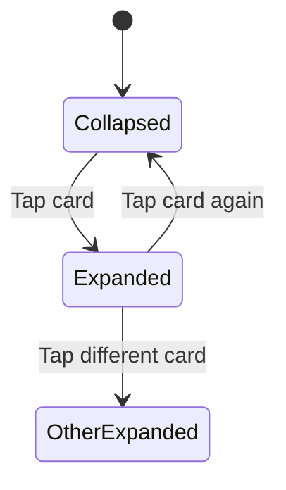

Implementation:

```jsx
const [expandedId, setExpandedId] = useState(null); // Track which card is open

{
  quotes.map((q) => {
    const expanded = expandedId === q.id;

    return (
      <TouchableOpacity
        key={q.id}
        activeOpacity={0.7}
        onPress={() => setExpandedId(expanded ? null : q.id)}
      >
        <Card mode="outlined" style={{ marginBottom: 12 }}>
          <Card.Content>
            {/* Always visible: amount + status */}
            <Text>
              {q.sourceAmount} {q.sourceCurrency} → {q.convertedAmount}
            </Text>

            {/* Only visible when expanded */}
            {expanded && (
              <View
                style={{
                  marginTop: 12,
                  backgroundColor: "#f8f9fa",
                  borderRadius: 8,
                  padding: 12,
                }}
              >
                <Divider style={{ marginBottom: 8 }} />
                <Row label="Quote ID" value={q.id} />
                <Row label="Rate" value={q.fxRate?.toString()} />
                <Row label="Fee" value={`${q.fee} ${q.sourceCurrency}`} />
                {/* ... more detail rows */}
              </View>
            )}
          </Card.Content>
        </Card>
      </TouchableOpacity>
    );
  });
}
```

**Key design choice:** Only one card can be expanded at a time. Tapping a new card closes the previous one.

### The Row Helper Component

A reusable label-value row used in detail views:

```jsx
function Row({ label, value }) {
  return (
    <View
      style={{
        flexDirection: "row",
        justifyContent: "space-between",
        paddingVertical: 4,
      }}
    >
      <Text variant="bodyMedium" style={{ color: "#6c757d" }}>
        {label}
      </Text>
      <Text
        variant="bodyMedium"
        style={{ fontWeight: "600", flexShrink: 1, textAlign: "right" }}
      >
        {value}
      </Text>
    </View>
  );
}
```

### ScrollView vs FlatList

| Feature           | ScrollView                | FlatList                  |
| ----------------- | ------------------------- | ------------------------- |
| Renders all items | Yes (fine for <50 items)  | No — only visible items   |
| Pull-to-refresh   | Via `refreshControl` prop | Built-in `onRefresh` prop |
| Item separator    | Manual                    | `ItemSeparatorComponent`  |
| Performance       | Good for small lists      | Required for large lists  |
| Used in our app   | ✅ Yes                    | Not needed                |

---

## 15. Screen Lifecycle — useFocusEffect & Cleanup

### The Problem

In a tab navigator, screens stay **mounted** when you switch tabs. A regular `useEffect` only runs once on mount — not when the user navigates back to the tab.

### useFocusEffect — Runs When Screen is Focused

React Navigation provides `useFocusEffect` which fires every time the screen gains focus:

```jsx
import { useFocusEffect } from "@react-navigation/native";

useFocusEffect(
  useCallback(() => {
    let active = true; // Guard against stale updates
    setLoading(true);

    load().finally(() => {
      if (active) setLoading(false); // Only update if still focused
    });

    return () => {
      active = false; // Cleanup when screen loses focus
    };
  }, [load]),
);
```

### Why the Cleanup Function?

When the user switches tabs mid-fetch, the fetch might complete after the screen has lost focus. The `active` flag prevents updating state on an unfocused screen:

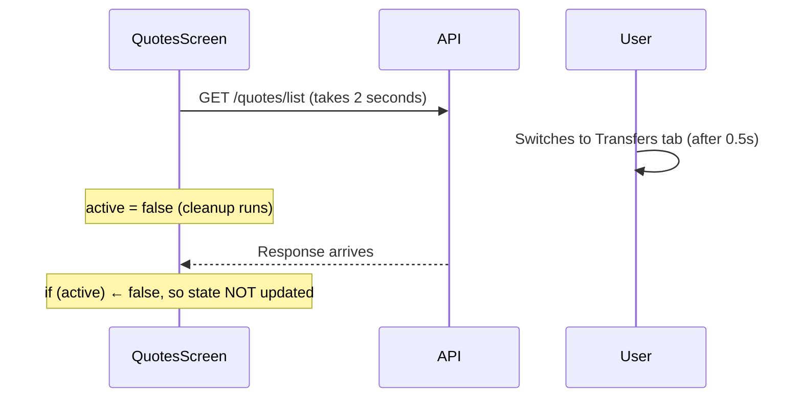

Without this guard, you'd get the React warning: _"Can't perform a React state update on an unmounted component."_

### Screens Using useFocusEffect

| Screen              | What It Fetches       | Why Focus Effect                        |
| ------------------- | --------------------- | --------------------------------------- |
| QuotesListScreen    | `GET /quotes/list`    | Refresh list when switching back to tab |
| TransfersListScreen | `GET /transfers/list` | Same — might have new transfers         |
| ProfileScreen       | `GET /auth/me`        | Refresh profile data                    |

### Screens NOT Using useFocusEffect

| Screen         | Why Not                                                       |
| -------------- | ------------------------------------------------------------- |
| QuoteScreen    | User initiates the action (tap button) — no auto-fetch needed |
| LoginScreen    | No data to fetch on focus                                     |
| RegisterScreen | No data to fetch on focus                                     |

---

## 16. Platform Differences — iOS, Android, Web

### React Native Is Truly Cross-Platform

Our app runs on three platforms from one codebase:

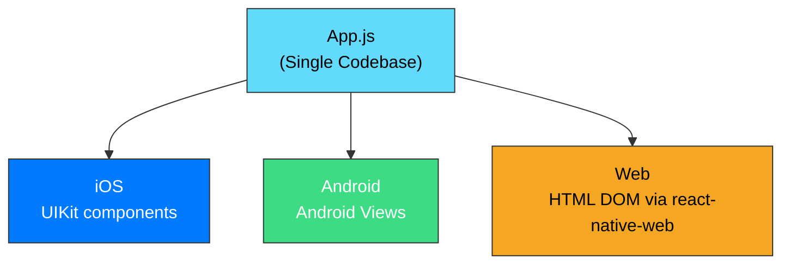

### Platform-Specific Code

Use `Platform.OS` for platform-specific behavior:

```jsx
import { Platform } from "react-native";

// KeyboardAvoidingView only needs "padding" behavior on iOS
behavior={Platform.OS === "ios" ? "padding" : undefined}
```

### Web Support

Our app supports web via `react-native-web` (included by Expo):

```bash
# Run in web browser
npx expo start --web

# Export for web deployment
npx expo export --platform web
```

### Key Platform Differences

| Behavior              | iOS                   | Android         | Web            |
| --------------------- | --------------------- | --------------- | -------------- |
| Keyboard handling     | Covers content        | Auto-adjusts    | N/A            |
| `elevation` (shadows) | No effect             | Creates shadow  | No effect      |
| `shadowOpacity`       | Creates shadow        | No effect       | Creates shadow |
| Status bar            | Over content          | Separate        | N/A            |
| Pull-to-refresh       | Native rubber-band    | Overscroll glow | Not native     |
| Safe areas            | Notch, home indicator | Status bar      | N/A            |

### StatusBar Component

Expo provides a cross-platform status bar:

```jsx
import { StatusBar } from "expo-status-bar";

<StatusBar style="auto" />; // Dark text on light bg, light text on dark bg
```

---

## 17. Debugging & Common Errors

### Common React Native Errors

#### "Text strings must be rendered within a `<Text>` component"

```jsx
// ❌ WRONG
<View>Hello World</View>

// ✅ CORRECT
<View><Text>Hello World</Text></View>
```

#### "Network request failed"

Usually means the device can't reach your backend:

| Cause              | Fix                                                          |
| ------------------ | ------------------------------------------------------------ |
| Wrong URL          | Check `API_BASE_URL` in `api.js` — use LAN IP, not localhost |
| Server not running | Start the backend with `node server.js`                      |
| Different Wi-Fi    | Phone and computer must be on the same network               |
| Firewall blocking  | Allow port 3000 through your firewall                        |

#### "Cannot read properties of null"

Usually caused by accessing data before it loads:

```jsx
// ❌ Crashes if quote is null
<Text>{quote.fxRate}</Text>

// ✅ Optional chaining
<Text>{quote?.fxRate}</Text>

// ✅ Conditional rendering
{quote && <Text>{quote.fxRate}</Text>}
```

#### "Invalid hook call"

Hooks (useState, useEffect, etc.) can only be called:

- Inside function components (not regular functions)
- At the top level (not inside if/for/while)
- In the same order every render

```jsx
// ❌ WRONG
if (condition) {
  const [value, setValue] = useState(false);
}

// ✅ CORRECT
const [value, setValue] = useState(false);
if (condition) {
  // use value here
}
```

### Debugging Tools

| Tool            | What It Does           | How to Open                     |
| --------------- | ---------------------- | ------------------------------- |
| Terminal output | Console.log messages   | Check `npx expo start` terminal |
| React DevTools  | Inspect component tree | Press `j` in Expo CLI           |
| Network tab     | See API requests       | Browser DevTools (web mode)     |
| Shake gesture   | Open dev menu (device) | Shake your phone                |

### The Console.log Strategy

The simplest debugging approach — log state at key points:

```jsx
const handleLogin = async () => {
  console.log("Login attempt:", email);
  try {
    const result = await loginUser(email, password);
    console.log("Login success:", result);
    await signIn(result.accessToken, result.user);
  } catch (err) {
    console.log("Login error:", err.message);
    setError(err.message);
  }
};
```

---

## 18. Project Architecture — File Structure & Patterns

### Separation of Concerns

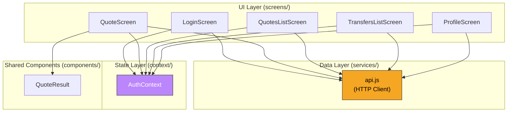

### Layer Responsibilities

| Layer      | Directory     | Responsibility                                    | Doesn't Know About  |
| ---------- | ------------- | ------------------------------------------------- | ------------------- |
| Screens    | `screens/`    | UI rendering, user interactions, state management | How HTTP works      |
| Components | `components/` | Reusable UI pieces                                | Business logic      |
| Context    | `context/`    | Global shared state                               | UI layout           |
| Services   | `services/`   | API communication                                 | UI state, rendering |

### File Naming Conventions

| Pattern               | Example          | Purpose                   |
| --------------------- | ---------------- | ------------------------- |
| `*Screen.js`          | `LoginScreen.js` | Full-page screens         |
| `*Context.js`         | `AuthContext.js` | React Context providers   |
| `*.js` in services/   | `api.js`         | Service/utility functions |
| PascalCase components | `QuoteResult.js` | React components          |

### Data Flow Through the App

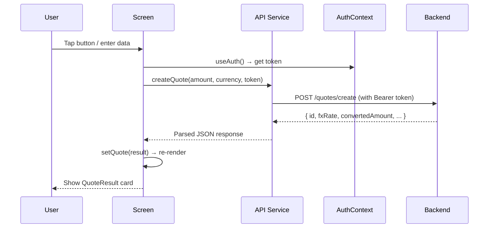

---

## 19. Building & Exporting

### Development Mode

```bash
cd mobile

# Start development server
npx expo start

# Platform-specific shortcuts
npx expo start --ios       # Open iOS simulator
npx expo start --android   # Open Android emulator
npx expo start --web       # Open in browser
```

### Web Export

Export a static web build:

```bash
npx expo export --platform web
```

This creates a `dist/` folder with:

- `index.html` — Entry point
- `_expo/static/js/` — Bundled JavaScript
- `favicon.ico` — App icon

### Production Builds (EAS)

For actual App Store / Play Store builds, use Expo Application Services:

```bash
# Install EAS CLI
npm install -g eas-cli

# Configure build profiles
eas build:configure

# Build for iOS
eas build --platform ios

# Build for Android
eas build --platform android
```

### app.json Configuration

```json
{
  "expo": {
    "name": "FX Quote Service",
    "slug": "fx-quote-service",
    "version": "1.0.0",
    "sdkVersion": "54.0.0",
    "platforms": ["ios", "android", "web"],
    "icon": "./assets/icon.png",
    "splash": {
      "image": "./assets/splash.png",
      "resizeMode": "contain",
      "backgroundColor": "#ffffff"
    }
  }
}
```

---

## 20. Putting It Together — Full FX App Walkthrough

### How Everything Connects

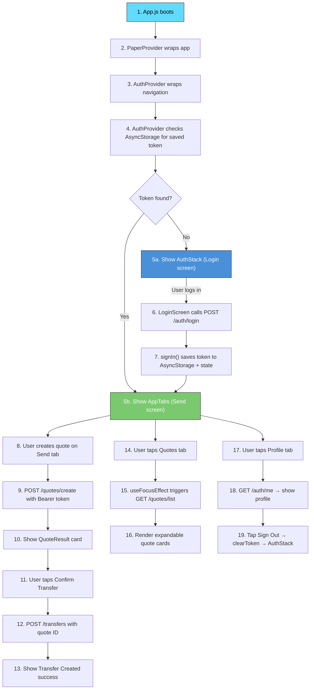

### Complete Dependency Map

```
mobile/
├── App.js
│   ├── imports: react-native-paper (PaperProvider)
│   ├── imports: @react-navigation/native (NavigationContainer)
│   ├── imports: @react-navigation/native-stack (Stack)
│   ├── imports: @react-navigation/bottom-tabs (Tab)
│   ├── imports: context/AuthContext (AuthProvider, useAuth)
│   └── imports: all 6 screen components
│
├── context/AuthContext.js
│   ├── imports: react (createContext, useState, useEffect)
│   └── imports: @react-native-async-storage/async-storage
│
├── services/api.js
│   ├── exports: registerUser, loginUser, getProfile
│   ├── exports: fetchQuote, createQuote, getQuote, listQuotes
│   └── exports: createTransfer, getTransfer, listTransfers
│
├── screens/LoginScreen.js
│   ├── imports: react-native-paper (Text, TextInput, Button, Banner)
│   ├── imports: services/api (loginUser)
│   └── imports: context/AuthContext (useAuth → signIn)
│
├── screens/RegisterScreen.js
│   ├── imports: react-native-paper (Text, TextInput, Button, Banner)
│   ├── imports: services/api (registerUser, loginUser)
│   └── imports: context/AuthContext (useAuth → signIn)
│
├── screens/QuoteScreen.js
│   ├── imports: react-native-paper (Text, TextInput, Button, Banner, Card, Chip)
│   ├── imports: services/api (createQuote, createTransfer)
│   ├── imports: context/AuthContext (useAuth → token, user)
│   └── imports: components/QuoteResult
│
├── screens/QuotesListScreen.js
│   ├── imports: react-native-paper (Text, Card, Chip, ActivityIndicator, Banner, Divider)
│   ├── imports: @react-navigation/native (useFocusEffect)
│   ├── imports: services/api (listQuotes)
│   └── imports: context/AuthContext (useAuth → token)
│
├── screens/TransfersListScreen.js
│   ├── imports: react-native-paper (Text, Card, Chip, ActivityIndicator, Banner, Divider)
│   ├── imports: @react-navigation/native (useFocusEffect)
│   ├── imports: services/api (listTransfers)
│   └── imports: context/AuthContext (useAuth → token)
│
├── screens/ProfileScreen.js
│   ├── imports: react-native-paper (Text, Card, Button, ActivityIndicator, Banner)
│   ├── imports: @react-navigation/native (useFocusEffect)
│   ├── imports: services/api (getProfile)
│   └── imports: context/AuthContext (useAuth → token, user, signOut)
│
└── components/QuoteResult.js
    └── imports: react-native-paper (Card, Text, Divider)
```

### API Endpoints Covered by the Mobile App

| Endpoint          | Method | Screen                      | Function           | Auth |
| ----------------- | ------ | --------------------------- | ------------------ | ---- |
| `/auth/register`  | POST   | RegisterScreen              | `registerUser()`   | No   |
| `/auth/login`     | POST   | LoginScreen, RegisterScreen | `loginUser()`      | No   |
| `/auth/me`        | GET    | ProfileScreen               | `getProfile()`     | Yes  |
| `/quotes/create`  | POST   | QuoteScreen                 | `createQuote()`    | Yes  |
| `/quotes/list`    | GET    | QuotesListScreen            | `listQuotes()`     | Yes  |
| `/transfers`      | POST   | QuoteScreen                 | `createTransfer()` | Yes  |
| `/transfers/list` | GET    | TransfersListScreen         | `listTransfers()`  | Yes  |

### Key Packages

| Package                                     | Version  | Purpose                           |
| ------------------------------------------- | -------- | --------------------------------- |
| `expo`                                      | ~54.0.33 | Framework and build toolchain     |
| `react`                                     | 19.1.0   | UI library core                   |
| `react-native`                              | 0.81.5   | Native platform bridge            |
| `react-native-paper`                        | ^5.15.0  | Material Design component library |
| `@react-navigation/native`                  | ^7.1.33  | Navigation framework              |
| `@react-navigation/native-stack`            | ^7.14.4  | Stack navigator (push/pop)        |
| `@react-navigation/bottom-tabs`             | ^7.15.5  | Bottom tab navigator              |
| `@react-native-async-storage/async-storage` | 2.2.0    | Persistent key-value storage      |
| `react-native-safe-area-context`            | ~5.6.0   | Safe area insets (notch handling) |
| `react-native-screens`                      | ~4.16.0  | Native screen containers          |
| `react-native-web`                          | ^0.21.0  | Web platform support              |

### Summary Cheat Sheet

| Concept           | Tool / Pattern                                                   | Key File                                    |
| ----------------- | ---------------------------------------------------------------- | ------------------------------------------- |
| Entry point       | `App.js` with PaperProvider + AuthProvider + NavigationContainer | `App.js`                                    |
| Auth state        | React Context + AsyncStorage                                     | `context/AuthContext.js`                    |
| API calls         | Centralized `request()` helper + named exports                   | `services/api.js`                           |
| Form screens      | Paper TextInput + Button + Banner for errors                     | `screens/Login,Register,QuoteScreen.js`     |
| List screens      | ScrollView + useFocusEffect + expandable cards                   | `screens/QuotesList,TransfersListScreen.js` |
| Profile           | useFocusEffect + Card + signOut                                  | `screens/ProfileScreen.js`                  |
| Reusable UI       | Export as named component, receive props                         | `components/QuoteResult.js`                 |
| Navigation        | Stack for auth, Tabs for main app, conditional root              | `App.js`                                    |
| Styling           | React Native Paper + inline styles (no StyleSheet.create)        | All files                                   |
| Platform handling | `Platform.OS` checks + KeyboardAvoidingView                      | Form screens                                |
