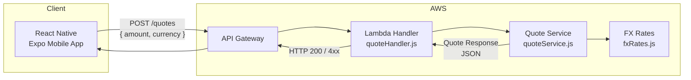
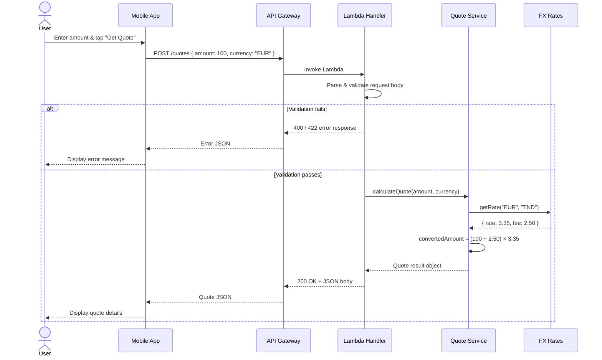
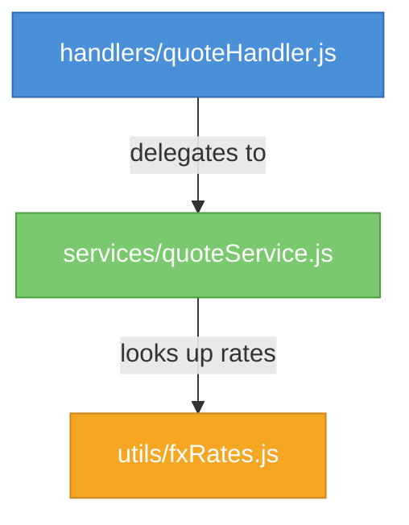
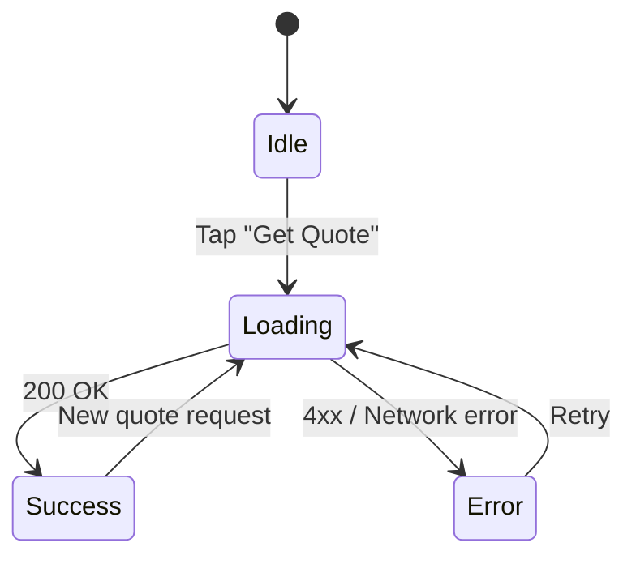

# FX Quote Service

A mini full-stack system that calculates **currency transfer quotes**. A user enters an amount in a source currency (e.g. **EUR**), and the system returns how much the recipient receives in the target currency (**TND**) after applying FX conversion and transfer fees.

> **Example:** Send **100 EUR** → Receive **326.63 TND** (after a 2.50 EUR fee at a 3.35 FX rate).

---

## Table of Contents

- [Architecture](#architecture)
- [Request Flow](#request-flow)
- [Project Structure](#project-structure)
- [Backend](#backend)
- [Mobile App](#mobile-app)
- [API Contract](#api-contract)
- [Quick Start](#quick-start)

---

## Architecture



| Layer            | Technology          | Responsibility                                              |
| ---------------- | ------------------- | ----------------------------------------------------------- |
| **Backend**      | Node.js, AWS Lambda | Validates input, calculates FX quote, returns JSON response |
| **Mobile**       | React Native, Expo  | Single-screen UI for requesting and displaying quotes       |
| **API Contract** | OpenAPI 3.0         | Formal specification of the `POST /quotes` endpoint         |

---

## Request Flow



---

## Backend Internal Architecture



| Module            | Role                                                                                                  |
| ----------------- | ----------------------------------------------------------------------------------------------------- |
| `quoteHandler.js` | AWS Lambda entry point — parses HTTP event, validates input, returns HTTP response                    |
| `quoteService.js` | Pure business logic — computes fee, applies FX rate, builds quote object                              |
| `fxRates.js`      | Data layer — provides exchange rates and fee schedule (static lookup, simulating an external service) |

---

## Project Structure

```
fx-quote-service/
├── README.md
├── backend/
│   ├── package.json
│   ├── handlers/
│   │   └── quoteHandler.js        # Lambda entry point
│   ├── services/
│   │   └── quoteService.js        # Core business logic
│   ├── utils/
│   │   └── fxRates.js             # FX rate lookup & constants
│   └── tests/
│       └── quoteService.test.js   # Jest unit tests
├── mobile/
│   ├── package.json
│   ├── app.json
│   ├── App.js
│   ├── screens/
│   │   └── QuoteScreen.js         # Main screen
│   ├── components/
│   │   └── QuoteResult.js         # Quote result display component
│   └── services/
│       └── api.js                 # HTTP client
└── openapi/
    └── quotes-api.yaml            # OpenAPI 3.0 specification
```

---

## Backend

### Setup

```bash
cd backend
npm install
```

### Run Tests

```bash
npm test
```

### Run Locally

The handler is designed for AWS Lambda but can be invoked locally:

```bash
node -e "
const { handler } = require('./handlers/quoteHandler');
handler({
  body: JSON.stringify({ amount: 100, currency: 'EUR' })
}).then(res => console.log(JSON.stringify(JSON.parse(res.body), null, 2)));
"
```

### API Endpoint

**`POST /quotes`**

#### Request Body

```json
{
  "amount": 100,
  "currency": "EUR"
}
```

| Field      | Type     | Required | Description                                              |
| ---------- | -------- | -------- | -------------------------------------------------------- |
| `amount`   | `number` | Yes      | Amount to send (must be positive)                        |
| `currency` | `string` | Yes      | ISO 4217 source currency code (e.g. `EUR`, `USD`, `GBP`) |

#### Success Response — `200 OK`

```json
{
  "sourceAmount": 100,
  "sourceCurrency": "EUR",
  "targetCurrency": "TND",
  "fxRate": 3.35,
  "fee": 2.5,
  "convertedAmount": 326.625,
  "estimatedDelivery": "5 minutes"
}
```

| Field               | Type     | Description                            |
| ------------------- | -------- | -------------------------------------- |
| `sourceAmount`      | `number` | Original amount entered by the user    |
| `sourceCurrency`    | `string` | Source currency code                   |
| `targetCurrency`    | `string` | Destination currency code              |
| `fxRate`            | `number` | Exchange rate applied                  |
| `fee`               | `number` | Flat fee deducted (in source currency) |
| `convertedAmount`   | `number` | Final amount the recipient receives    |
| `estimatedDelivery` | `string` | Estimated transfer delivery time       |

#### Error Responses

| Status  | When                                                        | Example Body                                      |
| ------- | ----------------------------------------------------------- | ------------------------------------------------- |
| **400** | Malformed request — missing fields, invalid JSON            | `{ "error": "Missing required field: amount" }`   |
| **422** | Business validation — negative amount, unsupported currency | `{ "error": "Amount must be a positive number" }` |

### Business Logic

The quote formula:

$$\text{convertedAmount} = (\text{amount} - \text{fee}) \times \text{fxRate}$$

- **FX rates** are retrieved from a static lookup table (simulating a real-time rates provider).
- A **flat fee** in the source currency is deducted before conversion.
- The fee schedule and supported currency pairs are defined in `utils/fxRates.js`.

---

## Mobile App

### Setup

```bash
cd mobile
npm install
```

### Run

```bash
npx expo start
```

Scan the QR code with Expo Go, or press **`a`** for Android emulator / **`i`** for iOS simulator.

### Configuration

Set `API_BASE_URL` in `mobile/services/api.js` to point to your backend endpoint.

### UI States



### Screen Layout

| Element                | Description                                                             |
| ---------------------- | ----------------------------------------------------------------------- |
| **Amount input**       | Numeric field for the send amount                                       |
| **"Get Quote" button** | Triggers the API call                                                   |
| **Quote result card**  | Displays: send amount, FX rate, fee, receive amount, estimated delivery |
| **Error banner**       | Shown on validation or network errors                                   |
| **Loading spinner**    | Shown while the request is in-flight                                    |

### Example Display

```
┌──────────────────────────────┐
│  You send:       100.00 EUR  │
│  FX rate:        3.35        │
│  Fee:            2.50 EUR    │
│  You receive:    326.63 TND  │
│  Est. delivery:  5 minutes   │
└──────────────────────────────┘
```

---

## API Contract

The full OpenAPI 3.0 specification lives at `openapi/quotes-api.yaml`.

You can load it in:

- [Swagger Editor](https://editor.swagger.io/)
- [Redocly](https://redocly.com/)
- Any OpenAPI-compatible tool

The spec defines:

- Request schema with validation constraints
- Success response schema
- `400` and `422` error response schemas

---

## Quick Start

```bash
# 1 — Backend
cd backend
npm install
npm test

# 2 — Mobile
cd ../mobile
npm install
npx expo start
```
