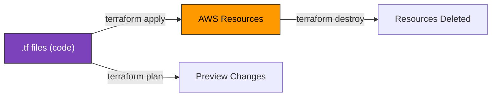
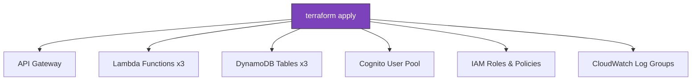
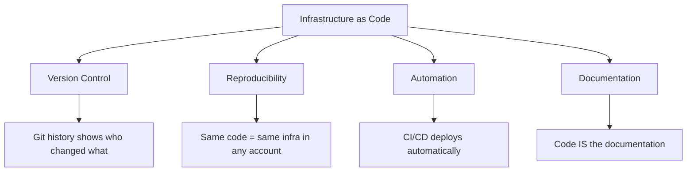
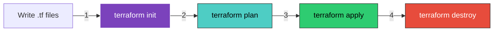
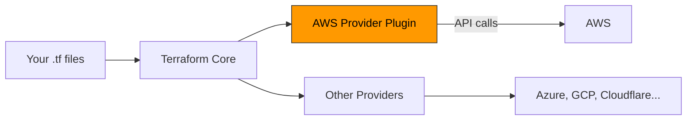
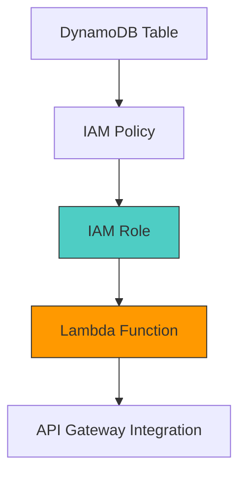
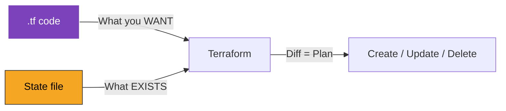
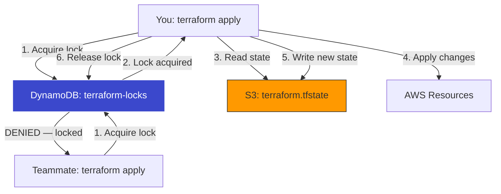
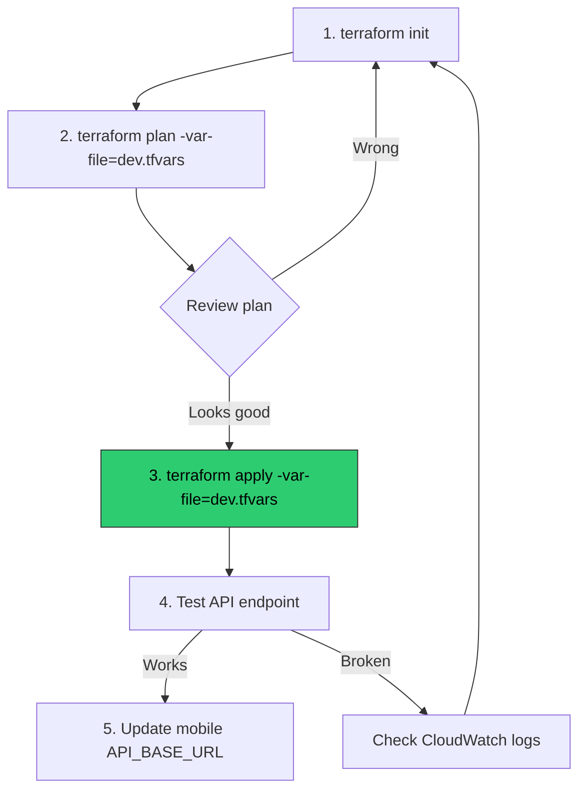

# Terraform — Learning Guide

A structured, course-like walkthrough of Terraform from zero to deploying the FX Quote Service on AWS. Each section builds on the previous one.

---

## Table of Contents

1. [Course Overview](#1-course-overview)
2. [What Is Infrastructure as Code?](#2-what-is-infrastructure-as-code)
3. [Installing Terraform & First Commands](#3-installing-terraform--first-commands)
4. [HCL — HashiCorp Configuration Language](#4-hcl--hashicorp-configuration-language)
5. [Providers — Connecting to AWS](#5-providers--connecting-to-aws)
6. [Resources — Creating AWS Things](#6-resources--creating-aws-things)
7. [Variables & Outputs](#7-variables--outputs)
8. [State — How Terraform Tracks Resources](#8-state--how-terraform-tracks-resources)
9. [Data Sources — Reading Existing Resources](#9-data-sources--reading-existing-resources)
10. [Modules — Reusable Infrastructure](#10-modules--reusable-infrastructure)
11. [IAM with Terraform](#11-iam-with-terraform)
12. [Lambda with Terraform](#12-lambda-with-terraform)
13. [API Gateway with Terraform](#13-api-gateway-with-terraform)
14. [DynamoDB with Terraform](#14-dynamodb-with-terraform)
15. [Cognito with Terraform](#15-cognito-with-terraform)
16. [S3 & CloudFront with Terraform](#16-s3--cloudfront-with-terraform)
17. [Environments — Dev, Staging, Prod](#17-environments--dev-staging-prod)
18. [Remote State & Locking](#18-remote-state--locking)
19. [Import & Migration](#19-import--migration)
20. [Full FX Service Deployment](#20-full-fx-service-deployment)

---

## 1. Course Overview

### What Is Terraform?

Terraform is a tool that lets you define cloud infrastructure in code files, then creates/updates/deletes those resources automatically.



### Why Terraform?

| Problem                               | Terraform Solution                          |
| ------------------------------------- | ------------------------------------------- |
| Clicking in AWS console is slow       | Define resources in code, apply in seconds  |
| "What did I create?" — no record      | `.tf` files document everything             |
| "Works on my account" — inconsistency | Same code = same infrastructure             |
| Manual changes break things           | `terraform plan` shows exactly what changes |
| Team collaboration                    | Code review for infrastructure changes      |

### What You'll Build

By the end of this guide, you'll deploy the FX Quote Service to AWS:



---

## 2. What Is Infrastructure as Code?

### The Old Way (ClickOps)

1. Log into AWS Console
2. Click "Create Lambda Function"
3. Fill in 15 form fields
4. Click "Create DynamoDB Table"
5. Fill in 10 more fields
6. Configure IAM permissions by clicking...
7. ❌ Forget what you did, can't reproduce, colleague asks "how did you set this up?"

### The New Way (IaC)

```hcl
# Everything documented, version-controlled, reproducible
resource "aws_lambda_function" "quotes" {
  function_name = "fx-quote-handler"
  runtime       = "nodejs20.x"
  handler       = "handlers/quoteHandler.handler"
  memory_size   = 256
  timeout       = 30
}
```

### IaC Benefits



---

## 3. Installing Terraform & First Commands

### Installation (Windows)

```powershell
# Option 1: Chocolatey
choco install terraform

# Option 2: Manual
# Download from https://developer.hashicorp.com/terraform/install
# Extract terraform.exe to a folder in your PATH

# Verify
terraform version
# Terraform v1.x.x
```

### The Core Workflow

Every Terraform project follows the same 4-step cycle:



| Command              | What It Does                                   |
| -------------------- | ---------------------------------------------- |
| `terraform init`     | Download provider plugins (like `npm install`) |
| `terraform plan`     | Preview what will be created/changed/destroyed |
| `terraform apply`    | Actually create/update the resources           |
| `terraform destroy`  | Delete everything Terraform created            |
| `terraform fmt`      | Auto-format your .tf files                     |
| `terraform validate` | Check syntax without connecting to AWS         |

### First Example — Create an S3 Bucket

```hcl
# main.tf
terraform {
  required_providers {
    aws = {
      source  = "hashicorp/aws"
      version = "~> 5.0"
    }
  }
}

provider "aws" {
  region = "eu-west-1"
}

resource "aws_s3_bucket" "my_first_bucket" {
  bucket = "my-unique-bucket-name-12345"
}
```

```powershell
terraform init     # Downloads the AWS provider
terraform plan     # Shows: 1 to add, 0 to change, 0 to destroy
terraform apply    # Type "yes" → bucket created
terraform destroy  # Type "yes" → bucket deleted
```

---

## 4. HCL — HashiCorp Configuration Language

### Basic Syntax

HCL is the language Terraform uses. It's not JSON, not YAML — it's its own thing.

```hcl
# Comments start with #

# Blocks have a type, optional labels, and a body
resource "aws_lambda_function" "quotes" {
  function_name = "fx-quote-handler"    # string
  memory_size   = 256                    # number
  publish       = true                   # boolean
  runtime       = "nodejs20.x"

  # Nested block
  environment {
    variables = {
      JWT_SECRET = var.jwt_secret        # reference to a variable
      TABLE_NAME = aws_dynamodb_table.quotes.name  # reference to another resource
    }
  }

  tags = {                               # map
    Project     = "fx-quote-service"
    Environment = var.environment
  }
}
```

### Types

| Type   | Example                              |
| ------ | ------------------------------------ |
| string | `"hello"`                            |
| number | `256`                                |
| bool   | `true` / `false`                     |
| list   | `["a", "b", "c"]`                    |
| map    | `{ key = "value", key2 = "value2" }` |

### String Interpolation

```hcl
name = "fx-${var.environment}-quotes"
# If var.environment = "prod" → "fx-prod-quotes"
```

### Conditional Expressions

```hcl
# condition ? true_value : false_value
memory_size = var.environment == "prod" ? 512 : 128
```

### Loops — `for_each`

```hcl
# Create a DynamoDB table for each name in the list
variable "table_names" {
  default = ["users", "quotes", "transfers"]
}

resource "aws_dynamodb_table" "tables" {
  for_each = toset(var.table_names)
  name     = "fx-${each.value}"
  # ...
}
```

---

## 5. Providers — Connecting to AWS

### What Is a Provider?

A provider is a plugin that tells Terraform how to talk to a specific cloud/service. The AWS provider translates your HCL into AWS API calls.



### AWS Provider Configuration

```hcl
# versions.tf — pin your providers
terraform {
  required_version = ">= 1.5"
  required_providers {
    aws = {
      source  = "hashicorp/aws"
      version = "~> 5.0"    # any 5.x version
    }
  }
}

# provider.tf — configure AWS connection
provider "aws" {
  region = var.aws_region

  default_tags {
    tags = {
      Project   = "fx-quote-service"
      ManagedBy = "terraform"
    }
  }
}
```

### Authentication

Terraform needs AWS credentials. **Never put them in .tf files.**

```powershell
# Option 1: AWS CLI (recommended for local dev)
aws configure
# Enter: Access Key, Secret Key, Region, Output format

# Option 2: Environment variables
$env:AWS_ACCESS_KEY_ID = "AKIA..."
$env:AWS_SECRET_ACCESS_KEY = "wJalr..."
$env:AWS_DEFAULT_REGION = "eu-west-1"

# Option 3: AWS SSO (recommended for teams)
aws sso login --profile my-profile
```

### Version Constraints

| Constraint | Meaning                    | Example   |
| ---------- | -------------------------- | --------- |
| `= 5.30`   | Exactly this version       | 5.30 only |
| `>= 5.0`   | This version or newer      | 5.0+      |
| `~> 5.0`   | Any 5.x (minor updates OK) | 5.0–5.99  |
| `~> 5.30`  | Patch updates only         | 5.30–5.39 |

---

## 6. Resources — Creating AWS Things

### Resource Block Structure

```hcl
resource "<PROVIDER>_<TYPE>" "<LOCAL_NAME>" {
  # arguments
}
```

- `<PROVIDER>_<TYPE>` = the AWS resource type (e.g., `aws_lambda_function`)
- `<LOCAL_NAME>` = your reference name (used to link resources together)

### Common Resources for Our Service

```hcl
# Lambda function
resource "aws_lambda_function" "quotes" {
  function_name = "fx-quotes"
  runtime       = "nodejs20.x"
  handler       = "handlers/quoteHandler.handler"
  filename      = "lambda.zip"
  role          = aws_iam_role.lambda_exec.arn
}

# DynamoDB table
resource "aws_dynamodb_table" "quotes" {
  name         = "fx-quotes"
  billing_mode = "PAY_PER_REQUEST"
  hash_key     = "id"

  attribute {
    name = "id"
    type = "S"    # S = String, N = Number, B = Binary
  }
}

# S3 bucket
resource "aws_s3_bucket" "exports" {
  bucket = "fx-quote-exports"
}
```

### Resource References

Resources can reference each other:

```hcl
resource "aws_iam_role" "lambda_exec" {
  name = "fx-lambda-role"
  # ...
}

resource "aws_lambda_function" "quotes" {
  role = aws_iam_role.lambda_exec.arn
  #      ^^^^^^^^^^^^^^^^^^^^^^^^ references the role above
}
```

Terraform builds a **dependency graph** and creates resources in the right order:



### Lifecycle & Prevent Destruction

```hcl
resource "aws_dynamodb_table" "quotes" {
  name = "fx-quotes"
  # ...

  lifecycle {
    prevent_destroy = true   # Terraform won't delete this even on `destroy`
  }
}
```

---

## 7. Variables & Outputs

### Input Variables

Variables make your configuration flexible and reusable.

```hcl
# variables.tf
variable "environment" {
  description = "Deployment environment"
  type        = string
  default     = "dev"

  validation {
    condition     = contains(["dev", "staging", "prod"], var.environment)
    error_message = "Environment must be dev, staging, or prod."
  }
}

variable "aws_region" {
  description = "AWS region to deploy to"
  type        = string
  default     = "eu-west-1"
}

variable "jwt_secret" {
  description = "JWT signing secret"
  type        = string
  sensitive   = true    # Won't show in logs or plan output
}
```

### Passing Variables

```powershell
# Option 1: Command line
terraform apply -var="environment=prod" -var="jwt_secret=my-secret"

# Option 2: .tfvars file (don't commit secrets!)
# terraform.tfvars
environment = "prod"
jwt_secret  = "super-secret-key"

# Option 3: Environment variables
$env:TF_VAR_environment = "prod"
$env:TF_VAR_jwt_secret = "super-secret-key"
```

### Output Values

Outputs display important information after `terraform apply`.

```hcl
# outputs.tf
output "api_url" {
  description = "API Gateway endpoint URL"
  value       = aws_apigatewayv2_stage.default.invoke_url
}

output "user_pool_id" {
  description = "Cognito User Pool ID"
  value       = aws_cognito_user_pool.users.id
}

output "quotes_table_name" {
  description = "DynamoDB quotes table name"
  value       = aws_dynamodb_table.quotes.name
}
```

After `terraform apply`:

```
Outputs:
  api_url          = "https://abc123.execute-api.eu-west-1.amazonaws.com/prod"
  user_pool_id     = "eu-west-1_AbCdEfG"
  quotes_table_name = "fx-prod-quotes"
```

### Variable Types

```hcl
# Simple types
variable "name" { type = string }
variable "port" { type = number }
variable "enabled" { type = bool }

# Collection types
variable "allowed_currencies" {
  type    = list(string)
  default = ["EUR", "USD", "GBP"]
}

variable "rate_config" {
  type = map(object({
    rate = number
    fee  = number
  }))
  default = {
    EUR = { rate = 3.35, fee = 2.5 }
    USD = { rate = 3.1,  fee = 3.0 }
  }
}
```

---

## 8. State — How Terraform Tracks Resources

### What Is State?

Terraform keeps a **state file** (`terraform.tfstate`) that maps your code to real AWS resources. It's the "memory" of what exists.



### State File Example

```json
{
  "resources": [
    {
      "type": "aws_dynamodb_table",
      "name": "quotes",
      "instances": [
        {
          "attributes": {
            "name": "fx-quotes",
            "arn": "arn:aws:dynamodb:eu-west-1:123:table/fx-quotes",
            "billing_mode": "PAY_PER_REQUEST"
          }
        }
      ]
    }
  ]
}
```

### Why State Matters

| Scenario                   | Without State               | With State                         |
| -------------------------- | --------------------------- | ---------------------------------- |
| Run `apply` twice          | Creates duplicate resources | No-op (already exists)             |
| Change memory from 128→256 | Creates new Lambda          | Updates existing Lambda            |
| Remove resource from code  | Orphaned resource in AWS    | Deletes the resource               |
| Team member runs `apply`   | Conflicts and duplicates    | Sees latest state, plans correctly |

### State Commands

```powershell
terraform state list                    # List all tracked resources
terraform state show aws_lambda_function.quotes   # Show details
terraform state rm aws_s3_bucket.old    # Stop tracking (don't delete)
terraform state mv aws_lambda_function.old aws_lambda_function.new  # Rename
```

### ⚠️ Critical Rules

1. **Never edit state manually** — use `terraform state` commands
2. **Never commit state to git** — it contains secrets and resource IDs
3. **Use remote state** (S3) for team projects — covered in Section 18

---

## 9. Data Sources — Reading Existing Resources

### What Are Data Sources?

Data sources read information about resources that **already exist** — created manually, by another Terraform config, or by AWS.

```hcl
# Read the current AWS account info
data "aws_caller_identity" "current" {}

# Read an existing VPC
data "aws_vpc" "main" {
  filter {
    name   = "tag:Name"
    values = ["main-vpc"]
  }
}

# Use the data
resource "aws_lambda_function" "quotes" {
  # ...
  vpc_config {
    subnet_ids = data.aws_vpc.main.*.subnet_ids
  }
}

output "account_id" {
  value = data.aws_caller_identity.current.account_id
}
```

### Common Data Sources

| Data Source               | What It Reads                        |
| ------------------------- | ------------------------------------ |
| `aws_caller_identity`     | Current account ID, user ARN         |
| `aws_region`              | Current region name                  |
| `aws_vpc`                 | VPC details by ID or tags            |
| `aws_subnets`             | Subnet IDs matching filters          |
| `aws_iam_policy_document` | Build IAM policies in HCL (not JSON) |
| `aws_ami`                 | Find latest AMI for EC2              |

### IAM Policy as Data Source (Cleaner Than JSON)

```hcl
data "aws_iam_policy_document" "lambda_dynamodb" {
  statement {
    effect = "Allow"
    actions = [
      "dynamodb:GetItem",
      "dynamodb:PutItem",
      "dynamodb:Query",
    ]
    resources = [
      aws_dynamodb_table.quotes.arn,
      aws_dynamodb_table.transfers.arn,
    ]
  }

  statement {
    effect    = "Allow"
    actions   = ["logs:*"]
    resources = ["*"]
  }
}

resource "aws_iam_role_policy" "lambda_policy" {
  role   = aws_iam_role.lambda_exec.id
  policy = data.aws_iam_policy_document.lambda_dynamodb.json
}
```

---

## 10. Modules — Reusable Infrastructure

### What Is a Module?

A module is a group of .tf files in a folder — reusable infrastructure packages.

```
infrastructure/
├── main.tf              # Root module
├── variables.tf
├── outputs.tf
└── modules/
    ├── lambda/          # Reusable Lambda module
    │   ├── main.tf
    │   ├── variables.tf
    │   └── outputs.tf
    └── dynamodb-table/  # Reusable DynamoDB module
        ├── main.tf
        ├── variables.tf
        └── outputs.tf
```

### Creating a Module

```hcl
# modules/lambda/variables.tf
variable "function_name" { type = string }
variable "handler" { type = string }
variable "runtime" { type = string; default = "nodejs20.x" }
variable "memory_size" { type = number; default = 256 }
variable "environment_variables" { type = map(string); default = {} }

# modules/lambda/main.tf
resource "aws_lambda_function" "this" {
  function_name = var.function_name
  runtime       = var.runtime
  handler       = var.handler
  memory_size   = var.memory_size
  filename      = "${path.module}/lambda.zip"
  role          = aws_iam_role.exec.arn

  environment {
    variables = var.environment_variables
  }
}

# modules/lambda/outputs.tf
output "function_name" { value = aws_lambda_function.this.function_name }
output "arn" { value = aws_lambda_function.this.arn }
output "invoke_arn" { value = aws_lambda_function.this.invoke_arn }
```

### Using the Module

```hcl
# main.tf — call the module 3 times for our 3 handlers
module "auth_lambda" {
  source        = "./modules/lambda"
  function_name = "fx-${var.environment}-auth"
  handler       = "handlers/authHandler.registerHandler"
  environment_variables = {
    JWT_SECRET = var.jwt_secret
  }
}

module "quotes_lambda" {
  source        = "./modules/lambda"
  function_name = "fx-${var.environment}-quotes"
  handler       = "handlers/quoteHandler.handler"
  environment_variables = {
    QUOTES_TABLE = module.quotes_table.name
  }
}

module "transfers_lambda" {
  source        = "./modules/lambda"
  function_name = "fx-${var.environment}-transfers"
  handler       = "handlers/transferHandler.createTransferHandler"
  environment_variables = {
    QUOTES_TABLE    = module.quotes_table.name
    TRANSFERS_TABLE = module.transfers_table.name
  }
}
```

### Public Modules (Terraform Registry)

Reuse community modules instead of building everything:

```hcl
module "vpc" {
  source  = "terraform-aws-modules/vpc/aws"
  version = "5.0.0"

  name = "fx-service-vpc"
  cidr = "10.0.0.0/16"
  azs  = ["eu-west-1a", "eu-west-1b"]
}
```

---

## 11. IAM with Terraform

### Lambda Execution Role

Every Lambda function needs a role that allows it to run:

```hcl
# Trust policy — allows Lambda service to assume this role
data "aws_iam_policy_document" "lambda_assume" {
  statement {
    effect  = "Allow"
    actions = ["sts:AssumeRole"]
    principals {
      type        = "Service"
      identifiers = ["lambda.amazonaws.com"]
    }
  }
}

resource "aws_iam_role" "lambda_exec" {
  name               = "fx-${var.environment}-lambda-role"
  assume_role_policy = data.aws_iam_policy_document.lambda_assume.json
}

# Attach AWS managed policy for CloudWatch logging
resource "aws_iam_role_policy_attachment" "lambda_logs" {
  role       = aws_iam_role.lambda_exec.name
  policy_arn = "arn:aws:iam::aws:policy/service-role/AWSLambdaBasicExecutionRole"
}

# Custom policy for DynamoDB access
resource "aws_iam_role_policy" "lambda_dynamodb" {
  role   = aws_iam_role.lambda_exec.id
  policy = data.aws_iam_policy_document.lambda_dynamodb.json
}
```

### Principle of Least Privilege in Terraform

```hcl
# ❌ BAD — too broad
data "aws_iam_policy_document" "bad" {
  statement {
    effect    = "Allow"
    actions   = ["*"]
    resources = ["*"]
  }
}

# ✅ GOOD — specific actions, specific resources
data "aws_iam_policy_document" "good" {
  statement {
    effect = "Allow"
    actions = [
      "dynamodb:GetItem",
      "dynamodb:PutItem",
      "dynamodb:Query",
    ]
    resources = [
      aws_dynamodb_table.quotes.arn,
      "${aws_dynamodb_table.quotes.arn}/index/*",
    ]
  }
}
```

---

## 12. Lambda with Terraform

### Complete Lambda Resource

```hcl
# Package the code
data "archive_file" "lambda_zip" {
  type        = "zip"
  source_dir  = "${path.root}/../backend"
  output_path = "${path.root}/builds/lambda.zip"
  excludes    = ["node_modules/.cache", "tests", "*.test.js"]
}

# Lambda function
resource "aws_lambda_function" "quotes" {
  function_name    = "fx-${var.environment}-quotes"
  runtime          = "nodejs20.x"
  handler          = "handlers/quoteHandler.handler"
  memory_size      = 256
  timeout          = 30
  filename         = data.archive_file.lambda_zip.output_path
  source_code_hash = data.archive_file.lambda_zip.output_base64sha256
  role             = aws_iam_role.lambda_exec.arn

  environment {
    variables = {
      NODE_ENV     = var.environment
      QUOTES_TABLE = aws_dynamodb_table.quotes.name
    }
  }
}

# CloudWatch log group (with retention)
resource "aws_cloudwatch_log_group" "quotes" {
  name              = "/aws/lambda/fx-${var.environment}-quotes"
  retention_in_days = 14
}

# Permission for API Gateway to invoke Lambda
resource "aws_lambda_permission" "quotes_apigw" {
  statement_id  = "AllowAPIGateway"
  action        = "lambda:InvokeFunction"
  function_name = aws_lambda_function.quotes.function_name
  principal     = "apigateway.amazonaws.com"
  source_arn    = "${aws_apigatewayv2_api.main.execution_arn}/*"
}
```

### `source_code_hash` — Auto-Redeploy on Code Changes

The `source_code_hash` tells Terraform to update the Lambda when the zip contents change. Without it, code updates wouldn't be detected.

---

## 13. API Gateway with Terraform

### HTTP API (v2 — Recommended)

```hcl
# The API
resource "aws_apigatewayv2_api" "main" {
  name          = "fx-${var.environment}-api"
  protocol_type = "HTTP"

  cors_configuration {
    allow_origins = ["*"]
    allow_methods = ["GET", "POST", "OPTIONS"]
    allow_headers = ["Content-Type", "Authorization"]
  }
}

# Default stage (auto-deploy)
resource "aws_apigatewayv2_stage" "default" {
  api_id      = aws_apigatewayv2_api.main.id
  name        = "$default"
  auto_deploy = true

  default_route_settings {
    throttling_burst_limit = 100
    throttling_rate_limit  = 50
  }
}

# Integration — connect API Gateway to Lambda
resource "aws_apigatewayv2_integration" "quotes" {
  api_id                 = aws_apigatewayv2_api.main.id
  integration_type       = "AWS_PROXY"
  integration_uri        = aws_lambda_function.quotes.invoke_arn
  payload_format_version = "2.0"
}

# Routes
resource "aws_apigatewayv2_route" "post_quotes" {
  api_id    = aws_apigatewayv2_api.main.id
  route_key = "POST /quotes"
  target    = "integrations/${aws_apigatewayv2_integration.quotes.id}"
}

resource "aws_apigatewayv2_route" "post_quotes_create" {
  api_id             = aws_apigatewayv2_api.main.id
  route_key          = "POST /quotes/create"
  target             = "integrations/${aws_apigatewayv2_integration.quotes.id}"
  authorization_type = "JWT"
  authorizer_id      = aws_apigatewayv2_authorizer.cognito.id
}
```

### Cognito Authorizer

```hcl
resource "aws_apigatewayv2_authorizer" "cognito" {
  api_id           = aws_apigatewayv2_api.main.id
  authorizer_type  = "JWT"
  identity_sources = ["$request.header.Authorization"]
  name             = "cognito-auth"

  jwt_configuration {
    audience = [aws_cognito_user_pool_client.app.id]
    issuer   = "https://cognito-idp.${var.aws_region}.amazonaws.com/${aws_cognito_user_pool.users.id}"
  }
}
```

---

## 14. DynamoDB with Terraform

### Tables for Our FX Service

```hcl
# Quotes table
resource "aws_dynamodb_table" "quotes" {
  name         = "fx-${var.environment}-quotes"
  billing_mode = "PAY_PER_REQUEST"
  hash_key     = "id"

  attribute {
    name = "id"
    type = "S"
  }

  attribute {
    name = "userId"
    type = "S"
  }

  # GSI to query quotes by user
  global_secondary_index {
    name            = "userId-index"
    hash_key        = "userId"
    projection_type = "ALL"
  }

  point_in_time_recovery {
    enabled = true
  }

  tags = {
    Service = "quotes"
  }

  lifecycle {
    prevent_destroy = true
  }
}

# Transfers table
resource "aws_dynamodb_table" "transfers" {
  name         = "fx-${var.environment}-transfers"
  billing_mode = "PAY_PER_REQUEST"
  hash_key     = "id"

  attribute {
    name = "id"
    type = "S"
  }

  attribute {
    name = "userId"
    type = "S"
  }

  global_secondary_index {
    name            = "userId-index"
    hash_key        = "userId"
    projection_type = "ALL"
  }

  point_in_time_recovery {
    enabled = true
  }

  lifecycle {
    prevent_destroy = true
  }
}

# Users table (if not using Cognito for storage)
resource "aws_dynamodb_table" "users" {
  name         = "fx-${var.environment}-users"
  billing_mode = "PAY_PER_REQUEST"
  hash_key     = "id"

  attribute {
    name = "id"
    type = "S"
  }

  attribute {
    name = "email"
    type = "S"
  }

  global_secondary_index {
    name            = "email-index"
    hash_key        = "email"
    projection_type = "ALL"
  }
}
```

### Billing Modes

| Mode            | How It Works                        | Best For             |
| --------------- | ----------------------------------- | -------------------- |
| PAY_PER_REQUEST | Pay per read/write operation        | Variable/low traffic |
| PROVISIONED     | Set fixed read/write capacity units | Predictable traffic  |

---

## 15. Cognito with Terraform

### User Pool

```hcl
resource "aws_cognito_user_pool" "users" {
  name = "fx-${var.environment}-users"

  # How users sign in
  username_attributes = ["email"]
  auto_verified_attributes = ["email"]

  # Password policy
  password_policy {
    minimum_length    = 8
    require_lowercase = true
    require_numbers   = true
    require_symbols   = false
    require_uppercase = true
  }

  # Required user attributes
  schema {
    name                = "name"
    attribute_data_type = "String"
    required            = true
    mutable             = true
  }

  # Email verification
  verification_message_template {
    default_email_option = "CONFIRM_WITH_CODE"
    email_subject        = "FX Quote Service — Verify your email"
    email_message        = "Your verification code is {####}"
  }
}

# App client (used by the mobile app)
resource "aws_cognito_user_pool_client" "app" {
  name         = "fx-mobile-app"
  user_pool_id = aws_cognito_user_pool.users.id

  # Auth flows
  explicit_auth_flows = [
    "ALLOW_USER_PASSWORD_AUTH",
    "ALLOW_REFRESH_TOKEN_AUTH",
  ]

  # Token validity
  access_token_validity  = 1    # hours
  id_token_validity      = 1    # hours
  refresh_token_validity = 30   # days

  # No client secret (public mobile app)
  generate_secret = false
}
```

### Outputs

```hcl
output "cognito_user_pool_id" {
  value = aws_cognito_user_pool.users.id
}

output "cognito_client_id" {
  value = aws_cognito_user_pool_client.app.id
}
```

---

## 16. S3 & CloudFront with Terraform

### S3 Bucket with Security

```hcl
resource "aws_s3_bucket" "exports" {
  bucket = "fx-${var.environment}-exports"
}

# Block all public access
resource "aws_s3_bucket_public_access_block" "exports" {
  bucket = aws_s3_bucket.exports.id

  block_public_acls       = true
  block_public_policy     = true
  ignore_public_acls      = true
  restrict_public_buckets = true
}

# Enable versioning
resource "aws_s3_bucket_versioning" "exports" {
  bucket = aws_s3_bucket.exports.id
  versioning_configuration {
    status = "Enabled"
  }
}

# Server-side encryption
resource "aws_s3_bucket_server_side_encryption_configuration" "exports" {
  bucket = aws_s3_bucket.exports.id

  rule {
    apply_server_side_encryption_by_default {
      sse_algorithm = "AES256"
    }
  }
}
```

### CloudFront Distribution

```hcl
resource "aws_cloudfront_distribution" "api" {
  enabled = true
  comment = "FX Quote API CDN"

  origin {
    domain_name = replace(aws_apigatewayv2_stage.default.invoke_url, "https://", "")
    origin_id   = "api-gateway"

    custom_origin_config {
      http_port              = 80
      https_port             = 443
      origin_protocol_policy = "https-only"
      origin_ssl_protocols   = ["TLSv1.2"]
    }
  }

  default_cache_behavior {
    allowed_methods        = ["GET", "HEAD", "OPTIONS", "PUT", "POST", "PATCH", "DELETE"]
    cached_methods         = ["GET", "HEAD"]
    target_origin_id       = "api-gateway"
    viewer_protocol_policy = "redirect-to-https"

    forwarded_values {
      query_string = true
      headers      = ["Authorization", "Content-Type"]

      cookies { forward = "none" }
    }
  }

  restrictions {
    geo_restriction { restriction_type = "none" }
  }

  viewer_certificate {
    cloudfront_default_certificate = true
  }
}
```

---

## 17. Environments — Dev, Staging, Prod

### Strategy: Workspaces vs Directories

| Approach    | How It Works                            | Pros           | Cons              |
| ----------- | --------------------------------------- | -------------- | ----------------- |
| Workspaces  | Same code, `terraform workspace` switch | Simple, DRY    | Shared state risk |
| Directories | Separate folders per environment        | Full isolation | Code duplication  |
| Var files   | Same code, different `.tfvars` files    | Balanced       | **Recommended**   |

### Recommended: Variable Files

```
infrastructure/
├── main.tf
├── variables.tf
├── outputs.tf
├── environments/
│   ├── dev.tfvars
│   ├── staging.tfvars
│   └── prod.tfvars
```

```hcl
# environments/dev.tfvars
environment  = "dev"
aws_region   = "eu-west-1"

# environments/prod.tfvars
environment  = "prod"
aws_region   = "eu-west-1"
```

```powershell
# Deploy to dev
terraform apply -var-file="environments/dev.tfvars"

# Deploy to prod
terraform apply -var-file="environments/prod.tfvars"
```

### Naming Convention

All resources include the environment in their name:

```hcl
resource "aws_lambda_function" "quotes" {
  function_name = "fx-${var.environment}-quotes"
  #                    ^^^^^^^^^^^^^^^^^^
  #                    fx-dev-quotes / fx-prod-quotes
}
```

---

## 18. Remote State & Locking

### The Problem with Local State

- Only you have the state file
- Teammate runs `apply` → duplicate resources
- Laptop dies → state is lost

### Solution: S3 Backend + DynamoDB Locking

```hcl
# backend.tf
terraform {
  backend "s3" {
    bucket         = "fx-terraform-state"
    key            = "fx-quote-service/terraform.tfstate"
    region         = "eu-west-1"
    encrypt        = true
    dynamodb_table = "terraform-locks"
  }
}
```



### Bootstrap Script (Run Once)

```hcl
# bootstrap/main.tf — creates the state infrastructure itself
provider "aws" { region = "eu-west-1" }

resource "aws_s3_bucket" "state" {
  bucket = "fx-terraform-state"
}

resource "aws_s3_bucket_versioning" "state" {
  bucket = aws_s3_bucket.state.id
  versioning_configuration { status = "Enabled" }
}

resource "aws_s3_bucket_server_side_encryption_configuration" "state" {
  bucket = aws_s3_bucket.state.id
  rule {
    apply_server_side_encryption_by_default { sse_algorithm = "AES256" }
  }
}

resource "aws_dynamodb_table" "locks" {
  name         = "terraform-locks"
  billing_mode = "PAY_PER_REQUEST"
  hash_key     = "LockID"

  attribute {
    name = "LockID"
    type = "S"
  }
}
```

---

## 19. Import & Migration

### Importing Existing Resources

If you created something manually in the console, Terraform can import it:

```powershell
# Import an existing DynamoDB table
terraform import aws_dynamodb_table.quotes fx-quotes

# Import an existing Lambda function
terraform import aws_lambda_function.quotes fx-quote-handler

# Import an existing S3 bucket
terraform import aws_s3_bucket.exports fx-quote-exports
```

After import, write matching `.tf` code and run `terraform plan` — it should show "No changes."

### `moved` Blocks (Refactoring)

When you rename resources in code:

```hcl
# Tell Terraform the resource was renamed, not deleted + recreated
moved {
  from = aws_lambda_function.quote_handler
  to   = aws_lambda_function.quotes
}
```

---

## 20. Full FX Service Deployment

### Project Structure

```
fx-quote-service/
├── backend/            # Application code
├── mobile/             # React Native app
├── openapi/            # API spec
├── infrastructure/     # ← Terraform lives here
│   ├── main.tf
│   ├── variables.tf
│   ├── outputs.tf
│   ├── versions.tf
│   ├── iam.tf
│   ├── lambda.tf
│   ├── api-gateway.tf
│   ├── dynamodb.tf
│   ├── cognito.tf
│   ├── cloudwatch.tf
│   └── environments/
│       ├── dev.tfvars
│       └── prod.tfvars
```

### Deployment Steps



### Complete `main.tf`

```hcl
# main.tf — ties everything together

# Package backend code
data "archive_file" "backend" {
  type        = "zip"
  source_dir  = "${path.root}/../backend"
  output_path = "${path.root}/builds/backend.zip"
  excludes    = ["node_modules/.cache", "tests", "server.js"]
}

# IAM
module "iam" {
  source      = "./modules/iam"
  environment = var.environment
  quotes_table_arn    = module.dynamodb.quotes_table_arn
  transfers_table_arn = module.dynamodb.transfers_table_arn
}

# DynamoDB tables
module "dynamodb" {
  source      = "./modules/dynamodb"
  environment = var.environment
}

# Cognito
module "cognito" {
  source      = "./modules/cognito"
  environment = var.environment
}

# Lambda functions
module "auth_lambda" {
  source        = "./modules/lambda"
  function_name = "fx-${var.environment}-auth"
  handler       = "handlers/authHandler.registerHandler"
  zip_file      = data.archive_file.backend.output_path
  zip_hash      = data.archive_file.backend.output_base64sha256
  role_arn      = module.iam.lambda_role_arn
  environment_variables = {
    USER_POOL_ID = module.cognito.user_pool_id
  }
}

module "quotes_lambda" {
  source        = "./modules/lambda"
  function_name = "fx-${var.environment}-quotes"
  handler       = "handlers/quoteHandler.handler"
  zip_file      = data.archive_file.backend.output_path
  zip_hash      = data.archive_file.backend.output_base64sha256
  role_arn      = module.iam.lambda_role_arn
  environment_variables = {
    QUOTES_TABLE = module.dynamodb.quotes_table_name
  }
}

module "transfers_lambda" {
  source        = "./modules/lambda"
  function_name = "fx-${var.environment}-transfers"
  handler       = "handlers/transferHandler.createTransferHandler"
  zip_file      = data.archive_file.backend.output_path
  zip_hash      = data.archive_file.backend.output_base64sha256
  role_arn      = module.iam.lambda_role_arn
  environment_variables = {
    QUOTES_TABLE    = module.dynamodb.quotes_table_name
    TRANSFERS_TABLE = module.dynamodb.transfers_table_name
  }
}

# API Gateway
module "api_gateway" {
  source      = "./modules/api-gateway"
  environment = var.environment
  cognito_user_pool_id = module.cognito.user_pool_id
  cognito_client_id    = module.cognito.client_id
  auth_lambda_arn      = module.auth_lambda.invoke_arn
  quotes_lambda_arn    = module.quotes_lambda.invoke_arn
  transfers_lambda_arn = module.transfers_lambda.invoke_arn
}
```

### Outputs After Deploy

```
Apply complete! Resources: 23 added, 0 changed, 0 destroyed.

Outputs:
  api_url           = "https://abc123.execute-api.eu-west-1.amazonaws.com"
  cognito_pool_id   = "eu-west-1_AbCdEfG"
  cognito_client_id = "1234567890abcdef"
  quotes_table      = "fx-prod-quotes"
  transfers_table   = "fx-prod-transfers"
```

### Quick Reference — Terraform Cheat Sheet

```powershell
terraform init                          # Install providers
terraform plan -var-file=dev.tfvars     # Preview changes
terraform apply -var-file=dev.tfvars    # Apply changes
terraform destroy -var-file=dev.tfvars  # Tear down everything
terraform fmt -recursive                # Format all .tf files
terraform validate                      # Syntax check
terraform state list                    # List tracked resources
terraform output                        # Show outputs
terraform import <type>.<name> <id>     # Import existing resource
```
