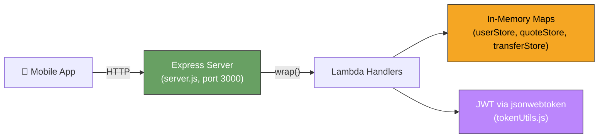
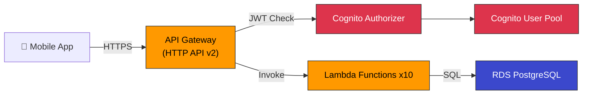
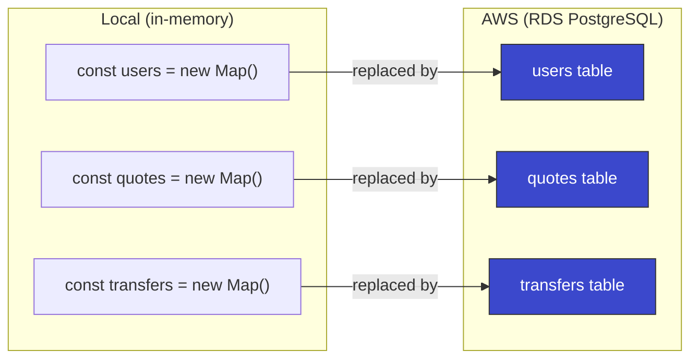
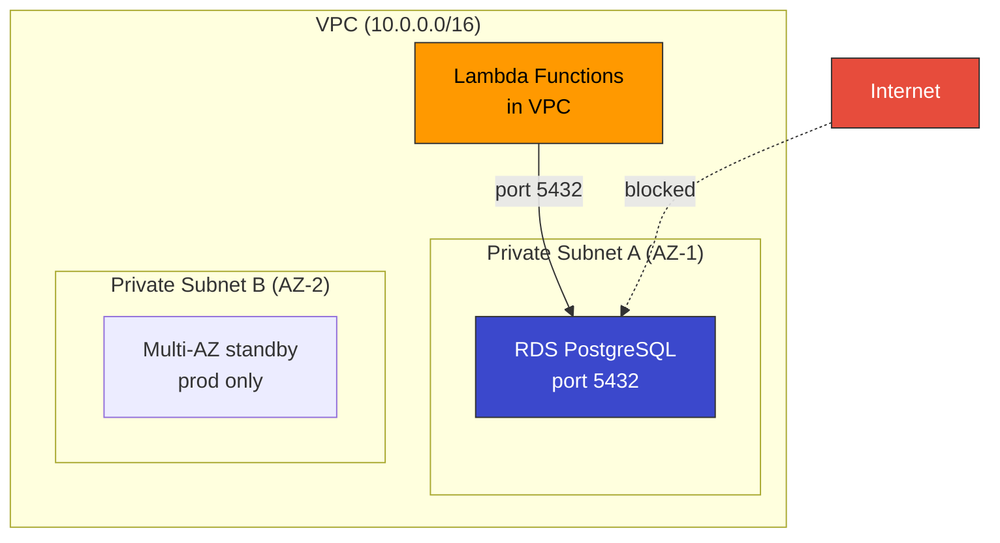
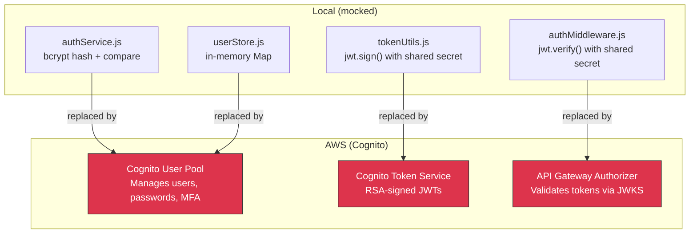
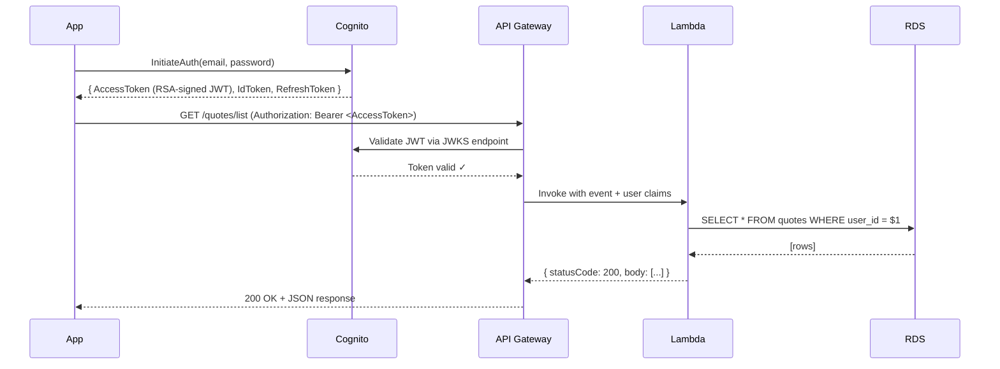
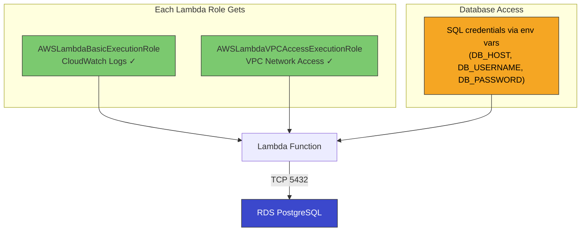
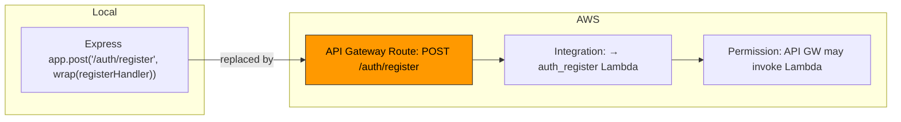
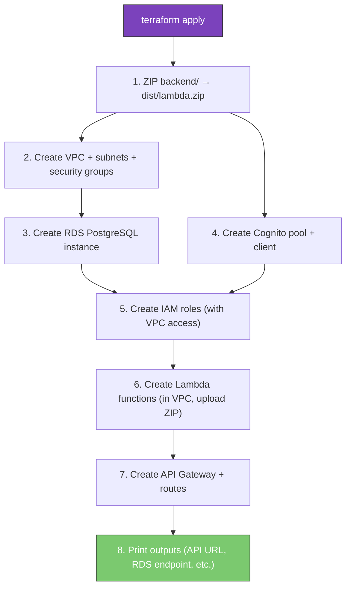

# Terraform Implementation Guide — FX Quote Service on AWS

A walkthrough of every Terraform file in the `terraform/` directory. Explains what each resource does, why it exists, and how it maps to the local backend you already know.

---

## Table of Contents

1. [Architecture Overview](#1-architecture-overview)
2. [Local vs AWS — What Changes](#2-local-vs-aws--what-changes)
3. [File Structure](#3-file-structure)
4. [Provider & Configuration — main.tf](#4-provider--configuration--maintf)
5. [Variables — variables.tf](#5-variables--variablestf)
6. [RDS PostgreSQL — rds.tf](#6-rds-postgresql--rdstf)
7. [Cognito User Pool — cognito.tf](#7-cognito-user-pool--cognitotf)
8. [IAM Roles & Policies — iam.tf](#8-iam-roles--policies--iamtf)
9. [Lambda Functions — lambda.tf](#9-lambda-functions--lambdatf)
10. [API Gateway — api_gateway.tf](#10-api-gateway--api_gatewaytf)
11. [Outputs — outputs.tf](#11-outputs--outputstf)
12. [Environment Configs — tfvars](#12-environment-configs--tfvars)
13. [How to Deploy](#13-how-to-deploy)
14. [How to Destroy](#14-how-to-destroy)
15. [What Would Need to Change in Backend Code](#15-what-would-need-to-change-in-backend-code)
16. [Cost Estimate](#16-cost-estimate)
17. [Full Resource Map](#17-full-resource-map)

---

## 1. Architecture Overview

### Local Development (What You Have Now)



### AWS Production (What Terraform Creates)



### What Terraform Creates

| Category    | Resources                                               | Count |
| ----------- | ------------------------------------------------------- | ----- |
| Networking  | VPC, 2 private subnets, 2 security groups               | 5     |
| RDS         | 1 PostgreSQL instance, 1 DB subnet group                | 2     |
| API Gateway | HTTP API, stage, authorizer, 10 routes, 10 integrations | 23    |
| Lambda      | 10 functions, 10 log groups, 10 permissions             | 30    |
| Cognito     | 1 user pool, 1 app client                               | 2     |
| IAM         | 3 roles, 6 managed policy attachments                   | 9     |

---

## 2. Local vs AWS — What Changes

Every component in the local backend maps to an AWS service:

| Local Component                   | File               | AWS Replacement                                       | Terraform File                  |
| --------------------------------- | ------------------ | ----------------------------------------------------- | ------------------------------- |
| Express server + routes           | `server.js`        | API Gateway HTTP API                                  | `api_gateway.tf`                |
| `wrap()` function                 | `server.js`        | Not needed — API Gateway sends Lambda events natively | —                               |
| `cors()` middleware               | `server.js`        | API Gateway CORS config                               | `api_gateway.tf`                |
| In-memory `Map` stores            | `store/*.js`       | RDS PostgreSQL tables                                 | `rds.tf`                        |
| `authMiddleware.js`               | `middleware/`      | API Gateway JWT Authorizer + Cognito                  | `api_gateway.tf` + `cognito.tf` |
| `tokenUtils.js` (JWT sign/verify) | `utils/`           | Cognito token issuance (RSA signed)                   | `cognito.tf`                    |
| `bcrypt` password hashing         | `authService.js`   | Cognito handles passwords internally                  | `cognito.tf`                    |
| Handler functions                 | `handlers/*.js`    | Lambda functions (same code!)                         | `lambda.tf`                     |
| Business logic                    | `services/*.js`    | Same code, runs inside Lambda                         | `lambda.tf`                     |
| FX rates                          | `utils/fxRates.js` | Same code, runs inside Lambda                         | `lambda.tf`                     |

### What Stays the Same

The handler functions (`authHandler.js`, `quoteHandler.js`, `transferHandler.js`) are already written in the Lambda event format:

```js
// This is ALREADY a Lambda handler — no changes needed for the function signature
async function registerHandler(event) {
  const body = JSON.parse(event.body);
  // ... business logic ...
  return {
    statusCode: 201,
    body: JSON.stringify(result),
  };
}
```

### What Gets Removed

These files are only needed for local dev and are NOT deployed to Lambda:

- `server.js` — Express server (replaced by API Gateway)
- `express`, `cors`, `swagger-ui-express`, `yamljs` packages

---

## 3. File Structure

```
terraform/
├── main.tf            ← Provider config (AWS, region, tags)
├── variables.tf       ← Input variables (region, env, memory, RDS config, etc.)
├── rds.tf             ← VPC, subnets, security groups, RDS PostgreSQL
├── cognito.tf         ← Cognito User Pool + App Client
├── iam.tf             ← IAM roles & policies for Lambda
├── lambda.tf          ← 10 Lambda functions + CloudWatch log groups
├── api_gateway.tf     ← HTTP API, routes, integrations, authorizer
├── outputs.tf         ← Values printed after deploy (API URL, RDS endpoint, etc.)
├── dev.tfvars         ← Dev environment overrides
├── prod.tfvars        ← Prod environment overrides
├── .gitignore         ← Ignore state files, .terraform/, etc.
└── README.md          ← Quick-start instructions
```

Each `.tf` file handles one concern. Terraform merges all `.tf` files in a directory automatically — the file names are for human organization only.

---

## 4. Provider & Configuration — main.tf

```hcl
terraform {
  required_version = ">= 1.5.0"

  required_providers {
    aws = {
      source  = "hashicorp/aws"
      version = "~> 5.0"
    }
    archive = {
      source  = "hashicorp/archive"
      version = "~> 2.0"
    }
  }
}

provider "aws" {
  region = var.aws_region

  default_tags {
    tags = {
      Project     = "fx-quote-service"
      Environment = var.environment
      ManagedBy   = "terraform"
    }
  }
}
```

### What This Does

| Block                        | Purpose                                      |
| ---------------------------- | -------------------------------------------- |
| `terraform.required_version` | Ensures Terraform CLI is v1.5+               |
| `required_providers.aws`     | Downloads the AWS provider plugin            |
| `required_providers.archive` | Creates ZIP files for Lambda deployment      |
| `provider "aws"`             | Configures which region to deploy to         |
| `default_tags`               | Every resource gets these tags automatically |

### The Archive Provider

Lambda requires code as a ZIP file. The `archive` provider creates it from the `backend/` directory:

```hcl
data "archive_file" "lambda_zip" {
  type        = "zip"
  source_dir  = "${path.module}/../backend"
  output_path = "${path.module}/dist/lambda.zip"
  excludes    = ["server.js", "__tests__", "coverage", ...]
}
```

This replaces running `zip` manually — Terraform handles it every time you deploy.

---

## 5. Variables — variables.tf

```hcl
variable "aws_region" {
  default = "eu-west-1"
}

variable "environment" {
  default = "dev"
}

variable "lambda_memory" {
  default = 256
}
```

### How Variables Work

Variables are inputs to your Terraform configuration. They can be set via:

1. **Default values** (in `variables.tf`)
2. **tfvars files** (`terraform apply -var-file="dev.tfvars"`)
3. **Command line** (`terraform apply -var="environment=prod"`)
4. **Environment variables** (`TF_VAR_environment=prod`)

Priority: CLI > tfvars > env vars > defaults

### Our Variables

| Variable                    | Default            | Purpose                       |
| --------------------------- | ------------------ | ----------------------------- |
| `aws_region`                | `eu-west-1`        | AWS region (Ireland)          |
| `environment`               | `dev`              | Suffix for resource names     |
| `project_name`              | `fx-quote-service` | Prefix for resource names     |
| `lambda_runtime`            | `nodejs20.x`       | Node.js version in Lambda     |
| `lambda_memory`             | `256` MB           | Memory allocated per function |
| `lambda_timeout`            | `30` seconds       | Max execution time            |
| `vpc_cidr`                  | `10.0.0.0/16`      | CIDR block for the VPC        |
| `rds_engine_version`        | `16.4`             | PostgreSQL version            |
| `rds_instance_class`        | `db.t4g.micro`     | RDS instance size             |
| `rds_allocated_storage`     | `20` GB            | Initial storage               |
| `rds_max_allocated_storage` | `50` GB            | Max storage for autoscaling   |
| `rds_db_name`               | `fxquoteservice`   | Database name                 |
| `rds_username`              | `fxadmin`          | Master username (sensitive)   |
| `rds_password`              | _(no default)_     | Master password (sensitive)   |

### Naming Convention

Every resource uses the pattern: `${var.project_name}-<resource>-${var.environment}`

Examples:

- `fx-quote-service-auth-register-dev`
- `fx-quote-service-db-prod`
- `fx-quote-service-api-dev`

This lets you deploy multiple environments side by side in the same AWS account.

---

## 6. RDS PostgreSQL — rds.tf

### What RDS Replaces



All three in-memory `Map` stores become SQL tables inside a single PostgreSQL database.

### Why RDS?

| Feature       | In-Memory Map            | RDS PostgreSQL                   |
| ------------- | ------------------------ | -------------------------------- |
| Persistence   | Lost on restart          | Durable, survives reboots        |
| Querying      | Manual filtering         | SQL (JOINs, indexes, WHERE)      |
| Relationships | No referential integrity | Foreign keys enforce consistency |
| Backups       | None                     | Automated daily snapshots        |
| Scaling       | Limited to one process   | Vertical scaling, read replicas  |

### Network Setup — VPC, Subnets, Security Groups

RDS must run inside a VPC (Virtual Private Cloud). Lambda functions connect to RDS through the VPC:



**Why private subnets?** RDS is not publicly accessible — only Lambda functions inside the same VPC can connect. This is a security best practice.

**Why two subnets?** RDS subnet groups require at least 2 availability zones for high availability.

### Security Groups

Two security groups control network access:

```hcl
# Lambda security group — allows outbound traffic
resource "aws_security_group" "lambda" {
  vpc_id = aws_vpc.main.id
  egress {
    from_port   = 0
    to_port     = 0
    protocol    = "-1"
    cidr_blocks = ["0.0.0.0/0"]
  }
}

# RDS security group — only accepts traffic from Lambda on port 5432
resource "aws_security_group" "rds" {
  vpc_id = aws_vpc.main.id
  ingress {
    from_port       = 5432
    to_port         = 5432
    protocol        = "tcp"
    security_groups = [aws_security_group.lambda.id]
  }
}
```

This means **only Lambda functions** can talk to the database. Nothing else — no internet, no other services.

### RDS Instance Configuration

```hcl
resource "aws_db_instance" "main" {
  identifier = "${var.project_name}-db-${var.environment}"

  engine         = "postgres"
  engine_version = var.rds_engine_version   # 16.4
  instance_class = var.rds_instance_class   # db.t4g.micro

  allocated_storage     = var.rds_allocated_storage      # 20 GB
  max_allocated_storage = var.rds_max_allocated_storage   # 50 GB (autoscales)
  storage_type          = "gp3"
  storage_encrypted     = true

  db_name  = var.rds_db_name    # "fxquoteservice"
  username = var.rds_username   # "fxadmin"
  password = var.rds_password   # from tfvars (sensitive)

  db_subnet_group_name   = aws_db_subnet_group.main.name
  vpc_security_group_ids = [aws_security_group.rds.id]

  multi_az            = var.environment == "prod" ? true : false
  publicly_accessible = false
  skip_final_snapshot = var.environment == "dev" ? true : false
}
```

### Key Settings Explained

| Setting                   | Dev            | Prod           | Why                                 |
| ------------------------- | -------------- | -------------- | ----------------------------------- |
| `instance_class`          | `db.t4g.micro` | `db.t4g.small` | Micro is free tier eligible         |
| `multi_az`                | `false`        | `true`         | Prod gets automatic failover        |
| `skip_final_snapshot`     | `true`         | `false`        | Prod keeps a snapshot on destroy    |
| `backup_retention_period` | `1` day        | `7` days       | Prod keeps more backup history      |
| `deletion_protection`     | `false`        | `true`         | Prevent accidental deletion in prod |
| `storage_encrypted`       | `true`         | `true`         | Always encrypt data at rest         |
| `publicly_accessible`     | `false`        | `false`        | Never expose DB to internet         |

### SQL Schema (What You'd Create After Deploy)

After RDS is running, you'd connect and create tables:

```sql
-- Users table (replaces userStore.js)
CREATE TABLE users (
    id         UUID PRIMARY KEY DEFAULT gen_random_uuid(),
    email      VARCHAR(255) UNIQUE NOT NULL,
    password   VARCHAR(255) NOT NULL,
    name       VARCHAR(255) NOT NULL,
    created_at TIMESTAMP DEFAULT NOW()
);

-- Quotes table (replaces quoteStore.js)
CREATE TABLE quotes (
    id              UUID PRIMARY KEY DEFAULT gen_random_uuid(),
    user_id         UUID REFERENCES users(id),
    from_currency   VARCHAR(3) NOT NULL,
    to_currency     VARCHAR(3) NOT NULL,
    amount          DECIMAL(15,2) NOT NULL,
    rate            DECIMAL(15,6) NOT NULL,
    converted_amount DECIMAL(15,2) NOT NULL,
    status          VARCHAR(20) DEFAULT 'pending',
    created_at      TIMESTAMP DEFAULT NOW(),
    expires_at      TIMESTAMP
);

-- Transfers table (replaces transferStore.js)
CREATE TABLE transfers (
    id         UUID PRIMARY KEY DEFAULT gen_random_uuid(),
    user_id    UUID REFERENCES users(id),
    quote_id   UUID REFERENCES quotes(id),
    status     VARCHAR(20) DEFAULT 'processing',
    created_at TIMESTAMP DEFAULT NOW()
);

-- Indexes for fast lookups (replaces GSIs)
CREATE INDEX idx_users_email ON users(email);
CREATE INDEX idx_quotes_user_id ON quotes(user_id);
CREATE INDEX idx_transfers_user_id ON transfers(user_id);
```

### RDS vs DynamoDB — Why We Chose RDS

| Consideration | DynamoDB                   | RDS PostgreSQL                  |
| ------------- | -------------------------- | ------------------------------- |
| Data model    | Key-value / document       | Relational (SQL)                |
| Relationships | Manual (denormalized)      | Foreign keys, JOINs             |
| Querying      | Limited (key + index only) | Full SQL power                  |
| Schema        | Schemaless (flexible)      | Structured (enforced)           |
| Pricing       | Pay per request            | Pay per hour (instance running) |
| Free tier     | 25 GB + 25 RCU/WCU         | 750 hrs/month db.t4g.micro      |
| Best for      | High-scale, simple access  | Complex queries, relationships  |

For an FX Quote Service with users → quotes → transfers relationships, a relational database is a natural fit.

---

## 7. Cognito User Pool — cognito.tf

### What Cognito Replaces



### User Pool Configuration

```hcl
resource "aws_cognito_user_pool" "main" {
  name = "${var.project_name}-${var.environment}"

  # Users sign in with email
  username_attributes = ["email"]

  # Password policy (matches our backend: min 8 chars)
  password_policy {
    minimum_length    = 8
    require_lowercase = true
    require_uppercase = false
    require_numbers   = false
    require_symbols   = false
  }

  # Custom "name" attribute
  schema {
    name                = "name"
    attribute_data_type = "String"
    mutable             = true
  }
}
```

### App Client

```hcl
resource "aws_cognito_user_pool_client" "app" {
  name         = "${var.project_name}-app-client"
  user_pool_id = aws_cognito_user_pool.main.id

  explicit_auth_flows = [
    "ALLOW_USER_PASSWORD_AUTH",    # Direct email + password login
    "ALLOW_REFRESH_TOKEN_AUTH",    # Refresh expired tokens
    "ALLOW_USER_SRP_AUTH",         # Secure Remote Password (optional)
  ]

  access_token_validity  = 1   # 1 hour (matches our TOKEN_EXPIRY)
  generate_secret        = false  # No secret — mobile apps are public clients
}
```

### Why `generate_secret = false`?

Mobile apps can't securely store a client secret (users could decompile the app). Cognito supports "public clients" that authenticate without a secret — the user's credentials are sufficient.

### Token Flow (Production)



---

## 8. IAM Roles & Policies — iam.tf

### Why IAM?

Every Lambda function needs an **IAM role** that defines what it's allowed to do. Without it, the function can't write logs or connect to the VPC.

### IAM with RDS

With RDS, Lambda doesn't need database-specific IAM policies. Instead, it needs **VPC access** — permission to create Elastic Network Interfaces (ENIs) so it can connect to the private RDS instance:



### IAM Structure

Each role has two managed policy attachments:

**1. Assume Role Policy** — who can use this role:

```hcl
data "aws_iam_policy_document" "lambda_assume" {
  statement {
    effect  = "Allow"
    actions = ["sts:AssumeRole"]
    principals {
      type        = "Service"
      identifiers = ["lambda.amazonaws.com"]
    }
  }
}
```

**2. Basic Execution** — CloudWatch Logs:

```hcl
resource "aws_iam_role_policy_attachment" "auth_lambda_basic" {
  role       = aws_iam_role.auth_lambda.name
  policy_arn = "arn:aws:iam::aws:policy/service-role/AWSLambdaBasicExecutionRole"
}
```

**3. VPC Access** — ENI permissions for connecting to RDS:

```hcl
resource "aws_iam_role_policy_attachment" "auth_lambda_vpc" {
  role       = aws_iam_role.auth_lambda.name
  policy_arn = "arn:aws:iam::aws:policy/service-role/AWSLambdaVPCAccessExecutionRole"
}
```

### RDS vs DynamoDB IAM Difference

| DynamoDB Approach                      | RDS Approach                        |
| -------------------------------------- | ----------------------------------- |
| Per-table IAM policies                 | VPC access + SQL credentials        |
| `dynamodb:GetItem`, `dynamodb:PutItem` | `ec2:CreateNetworkInterface` (VPC)  |
| Fine-grained per-resource              | Security group controls access      |
| Auth controlled by AWS IAM             | Auth controlled by PostgreSQL users |

With RDS, the **security group** replaces per-table IAM policies. Only Lambdas in the right security group can connect to port 5432.

---

## 9. Lambda Functions — lambda.tf

### One Function Per Endpoint

Each API endpoint gets its own Lambda function:

| Function Name     | Handler                                          | Endpoint              |
| ----------------- | ------------------------------------------------ | --------------------- |
| `auth-register`   | `handlers/authHandler.registerHandler`           | `POST /auth/register` |
| `auth-login`      | `handlers/authHandler.loginHandler`              | `POST /auth/login`    |
| `auth-me`         | `handlers/authHandler.meHandler`                 | `GET /auth/me`        |
| `quote-preview`   | `handlers/quoteHandler.handler`                  | `POST /quotes`        |
| `quote-create`    | `handlers/quoteHandler.createQuoteHandler`       | `POST /quotes/create` |
| `quote-get`       | `handlers/quoteHandler.getQuoteHandler`          | `GET /quotes/{id}`    |
| `quote-list`      | `handlers/quoteHandler.listQuotesHandler`        | `GET /quotes/list`    |
| `transfer-create` | `handlers/transferHandler.createTransferHandler` | `POST /transfers`     |
| `transfer-get`    | `handlers/transferHandler.getTransferHandler`    | `GET /transfers/{id}` |
| `transfer-list`   | `handlers/transferHandler.listTransfersHandler`  | `GET /transfers/list` |

### Lambda Configuration

```hcl
resource "aws_lambda_function" "auth_register" {
  function_name = "${var.project_name}-auth-register-${var.environment}"
  description   = "POST /auth/register — User registration"

  # Code source
  filename         = data.archive_file.lambda_zip.output_path
  source_code_hash = data.archive_file.lambda_zip.output_base64sha256

  # Entry point: file path + exported function name
  handler = "handlers/authHandler.registerHandler"
  runtime = var.lambda_runtime   # nodejs20.x

  memory_size = var.lambda_memory  # 256 MB
  timeout     = var.lambda_timeout # 30 seconds

  role = aws_iam_role.auth_lambda.arn

  # VPC config — required to reach RDS in a private subnet
  vpc_config {
    subnet_ids         = [aws_subnet.private_a.id, aws_subnet.private_b.id]
    security_group_ids = [aws_security_group.lambda.id]
  }

  environment {
    variables = {
      DB_HOST           = aws_db_instance.main.address
      DB_PORT           = tostring(aws_db_instance.main.port)
      DB_NAME           = var.rds_db_name
      DB_USERNAME       = var.rds_username
      DB_PASSWORD       = var.rds_password
      COGNITO_POOL_ID   = aws_cognito_user_pool.main.id
      COGNITO_CLIENT_ID = aws_cognito_user_pool_client.app.id
    }
  }
}
```

### VPC Config — Why Lambda Needs It

```hcl
vpc_config {
  subnet_ids         = [aws_subnet.private_a.id, aws_subnet.private_b.id]
  security_group_ids = [aws_security_group.lambda.id]
}
```

Without `vpc_config`, Lambda runs in AWS's shared network and **cannot reach** RDS in your private VPC. With it, Lambda creates an ENI (Elastic Network Interface) inside your VPC's subnets, allowing it to connect to RDS on port 5432.

### How `handler` Maps to Code

```
handler = "handlers/authHandler.registerHandler"
           ──────────────────── ───────────────
           File path (relative)  Exported function
```

Terraform tells Lambda: "In the ZIP archive, find `handlers/authHandler.js` and call the `registerHandler` export."

### Environment Variables

Lambda functions receive RDS connection details via environment variables:

```hcl
environment {
  variables = {
    DB_HOST     = aws_db_instance.main.address    # e.g. "fx-quote-service-db-dev.abc123.eu-west-1.rds.amazonaws.com"
    DB_PORT     = tostring(aws_db_instance.main.port)  # "5432"
    DB_NAME     = var.rds_db_name                 # "fxquoteservice"
    DB_USERNAME = var.rds_username                 # "fxadmin"
    DB_PASSWORD = var.rds_password                 # from tfvars
  }
}
```

In the code, you'd use these to create a database connection:

```js
const { Pool } = require("pg");
const pool = new Pool({
  host: process.env.DB_HOST,
  port: process.env.DB_PORT,
  database: process.env.DB_NAME,
  user: process.env.DB_USERNAME,
  password: process.env.DB_PASSWORD,
});
```

### `source_code_hash` — Detecting Code Changes

```hcl
source_code_hash = data.archive_file.lambda_zip.output_base64sha256
```

Terraform compares the hash of the ZIP on each `apply`. If the code hasn't changed, Lambda isn't redeployed. If it has, Terraform uploads the new ZIP.

### CloudWatch Log Groups

```hcl
resource "aws_cloudwatch_log_group" "auth_register" {
  name              = "/aws/lambda/${aws_lambda_function.auth_register.function_name}"
  retention_in_days = 14
}
```

Lambda auto-creates log groups, but without a retention policy they store logs **forever** (costly). We explicitly create them with 14-day retention.

---

## 10. API Gateway — api_gateway.tf

### What API Gateway Replaces



### The Three-Part Pattern

Every endpoint requires three resources:

```
Route → Integration → Lambda Permission
```

**1. Route** — defines the HTTP method and path:

```hcl
resource "aws_apigatewayv2_route" "auth_register" {
  api_id    = aws_apigatewayv2_api.main.id
  route_key = "POST /auth/register"
  target    = "integrations/${aws_apigatewayv2_integration.auth_register.id}"
}
```

**2. Integration** — connects the route to a Lambda function:

```hcl
resource "aws_apigatewayv2_integration" "auth_register" {
  api_id                 = aws_apigatewayv2_api.main.id
  integration_type       = "AWS_PROXY"
  integration_uri        = aws_lambda_function.auth_register.invoke_arn
  payload_format_version = "2.0"
}
```

**3. Permission** — allows API Gateway to invoke the Lambda:

```hcl
resource "aws_lambda_permission" "auth_register" {
  action        = "lambda:InvokeFunction"
  function_name = aws_lambda_function.auth_register.function_name
  principal     = "apigateway.amazonaws.com"
  source_arn    = "${aws_apigatewayv2_api.main.execution_arn}/*/*"
}
```

### CORS Configuration

```hcl
cors_configuration {
  allow_origins = ["*"]
  allow_methods = ["GET", "POST", "PUT", "DELETE", "OPTIONS"]
  allow_headers = ["Content-Type", "Authorization"]
  max_age       = 3600
}
```

This replaces `app.use(cors())` from Express. API Gateway handles CORS preflight (`OPTIONS`) requests automatically.

### JWT Authorizer — Replacing authMiddleware.js

```hcl
resource "aws_apigatewayv2_authorizer" "cognito" {
  api_id           = aws_apigatewayv2_api.main.id
  authorizer_type  = "JWT"
  identity_sources = ["$request.header.Authorization"]
  name             = "cognito-jwt"

  jwt_configuration {
    audience = [aws_cognito_user_pool_client.app.id]
    issuer   = "https://cognito-idp.${var.aws_region}.amazonaws.com/${aws_cognito_user_pool.main.id}"
  }
}
```

This replaces:

```js
// middleware/authMiddleware.js (no longer needed)
const decoded = verifyToken(parts[1]);
```

API Gateway validates the JWT **before** your Lambda code even runs. Invalid or expired tokens get a `401` without invoking Lambda (saves money and execution time).

### Authenticated vs Public Routes

**Public routes** (no auth):

```hcl
resource "aws_apigatewayv2_route" "auth_register" {
  route_key = "POST /auth/register"
  target    = "integrations/${aws_apigatewayv2_integration.auth_register.id}"
  # No authorization_type → public
}
```

**Authenticated routes** (JWT required):

```hcl
resource "aws_apigatewayv2_route" "quote_create" {
  route_key          = "POST /quotes/create"
  target             = "integrations/${aws_apigatewayv2_integration.quote_create.id}"
  authorization_type = "JWT"
  authorizer_id      = aws_apigatewayv2_authorizer.cognito.id
}
```

### Route Summary

| Route                 | Auth   | Lambda            |
| --------------------- | ------ | ----------------- |
| `POST /auth/register` | Public | `auth_register`   |
| `POST /auth/login`    | Public | `auth_login`      |
| `GET /auth/me`        | JWT    | `auth_me`         |
| `POST /quotes`        | Public | `quote_preview`   |
| `POST /quotes/create` | JWT    | `quote_create`    |
| `GET /quotes/list`    | JWT    | `quote_list`      |
| `GET /quotes/{id}`    | JWT    | `quote_get`       |
| `POST /transfers`     | JWT    | `transfer_create` |
| `GET /transfers/list` | JWT    | `transfer_list`   |
| `GET /transfers/{id}` | JWT    | `transfer_get`    |

---

## 11. Outputs — outputs.tf

After `terraform apply`, these values are printed:

```hcl
output "api_url" {
  value = aws_apigatewayv2_stage.default.invoke_url
}

output "rds_endpoint" {
  value = aws_db_instance.main.endpoint
}

output "rds_hostname" {
  value = aws_db_instance.main.address
}

output "cognito_user_pool_id" {
  value = aws_cognito_user_pool.main.id
}
```

Example output after deploy:

```
api_url              = "https://abc123xyz.execute-api.eu-west-1.amazonaws.com"
rds_endpoint         = "fx-quote-service-db-dev.abc123.eu-west-1.rds.amazonaws.com:5432"
rds_hostname         = "fx-quote-service-db-dev.abc123.eu-west-1.rds.amazonaws.com"
cognito_user_pool_id = "eu-west-1_AbCdEfGhI"
cognito_client_id    = "1a2b3c4d5e6f7g8h9i0j"
```

To update the mobile app, you'd change `API_BASE_URL` in `api.js`:

```js
// Before (local)
const API_BASE_URL = "http://192.168.1.15:3000";

// After (AWS)
const API_BASE_URL = "https://abc123xyz.execute-api.eu-west-1.amazonaws.com";
```

---

## 12. Environment Configs — tfvars

### dev.tfvars

```hcl
aws_region     = "eu-west-1"
environment    = "dev"
lambda_memory  = 256
lambda_timeout = 30

# RDS
rds_instance_class        = "db.t4g.micro"
rds_allocated_storage     = 20
rds_max_allocated_storage = 50
rds_db_name               = "fxquoteservice"
rds_username              = "fxadmin"
rds_password              = "CHANGE_ME_dev_password_123"
```

### prod.tfvars

```hcl
aws_region     = "eu-west-1"
environment    = "prod"
lambda_memory  = 512
lambda_timeout = 30

# RDS
rds_instance_class        = "db.t4g.small"    # Bigger instance for production
rds_allocated_storage     = 50
rds_max_allocated_storage = 100
rds_db_name               = "fxquoteservice"
rds_username              = "fxadmin"
rds_password              = "CHANGE_ME_prod_password_456"
```

Deploy to different environments:

```bash
# Dev
terraform apply -var-file="dev.tfvars"

# Prod
terraform apply -var-file="prod.tfvars"
```

Each environment creates completely separate resources (different names, different databases, different Cognito pools).

> **Security Note:** In production, avoid storing passwords in `.tfvars` files. Use `TF_VAR_rds_password` environment variable or AWS Secrets Manager instead.

---

## 13. How to Deploy

### Prerequisites

1. **Terraform CLI** installed (`terraform -version`)
2. **AWS CLI** configured with credentials (`aws configure`)
3. **Node.js** installed (for `npm install` in backend)

### Step-by-Step

```bash
# 1. Install backend dependencies (Lambda needs node_modules in the ZIP)
cd backend
npm install --production
cd ..

# 2. Initialize Terraform (downloads providers)
cd terraform
terraform init

# 3. Preview what will be created
terraform plan -var-file="dev.tfvars"

# 4. Deploy (type "yes" to confirm)
terraform apply -var-file="dev.tfvars"

# 5. Note the outputs
# api_url      = "https://abc123xyz.execute-api.eu-west-1.amazonaws.com"
# rds_endpoint = "fx-quote-service-db-dev.abc123.eu-west-1.rds.amazonaws.com:5432"

# 6. Run the SQL schema against RDS (one-time setup)
# Connect via a bastion host or AWS Session Manager and run the CREATE TABLE statements
```

### What Happens During `terraform apply`



> **Note:** RDS creation takes 5-10 minutes. This is normal — it's provisioning a real database server.

---

## 14. How to Destroy

```bash
# Preview what will be deleted
terraform plan -destroy -var-file="dev.tfvars"

# Destroy everything (type "yes" to confirm)
terraform destroy -var-file="dev.tfvars"
```

This deletes ALL resources — Lambda functions, RDS instance (and all data unless a final snapshot is kept), Cognito pool (and all users), VPC, API Gateway, IAM roles, log groups. **Irreversible for data in dev** (prod keeps a final snapshot).

---

## 15. What Would Need to Change in Backend Code

To make the backend code work with RDS instead of in-memory stores, these files need modifications:

### Store Files → PostgreSQL Queries

```js
// BEFORE: store/quoteStore.js (in-memory)
const quotes = new Map();
function save(quote) {
  quotes.set(quote.id, quote);
  return quote;
}

// AFTER: store/quoteStore.js (PostgreSQL via pg)
const { Pool } = require("pg");
const pool = new Pool({
  host: process.env.DB_HOST,
  port: process.env.DB_PORT,
  database: process.env.DB_NAME,
  user: process.env.DB_USERNAME,
  password: process.env.DB_PASSWORD,
  max: 5, // Connection pool size
  idleTimeoutMillis: 30000,
});

async function save(quote) {
  const result = await pool.query(
    `INSERT INTO quotes (id, user_id, from_currency, to_currency, amount, rate, converted_amount, status, expires_at)
     VALUES ($1, $2, $3, $4, $5, $6, $7, $8, $9)
     RETURNING *`,
    [
      quote.id,
      quote.userId,
      quote.fromCurrency,
      quote.toCurrency,
      quote.amount,
      quote.rate,
      quote.convertedAmount,
      quote.status,
      quote.expiresAt,
    ],
  );
  return result.rows[0];
}

async function findById(id) {
  const result = await pool.query("SELECT * FROM quotes WHERE id = $1", [id]);
  return result.rows[0] || null;
}

async function findByUserId(userId) {
  const result = await pool.query(
    "SELECT * FROM quotes WHERE user_id = $1 ORDER BY created_at DESC",
    [userId],
  );
  return result.rows;
}
```

### Auth Service → Cognito SDK Calls

```js
// BEFORE: services/authService.js (bcrypt + jwt)
const hashedPassword = await bcrypt.hash(password, 10);
const token = signToken({ id: user.id, email: user.email });

// AFTER: services/authService.js (Cognito SDK)
const {
  CognitoIdentityProviderClient,
  SignUpCommand,
  InitiateAuthCommand,
} = require("@aws-sdk/client-cognito-identity-provider");

const cognito = new CognitoIdentityProviderClient({});

async function register(email, password, name) {
  await cognito.send(
    new SignUpCommand({
      ClientId: process.env.COGNITO_CLIENT_ID,
      Username: email,
      Password: password,
      UserAttributes: [{ Name: "name", Value: name }],
    }),
  );
}

async function login(email, password) {
  const result = await cognito.send(
    new InitiateAuthCommand({
      AuthFlow: "USER_PASSWORD_AUTH",
      ClientId: process.env.COGNITO_CLIENT_ID,
      AuthParameters: { USERNAME: email, PASSWORD: password },
    }),
  );
  return {
    accessToken: result.AuthenticationResult.AccessToken,
    idToken: result.AuthenticationResult.IdToken,
    refreshToken: result.AuthenticationResult.RefreshToken,
  };
}
```

### Middleware → Removed

The `authMiddleware.js` file is no longer needed. API Gateway's JWT authorizer validates tokens before Lambda runs. The user's identity comes from the event's `requestContext`:

```js
// BEFORE
const user = authenticate(event); // Manual JWT verification

// AFTER — API Gateway already validated the token
const userId = event.requestContext.authorizer.jwt.claims.sub;
const email = event.requestContext.authorizer.jwt.claims.email;
```

---

## 16. Cost Estimate

### AWS Free Tier (First 12 Months)

| Service     | Free Tier                           | Our Usage         | Cost   |
| ----------- | ----------------------------------- | ----------------- | ------ |
| RDS         | 750 hrs/month db.t4g.micro, 20 GB   | 1 instance, 20 GB | **$0** |
| Lambda      | 1M requests + 400K GB-seconds/month | ~100 requests/day | **$0** |
| API Gateway | 1M HTTP API calls/month             | ~100 calls/day    | **$0** |
| Cognito     | 50,000 MAUs                         | 1-10 users        | **$0** |
| CloudWatch  | 5 GB logs/month                     | < 100 MB          | **$0** |
| VPC         | No charge for VPC/subnets/SGs       | 1 VPC             | **$0** |

**Total for a learning project: $0/month** (within Free Tier)

### Beyond Free Tier

| Service     | Price                                               |
| ----------- | --------------------------------------------------- |
| RDS         | db.t4g.micro ~$12/month, db.t4g.small ~$24/month    |
| Lambda      | $0.20 per 1M requests + $0.0000166667 per GB-second |
| API Gateway | $1.00 per 1M requests                               |
| Cognito     | $0.0055 per MAU (after 50K)                         |

> **Important:** RDS charges hourly whether or not it's in use. Remember to `terraform destroy` dev environments when not in use.

---

## 17. Full Resource Map

### Every Resource Terraform Creates

```mermaid
graph TD
    subgraph "VPC"
        VPC["VPC 10.0.0.0/16"]
        SN_A["Private Subnet A"]
        SN_B["Private Subnet B"]
        SG_L["Lambda Security Group"]
        SG_R["RDS Security Group"]
    end

    subgraph "RDS"
        DB["PostgreSQL<br/>fx-quote-service-db-dev"]
    end

    subgraph "API Gateway"
        API["HTTP API<br/>fx-quote-service-api-dev"]
        STAGE["Stage: $default"]
        AUTH_GW["JWT Authorizer (Cognito)"]
        R1["POST /auth/register"]
        R2["POST /auth/login"]
        R3["GET /auth/me 🔒"]
        R4["POST /quotes"]
        R5["POST /quotes/create 🔒"]
        R6["GET /quotes/list 🔒"]
        R7["GET /quotes/{id} 🔒"]
        R8["POST /transfers 🔒"]
        R9["GET /transfers/list 🔒"]
        R10["GET /transfers/{id} 🔒"]
    end

    subgraph "Lambda (in VPC)"
        L1["auth-register"]
        L2["auth-login"]
        L3["auth-me"]
        L4["quote-preview"]
        L5["quote-create"]
        L6["quote-list"]
        L7["quote-get"]
        L8["transfer-create"]
        L9["transfer-list"]
        L10["transfer-get"]
    end

    subgraph "Cognito"
        CP["User Pool"]
        CC["App Client"]
    end

    subgraph "IAM"
        ROLE1["auth-lambda-role"]
        ROLE2["quote-lambda-role"]
        ROLE3["transfer-lambda-role"]
    end

    R1 --> L1
    R2 --> L2
    R3 --> L3
    R4 --> L4
    R5 --> L5
    R6 --> L6
    R7 --> L7
    R8 --> L8
    R9 --> L9
    R10 --> L10

    L1 -->|SQL| DB
    L2 -->|SQL| DB
    L3 -->|SQL| DB
    L4 -->|SQL| DB
    L5 -->|SQL| DB
    L6 -->|SQL| DB
    L7 -->|SQL| DB
    L8 -->|SQL| DB
    L9 -->|SQL| DB
    L10 -->|SQL| DB

    AUTH_GW --> CP

    L1 -.-> ROLE1
    L2 -.-> ROLE1
    L3 -.-> ROLE1
    L4 -.-> ROLE2
    L5 -.-> ROLE2
    L6 -.-> ROLE2
    L7 -.-> ROLE2
    L8 -.-> ROLE3
    L9 -.-> ROLE3
    L10 -.-> ROLE3

    style API fill:#ff9900,stroke:#333,color:#000
    style CP fill:#dd344c,stroke:#333,color:#fff
    style CC fill:#dd344c,stroke:#333,color:#fff
    style DB fill:#3b48cc,stroke:#333,color:#fff
    style VPC fill:#232f3e,stroke:#333,color:#fff
```

### Terraform File → Resource Mapping

| File             | Resources Created                                                                           |
| ---------------- | ------------------------------------------------------------------------------------------- |
| `main.tf`        | Provider configuration (no resources)                                                       |
| `variables.tf`   | Input variables (no resources)                                                              |
| `rds.tf`         | 1 VPC + 2 subnets + 2 security groups + 1 DB subnet group + 1 RDS instance                  |
| `cognito.tf`     | 1 user pool + 1 app client                                                                  |
| `iam.tf`         | 3 roles + 6 managed policy attachments (basic execution + VPC access)                       |
| `lambda.tf`      | 10 functions + 10 log groups + 1 ZIP archive                                                |
| `api_gateway.tf` | 1 API + 1 stage + 1 authorizer + 10 routes + 10 integrations + 10 permissions + 1 log group |
| `outputs.tf`     | Output values (no resources)                                                                |
